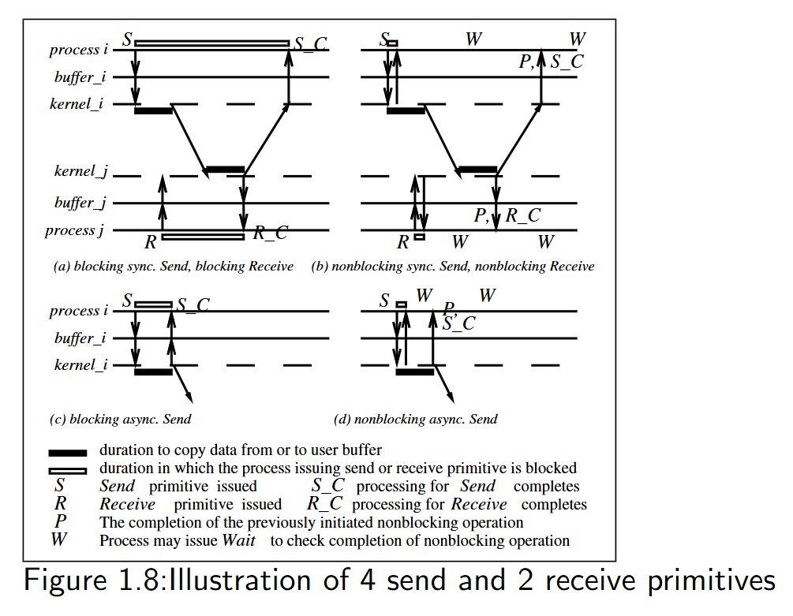
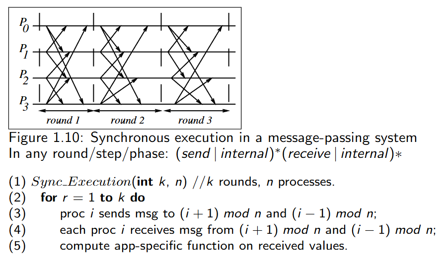
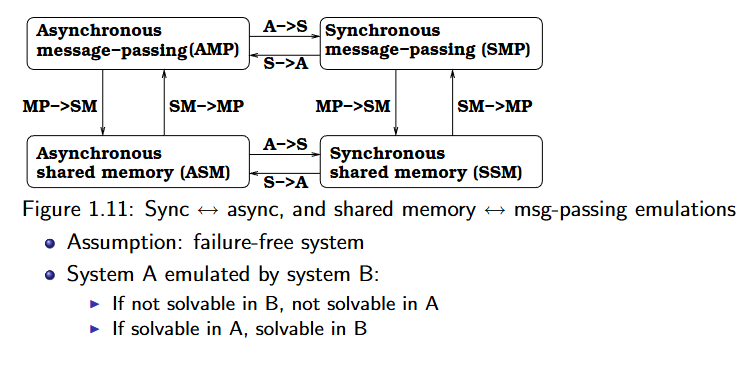
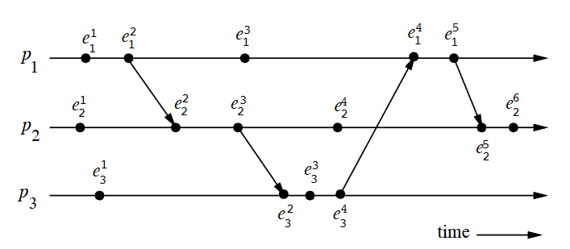
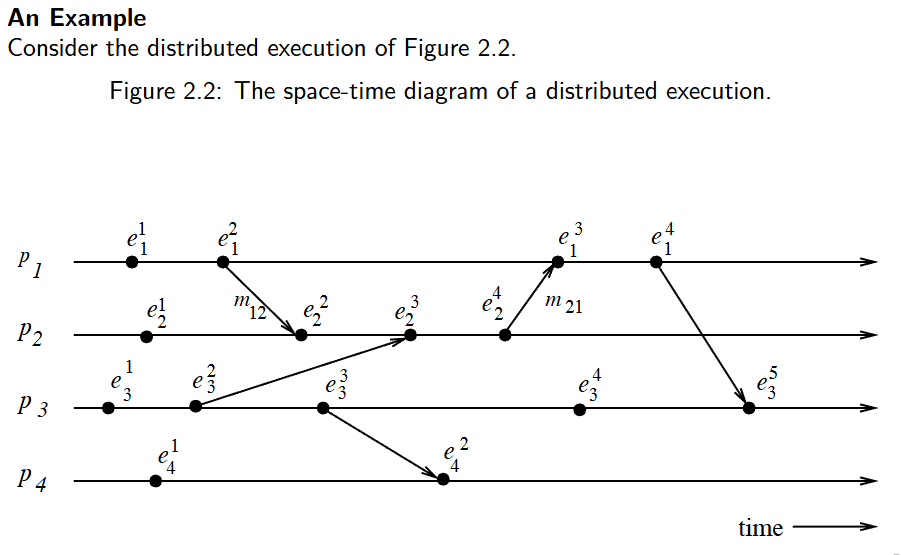

# 高级分布式系统
简介：一些通过通信网络交流连接的自主处理器。分布式系统是**若干独立自主计算机**的集合（硬件），这些计算机对于用户来说像是**单个耦合**系统（软件）——用户或者应用程序感觉系统是一个系统。

## CH-1

分布式系统的特性：
- 无共享物理时钟
- 无共享内存
- 地理上分隔的
- 自主性（计算节点硬件或者软件进程是独立的）与异构性

各软件组件之间的关系（从上到下）：
分布式应用-分布式软件（中间件库）-操作系统和网络协议栈（应用层、传输层、网络层和数据链路层）

分布式系统的设计动机：
1. inherently distributed computation（天然的分布式计算，如不同地区的业务）
2. 资源共享：多节点共享硬件、数据
3. 访问远程资源：跨网络访问资源
4. 提高性能/性价比：廉价节点集群实现高性能
5. 可靠性与可拓展性

并行系统：
1. 多处理器系统（直接访问共享内存，UMA model）
   - 互联网络：总线、多级交换机
2. 多计算机并行系统（无需直接访问共享内存，NUMA model）
   - 常用总线、环、mesh（无线网格网络）
3. 阵列处理器

UMA和NUMA（uniform memory access）
- uma 处理器和内存分离，通过内联网络实现对内存的共享，特点就是所有处理器访问内存的时间一致
- numa 处理器和内存绑定 节点间经过互连网络通信

OmegaNetwork

叽里咕噜的不知道说啥呢。反正就是n个处理器，n个内存；log2n个阶段，n/2个2*2容量的交换机通过互联函数形成某个拓扑结构。

Flynn’sTaxonomy 弗林分类法

分类及说明
- SISD（单指令流单数据流）
定义：单一指令流控制单一处理单元，处理单一数据流。
对应：传统串行计算机（如早期个人电脑）。
- SIMD（单指令流多数据流）
定义：单一指令流控制多个处理单元，同时处理多组数据流。
适用场景：科学计算、大型数组运算。
实例：向量处理器、脉动阵列、Pentium/SSE 指令集、DSP 芯片。
- MISD（多指令流单数据流）
定义：多个指令流控制不同处理单元，共同处理同一数据流。
实例：可视化场景（实际应用较少）。
- MIMD（多指令流多数据流）
定义：多个指令流分别控制不同处理单元，并行处理多组数据流。
适用场景：分布式系统、绝大多数并行系统（是当前主流并行架构）。

并行系统术语

- **耦合性（Coupling）**
定义：硬件 / 软件模块（如操作系统、中间件）之间的依赖 / 绑定程度。
解读：决定了系统的紧 / 松耦合特性（如 UMA 是紧耦合，NUMA 是松耦合）。
- **并行度（Parallelism）**
定义：T(1)/T(n)
（单处理单元耗时与 n 个处理单元耗时的比值）。
解读：由程序与系统共同决定，反映并行加速效果。
- 程序并发性（Concurrency of a program）
定义：衡量程序的有效 CPU 时间与同步等待时间的比例。
解读：并发性越高，CPU 利用率越高。
- 程序粒度（Granularity of a program）
定义：计算量与通信量的比值。
解读：细粒度程序适合紧耦合系统（通信延迟低），粗粒度程序适合松耦合系统。

Message-Passing vs. Shared Memory

消息传递与共享内存
- 基于共享内存模拟消息传递（Emulating MP over SM）：将共享地址空间分区，每个进程有专用的信箱。用内存的写/读来模拟消息的发送/接收
- 基于消息传递模拟共享内存（Emulating SM over MP）：将每个共享对象抽象为独立进程。实现方式：
  - 写共享对象：向拥有该对象的进程发送写消息；
  - 读共享对象：向拥有该对象的进程发送查询消息。

通信原语分类
- 同步（发/收）
  - 发送接收之前需要握手
  - 当接收完成发送才完成
  - 当数据拷贝到缓冲区接收才完成
- 异步（发）
  - 发送方当数据拷贝出用户缓冲区后，控制权立即返回进程
- Blocking（send/ receive ）and Nonblocking（send/ receive ） 阻塞与非阻塞通信原语
  - 阻塞：原语（无论 sync or async）操作完成后，控制权才返回调用进程
  - 非阻塞：调用后控制权立即返回进程，无需等待操作完成；发送：甚至在数据从用户缓冲区拷贝完成前就返回；接收：甚至在数据从发送方到达前就返回。

- Non-blocking Primitive 非阻塞原语的例子：当发起一个非阻塞的发送请求的时候，会返回一个$handle_k$句柄，然后在发送请求发出后，cpu可以去干别的事，直到你需要确认数据是否发送成功。确认的方式有持续检查（轮询）和发起等待（wait）两种，wait操作是阻塞的直到它等待的句柄之一被发布（实际上wait的常用的实现方法是基于硬件中断，除了一些HPC场景，它会把进程加入到一个等待名单中然后阻塞他，直到某个句柄发布然后检查下名单，将在等待对应句柄完成的进程ready）。

经典图片——阻塞/非阻塞；同步/异步；发送/接收原语

- 双横线 (=)：表示进程处于 Blocked（阻塞） 状态，暂停运行，什么都干不了。
- 单横线：表示进程处于 Running（运行） 状态，正在执行代码。
- 粗黑条：表示数据正在从用户缓冲区 复制 (Copy) 到内核缓冲区（或反之）的时间。
- Wait (W)：检查之前的非阻塞操作是否完成。

1. 阻塞同步发送：发送后阻塞，只有确定接收方接收完了，才解开阻塞
2. 非阻塞同步发送：发送后不阻塞，但是因为是同步的，还是要调用wait知道有没有接收完，接收完后才算发送完成。
3. 阻塞异步发送：进程仍会阻塞，但只阻塞到数据拷贝到本地内核缓冲区为止，也就是一旦把数据交给操作系统就算发送完成了
4. 非阻塞异步发送:调用完发送后函数立即返回。PS：系统只是记下了“你要发数据”这个请求，连数据拷贝都没做完，你就继续往下跑代码了。数据拷贝是在后台（由 DMA 或内核线程）默默进行的。当你需要重用你的数据缓冲区时，调用W来确认。

同步和异步的区别：同步总得把数据交给接收方，发送才算完成，不管阻塞不阻塞的；但是异步就不管了，把数据拷贝到内核就算完成。

阻塞和非阻塞的区别：阻塞的话进程会一直等待，不干别的事情；非阻塞的那么可以先进行别的事。

Asynchronous Executions; Mesage-passing System

异步执行基于一些最坏的情况考虑：
1. 没有处理器同步：不存在同步的处理器（处理器速率不一样），没有统一时钟且时钟的漂移无法预测（即使你在开始互相之间对准了，后续误差依旧无法预测）
2. 消息延迟有限但无上限 (Message delays are finite but unbounded)：消息不会丢（除非信道故障），但是你不知道它什么时候送达
3. 处理速度无上限：就是说我们不知道计算机处理一行代码要多久，可能在某个地方卡住了（硬盘什么的）要很久，也可能马上就好

同步执行，和异步执行刚好相反：
1. 处理器之间同步：任意两个处理器之间漂移是有界的。
2. 消息延迟 (message delivery) 发生在一个逻辑步骤或轮次 (logical step or round) 内。意味着消息的传输和交付有严格的时间限制。
3. 进程进行一个步骤所需的时间有一个明确已知的上限。

解释下这张图：取模是因为环形拓扑的需要，要把不存在的第n个进程转成第0个进程；然后消息在局部的邻居进程间传递，但不代表消息在每个round送不到其他进程，在同步执行模型中，一个进程可以在一个轮次内向所有其他进程发送消息（如果需要）

- 总的来说，要实现同步执行是很难的，毕竟要满足那三个条件，尤其是在广域网中。但可以模拟这种同步的抽象，使在应用层上表现得像同步模型。
- 虚拟同步:虚拟同步是一种旨在在异步环境（现实世界中的大多数分布式系统）中提供同步抽象的机制。
- 仿真：异步程序在同步系统上运行很简单，因为三个约束都能满足；但反过来就难了，需要引入一个同步器，同步器通过在软件层面引入协调机制（如全局快照、两阶段提交、或轮次同步协议），模拟同步系统的“轮次”和“有界延迟”特性，从而保证同步程序所需的时序和协调约束。这通常以牺牲性能为代价，因为它引入了额外的通信和等待时间。

- 如上图所示，共享内存和消息传递之间可以互相模拟——通信机制可以转换
- 然后异步和同步也是可以转换的，所以上述这四个系统之间一定情况下是可以转换的。但是基于两个规则：一是failure-free假设，即系统无故障。二是说，系统B模拟的系统A，如果A的问题在B上不可解，那么在A一定不可解；反之，如果A上可解，那么B也一定可解。 

……中间有关系统角度的挑战、算法设计上的难点就跳过了……

## CH-2

### 1. 分布式程序 (A Distributed Program) 的特征

*   **组成：** 由一组 $n$ 个**异步进程** ($P_1, P_2, \dots, P_n$) 组成。
*   **无共享内存和时钟：**
    *   进程**不共享全局内存**，仅通过**消息传递 (passing messages)** 进行通信。
    *   进程**不共享全局时钟**，即没有一个即时可访问的统一时间参考。
*   **异步性：** 进程执行和消息传输都是**异步**的。
*   **处理器假设：** 在不失一般性的前提下，假设每个进程运行在不同的处理器上。
*   **通信信道和消息：**
    *   $C_{ij}$：表示从进程 $P_i$ 到进程 $P_j$ 的通信信道。
    *   $m_{ij}$：表示由 $P_i$ 发送给 $P_j$ 的消息。
*   **消息延迟：** 消息传输延迟是**有限但不可预测 (finite and unpredictable)** 的。

### 2. 分布式执行模型 (A Model of Distributed Executions)

这部分将进程的执行形式化为一系列事件，用于构建逻辑时序。

*   **进程执行：** 进程的执行由其**动作的顺序执行**组成。
*   **原子动作/事件：** 进程的动作被建模为三种类型的**原子事件 (atomic events)**：
    1.  **内部事件 (internal events)：** 进程的本地计算。
    2.  **消息发送事件 (message send events)。**
    3.  **消息接收事件 (message receive events)。**
*   **事件表示法：**
    *   $e_i^x$：表示进程 $P_i$ 的第 $x$ 个事件。
    *   $send(m)$ 和 $rec(m)$：分别表示消息 $m$ 的**发送事件**和**接收事件**。
*   **状态变化：** 事件的发生会改变相应**进程**和**信道**的状态：
    *   **内部事件：** 改变**发生这个事件的进程**的状态。
    *   **发送事件：** 改变**发送消息的进程**的状态和**消息所在信道**的状态（例如，信道中增加了一个在途消息）。
    *   **接收事件：** 改变**接收消息的进程**的状态和**消息所在信道**的状态（例如，信道中减少了一个在途消息）。

*   **线性有序 (Linearly ordered)：** 在一个进程 $P_i$ 内部，事件是按照**发生顺序**进行**线性排序**的。
*   **进程执行历史 ($\mathcal{H}_i$)：** 进程 $P_i$ 的执行产生一个事件序列 $e_i^1, e_i^2, \dots, e_i^x, e_i^{x+1}, \dots$。
    *   $\mathcal{H}_i = (h_i, \rightarrow_i)$
        *   $h_i$：是进程 $P_i$ 产生的所有事件的集合。
        *   二元关系 $\rightarrow_i$：定义了这些事件上的**线性顺序 (linear order)**。
*   **因果依赖 (Causal dependencies)：** 关系 $\rightarrow_i$ 表示了进程 $P_i$ 内部事件之间的**因果依赖关系**（例如，一个事件的发生是下一个事件发生的必要条件）。

*   **消息传递与因果依赖：** 发送事件和接收事件标志着**进程间信息的流动 (flow of information)**，并建立了从**发送进程**到**接收进程**的**因果依赖关系**。
    *   **原因：** 消息的内容（发送者的状态信息）是接收者后续行为的**原因**。
*   **消息因果关系 ($\rightarrow_{msg}$)：** 定义一个关系 $\rightarrow_{msg}$ 来捕获由于消息交换而产生的**因果依赖关系**。
    *   对于两个进程之间交换的每条消息 $m$，我们有：
        $$\text{send}(m) \rightarrow_{msg} \text{rec}(m)$$
        *   这意味着**发送事件** $\text{send}(m)$ 是**接收事件** $\text{rec}(m)$ 的**直接原因**。
*   **定义：** 关系 $\rightarrow_{msg}$ 定义了相应**发送**和**接收事件对**之间的**因果依赖关系**。

*   **事件集 ($H$):** 令 $H = \bigcup_{i} h_i$ 表示分布式计算中所有进程 ($P_1, P_2, \dots$) 所执行的事件集合。
*   **关系 $\rightarrow$ 的定义：** 在事件集 $H$ 上定义一个二元关系 $\rightarrow$，它表达了分布式执行中事件之间的因果依赖关系。对于任意两个事件 $e_i^x, e_j^y \in H$，有 $e_i^x \rightarrow e_j^y$ 当且仅当满足以下**三条规则之一**：

    1.  **进程内顺序 (Intra-process order):**
        $$e_i^x \rightarrow_i e_j^y \quad \text{i.e., } (i = j) \land (x < y)$$
        *   **含义：** 如果 $e_i^x$ 和 $e_j^y$ 发生在**同一进程** ($P_i=P_j$) 中，并且 $e_i^x$ **先于** $e_j^y$ 发生，则 $e_i^x \rightarrow e_j^y$。

    2.  **消息传递顺序 (Message passing order):**
        $$e_i^x \rightarrow_{msg} e_j^y$$
        *   **含义：** 如果 $e_i^x$ 是一个消息 $m$ 的**发送事件**，而 $e_j^y$ 是同一个消息 $m$ 的**接收事件**，则 $e_i^x \rightarrow e_j^y$。

    3.  **传递性 (Transitivity):**
        $$\exists e_k^z \in H: e_i^x \rightarrow e_k^z \land e_k^z \rightarrow e_j^y$$
        *   **含义：** 如果存在另一个事件 $e_k^z$，使得 $e_i^x$ 先于 $e_k^z$ 发生，且 $e_k^z$ 先于 $e_j^y$ 发生，则 $e_i^x \rightarrow e_j^y$（即，因果关系是**可传递**的）。

*   **偏序关系 (Partial Order):** 因果优先关系 $\rightarrow$ 在分布式计算的事件上导出一个**不可自反的偏序关系 (irreflexive partial order)**，记为 $\mathcal{H}=(H, \rightarrow)$。

*   **Lamport 关系：** 关系 $\rightarrow$ 就是“发生在先” 关系。
*   **依赖性 (Dependency):**
    *   如果 $e_i \rightarrow e_j$，则事件 $e_j$ **直接或传递地依赖于 (directly or transitively dependent on)** 事件 $e_i$。 意味着在空间-时间图上，这意味着存在一条由**消息箭头**和**进程线段**组成的路径，从 $e_i$ 开始，到 $e_j$ 结束，且路径方向始终是**沿着时间增加的方向**。
    *   **信息流:** 关系 $e_i \rightarrow e_j$ 表示分布式计算中**信息流**的方向，它意味着所有在 $e_i$ 处可用的信息**可能**在 $e_j$ 处也是可访问的。
    *   **示例：** 在上图中，$e_2^6$ 已经获知图中所示的所有其他事件，因为从所有其他事件到 $e_2^6$ 都存在一条沿着时间增加方向的因果路径。
   
这张图片在上文定义了**因果先行关系 ($\rightarrow$)** 的基础上，进一步定义了其反面——**缺乏因果关系**以及**并发事件 (Concurrent events)** 的概念。

*   **定义：** 对于任意两个事件 $e_i$ 和 $e_j$，如果 $e_i \not\rightarrow e_j$，表示事件 $e_j$ **不直接或传递地依赖于**事件 $e_i$。
*   **含义：** 这意味着事件 $e_i$ 的执行**不会因果地影响 (causally affect)** 事件 $e_j$ 的执行。
*   **信息流：** 在这种情况下，事件 $e_j$ 不知道事件 $e_i$ 的执行或不知道任何发生在 $e_i$ 同个进程之后的事件。

*   **规则总结：**
    1.  $e_i \not\rightarrow e_j \not\Rightarrow e_j \not\rightarrow e_i$
    2.  $e_i \rightarrow e_j \Rightarrow e_j \not\rightarrow e_i$：这是偏序关系的**不可自反性**，即如果 $e_i$ 导致了 $e_j$，那么 $e_j$ 不可能再导致 $e_i$（无环）。

#### 并发事件 (Concurrent events)

*   **定义 ($\parallel$):** 对于任意两个事件 $e_i$ 和 $e_j$，如果**既没有** $e_i \rightarrow e_j$ **也没有** $e_j \rightarrow e_i$，则称事件 $e_i$ 和 $e_j$ **并发 (concurrent)**，记作 $e_i \parallel e_j$。
*   **含义：** 并发事件之间没有因果关系。它们可以被任意排序而不会改变分布式计算的逻辑结果（但它们的物理时间顺序是无法确定的）。

*   **非传递性 (Non-transitive):**
    *   **关系 $\parallel$ 是不传递的 (is not transitive)：** 即 $(e_i \parallel e_j) \land (e_j \parallel e_k)$ **不一定**意味着 $e_i \parallel e_k$。
    *   **示例：** 在图 2.1 中，$e_3^3 \parallel e_2^4$（$e_3^3$ 和 $e_2^4$ 并发）且 $e_2^4 \parallel e_1^5$（$e_2^4$ 和 $e_1^5$ 并发），但 $e_3^3 \not\parallel e_1^5$（因为 $e_3^3 \rightarrow e_2^4 \rightarrow e_1^5$ 成立，所以 $e_3^3 \rightarrow e_1^5$）。

*   **三元组关系:**
    *   在分布式执行中，对于任意两个事件 $e_i$ 和 $e_j$，它们之间的关系**必是以下三种之一**：
        $$e_i \rightarrow e_j \quad \text{or} \quad e_j \rightarrow e_i \quad \text{or} \quad e_i \parallel e_j$$
    *   这三种关系**互斥**且**完备**地划分了分布式系统中的所有事件对。

这张图片涵盖了两个重要的概念：**逻辑并发与物理并发 (Logical vs. Physical Concurrency)** 的区别，以及**通信网络的模型 (Models of Communication Networks)**。

#### 逻辑并发 vs. 物理并发 (Logical vs. Physical Concurrency)

这部分强调了在分布式系统中，**因果关系 (causality)** 比**物理时间** 顺序更重要的观点。

*   **逻辑并发 (Logical concurrency):**
    *   在分布式计算中，两个事件是**逻辑并发**的,当且仅当它们**不因果地影响彼此**。
    *   逻辑并发关系只取决于事件之间的**发生在先 ($\rightarrow$) 关系**。

*   **物理并发:**
    *   **物理并发**意味着事件在**物理时间的同一瞬间**发生。

*   **关系和重点：**
    *   **不同步：** 两个或多个事件可能**逻辑并发**，即使它们**没有在物理时间的同一瞬间发生**。
    *   **不影响结果：** 一组逻辑并发事件**是否在物理时间上重合，不会改变计算的结果**。
    *   **可假设：** 因此，即使一组逻辑并发事件在物理时间上并没有在同一瞬间发生，我们也可以**假设**它们在物理时间上是同时发生的，因为它们之间缺乏因果依赖，这种假设不会影响计算的逻辑正确性。

**核心思想：** 在分布式系统中，由于无法确定一个精确的全局时钟，**逻辑并发**（基于因果关系）是比**物理并发**更重要且更有用的概念。

### 3. 通信网络模型 (Models of Communication Networks)

*   **服务模型：** 通信网络提供了几种服务模型，特别是关于消息排序的：
    1.  **FIFO (First-In, First-Out)：** 先进先出。
    2.  **Non-FIFO (Non-First-In, Non-Out)：** 非先进先出。
    3.  **Causal Ordering (因果排序)。**

*   **FIFO 模型：**
    *   每个信道充当一个**先进先出的消息队列 (first-in first-out message queue)**。
    *   因此，**消息顺序由信道保持**。即，如果进程 A 发送消息 $m_1$ 给进程 B，紧接着发送 $m_2$，那么 B 接收 $m_1$ 的顺序一定在 $m_2$ 之前。

*   **Non-FIFO 模型：**
    *   一个信道充当一个**集合**。发送进程向其中添加消息，接收进程以**随机顺序** 从中移除消息。
    *   在非 FIFO 模型中，不保证消息的发送顺序与接收顺序一致。

*   **因果排序模型 (Causal Ordering Model)：** 它要求如果消息 $m_1$ **因果地发生在先**于 $m_2$，则所有接收者必须先接收 $m_1$ 再接收 $m_2$。

*   **基础：** **因果排序 (CO)** 模型基于 **Lamport 的“发生在先”关系** ($\rightarrow$)。

*   **定义：** 一个支持因果排序模型的系统满足以下特性 (CO)：
    $$ CO：\forall m_{ij}\And m_{kj}, \quad if: send(m_{ij}) \rightarrow send(m_{kj})，then:rec(m_{ij}) \rightarrow rec(m_{kj})$$。

*   **含义解释：**
    *   **前提 $send(m_{ij}) \rightarrow send(m_{kj})$：** 表示 $m_{ij}$ 的发送事件**因果地发生在先**于 $m_{kj}$ 的发送事件（可能是通过 $P_i$ 内部的事件序列或通过另一条消息传递）。
    *   **结论 $rec(m_{ij}) \rightarrow rec(m_{kj})$：** 保证**接收者 $P_j$ 必须先接收 $m_{ij}$，然后才能接收 $m_{kj}$**。

*   **作用：** 这个特性确保了发送给**同一目的地**的、**因果相关的消息**，将以**与其因果关系一致的顺序**交付。即，如果 $m_1$ 导致了 $m_2$ 的发送，那么 $m_2$ 永远不能在 $m_1$ 之前被接收。

#### 因果排序与其他模型的关系

*   **CO 蕴含于 FIFO：** 消息的因果有序交付**隐含着** FIFO 消息交付。
    *   **原因：** 如果 $P_i$ 连续发送 $m_1$ 和 $m_2$，则 $send(m_1) \rightarrow_i send(m_2)$。根据 CO 特性，必须 $rec(m_1) \rightarrow rec(m_2)$。这恰好是 FIFO 的定义。
    *   **层次关系：** 因果排序 $CO$ 是比 FIFO 更严格的保证，而 FIFO 又比 Non-FIFO 更严格。
$$\text{CO} \subset \text{FIFO} \subset \text{Non-FIFO}$$

*   **内置同步：** 因果排序模型极大地**简化了分布式算法的设计**，因为它**提供了内置的同步机制**。算法设计者不再需要手动追踪和保证因果关系，因为通信层已经保证了所有因果相关的消息都会按正确的顺序到达。   

这张图片定义了**分布式系统的全局状态 (Global State of a Distributed System)** 的概念，并提出了用于形式化表示状态和事件的**符号 (Notations)**。

### 4.分布式系统的全局状态 

*   **定义：** 分布式系统的全局状态是其所有**组件**的**局部状态 (local states)** 的集合，这些组件包括**进程**和**通信信道**。

*   **进程的局部状态:**
    *   由处理器寄存器、堆栈、局部内存等**内容**定义。
    *   取决于分布式应用程序的**局部上下文**。

*   **信道的局部状态:**
    *   由信道中**正在传输** 的消息集合给出。

*   **状态变化 (State changes):**
    *   事件的发生改变相应**进程**和**信道**的状态（上面有）：

#### 符号 (Notations)

这部分定义了用于表示进程局部状态和事件历史的形式化符号：

*   **$LS_i^x$:**
    *   表示进程 $P_i$ 在事件 $e_i^x$ **发生之后**、事件 $e_i^{x+1}$ **发生之前**的状态。
    *   **含义：** 这是一个**时间点**上的快照，是进程 $P_i$ 迄今为止执行的结果。

*   **$LS_i^0$:**
    *   表示进程 $P_i$ 的**初始状态**。

*   **$LS_i^x$ 的另一种理解：**
    *   $LS_i^x$ 是进程 $P_i$ **执行所有事件直到 $e_i^x$ 的结果**。

*   **$\text{send}(m) \le LS_i^x$:**
    *   表示**存在** 某个时间点 $y$（$1 \le y \le x$），使得进程 $P_i$ 的第 $y$ 个事件 $e_i^y$ **是发送消息 $m$ 的事件** ($e_i^y = \text{send}(m)$)。
    *   **含义：** 消息 $m$ 在 $P_i$ 记录的 $x$ 个事件中**被发送了**。

*   **$\text{rec}(m) \not\le LS_i^x$:**
    *   表示**对于所有** 时间点 $y$（$1 \le y \le x$），进程 $P_i$ 的第 $y$ 个事件 $e_i^y$ **都不是接收消息 $m$ 的事件** ($e_i^y \neq \text{rec}(m)$)。
    *   **含义：** 消息 $m$ 在 $P_i$ 记录的 $x$ 个事件中**尚未被接收**。

#### 信道状态 (A Channel State)

*   **信道状态的依赖：** 信道的状态取决于它所连接的**进程的状态**。
*   **符号 $SC_{ij}^{x,y}$ 的定义：**
    *   $SC_{ij}^{x,y}$ 表示从进程 $P_i$ 到进程 $P_j$ 的信道 $C_{ij}$ 的状态。
    *   **集合定义：**
        $$SC_{ij}^{x,y} = \{ m_{ij} \mid \text{send}(m_{ij}) \le e_i^x \land \text{rec}(m_{ij}) \not\le e_j^y \}$$
    *   **含义解释：** 集合 $SC_{ij}^{x,y}$ 包含了所有满足以下两个条件的消息 $m_{ij}$：
        1.  $\text{send}(m_{ij}) \le e_i^x$：消息 $m_{ij}$ 在 $P_i$ 执行到事件 $e_i^x$ **为止被发送了**。
        2.  $\text{rec}(m_{ij}) \not\le e_j^y$：消息 $m_{ij}$ 在 $P_j$ 执行到事件 $e_j^y$ **为止尚未被接收**。
    *   **结论：** $SC_{ij}^{x,y}$ 表示在 $P_i$ 记录了 $e_i^x$ 且 $P_j$ 记录了 $e_j^y$ 这一时刻，**信道 $C_{ij}$ 中所有正在传输的（在途）消息集合**。

#### 全局状态 (Global State)

*   **定义回顾：** 分布式系统的全局状态 $GS$ 是所有**进程的局部状态**和所有**信道的局部状态**的集合。
*   **符号定义：** 全局状态 $GS$ 被定义为：
    $$GS = \{ \bigcup_i LS_i^{x_i}, \bigcup_{j,k} SC_{jk}^{y_{j}, z_{k}} \}$$
    *   $LS_i^{x_i}$：所有进程 $P_i$ 的局部状态（记录到各自事件 $e_i^{x_i}$）。
    *   $SC_{jk}^{y_{j}, z_{k}}$：所有信道 $C_{jk}$ 的状态（在 $P_j$ 记录到 $e_j^{y_{j}}$ 且 $P_k$ 记录到 $e_k^{z_{k}}$ 时刻）。

*   **有意义的全局状态 (Meaningful Global State) 的挑战：**
    *   **要求：** 要使一个全局状态有意义，分布式系统中**所有组件的状态必须在同一瞬间被记录 (must be recorded at the same instant)**。
    *   只有在以下情况下才可能实现：
        1.  所有进程的局部时钟**完美同步**；
        2.  或存在一个进程可以**即时读取**的**全局系统时钟** (However, both are impossible.)**。

这张图片定义了分布式系统理论中最重要的概念之一：**一致性全局状态 (A Consistent Global State)**，并提供了形式化的条件和图示示例。

#### 一致性全局状态 (A Consistent Global State)

*   **核心思想：** 即使所有组件的状态不是在同一瞬间记录的，只要这个状态**不违反因果关系 (does not violate causality)**，它仍然是**有意义 (meaningful)** 的。
*   **因果律要求：**
    *   **效果不应先于原因：** 一个效果不应该在没有它的原因的情况下出现。
    *   **消息的发送与接收：** 一个消息的接收不能在它没有被发送的情况下发生。
    *   **一致性状态：** 满足上述因果律的状态被称为**一致性全局状态**，它们是有意义的全局状态。
*   **不一致性状态 (Inconsistent Global States):**
    *   不一致的全局状态是**无意义的**，因为一个分布式系统**永远不可能处于不一致的状态**（系统不可能接收到一个从未被发送的消息）。

####  一致性全局状态的形式化条件

一个全局状态 $GS$ 是**一致性全局状态**当且仅当对于任意消息 $m_{ij}$，以下条件成立：

$$\forall m_{ij}: \text{send}(m_{ij}) \not\le LS_j^{x_j} \iff m_{ij} \not\in SC_{ij}^{x_i, y_j} \land \text{rec}(m_{ij}) \not\le LS_i^{y_j}$$

*   就是说$SC_{ij}^{x_i, y_j}$和$LS_i^{y_j}$不能包含任何进程$p_i$在$e_i^{x_i}$后执行的消息。

*   **核心一致性条件 （最简形式）：**
    * **如果一个进程的局部状态记录了消息的接收，那么发送该消息的进程的局部状态必须记录了该消息的发送。**
    *   即，你不能**记录了效果 (接收)**，却没有**记录原因 (发送)**。

*   **全局状态 $GS_1$ 的局部状态：** $GS_1 = \{LS_1^1, LS_2^3, LS_3^3, LS_4^2\}$
    *   $LS_1^1$：进程 $P_1$ 记录到 $e_1^1$ 事件之后的状态。
    *   $LS_2^3$：进程 $P_2$ 记录到 $e_2^3$ 事件之后的状态。
    *   $LS_3^3$：进程 $P_3$ 记录到 $e_3^3$ 事件之后的状态。
    *   $LS_4^2$：进程 $P_4$ 记录到 $e_4^2$ 事件之后的状态。

*   **不一致性原因：** **$P_2$ 的状态 ($LS_2^3$) 已经记录了消息 $m_{12}$ 的接收**（因为 $\text{rec}(m_{12}) = e_2^2$，而 $e_2^2$ 发生在 $e_2^3$ 之前），**然而，$P_1$ 的状态 ($LS_1^1$) 却没有记录其发送**（因为 $\text{send}(m_{12}) = e_1^2$，而 $e_1^2$ 发生在 $e_1^1$ 之后）。
    *   **违反因果律：** 这违反了**一致性全局状态**的核心原则——**你不能记录了效果（接收），却没有记录原因（发送）**。在 $GS_1$ 这个快照点上，系统“看到”了 $P_2$ 接收了 $m_{12}$，但 $P_1$ 却还“不知道”它发送过 $m_{12}$。因此，$GS_1$ 是**不一致的**。

---

*   **全局状态 $GS_2$ 的局部状态：** $GS_2 = \{LS_1^2, LS_2^4, LS_3^4, LS_4^2\}$
    *   $LS_1^2$：进程 $P_1$ 记录到 $e_1^2$（**发送 $m_{12}$**）之后的状态。
    *   $LS_2^4$：进程 $P_2$ 记录到 $e_2^4$ 之后的状态（已经接收 $m_{12}$ 和 $m_{21}$ 的发送）。
    *   $LS_3^4$：进程 $P_3$ 记录到 $e_3^4$ 之后的状态。
    *   $LS_4^2$: 进程 $P_4$ 记录到 $e_4^2$ 之后的状态。

*   **一致性分析：**
    *   **消息 $m_{12}$：** $P_1$ ($LS_1^2$) 记录了发送，而 $P_2$ ($LS_2^4$) 记录了接收。**一致。**
    *   **消息 $m_{21}$：** $P_2$ ($LS_2^4$) 记录了发送 ($e_2^3$），而 $P_1$ ($LS_1^2$) **尚未**记录接收 ($e_1^3$ 发生在 $e_1^2$ 之后，但 $e_1^3$ 接收 $m_{21}$）。
        *   因此，$m_{21}$ 必须处于**在途状态**，即 $m_{21} \in SC_{21}^{4,2}$。
    *   **信道状态：** 描述称**所有信道都是空的，除了 $C_{21}$ 包含消息 $m_{21}$**。
    *   **结论：** 在 $GS_2$ 这个快照点：
        *   所有**已接收**的消息，其发送也一定被记录了。
        *   所有**已发送但未接收**的消息 $m_{21}$ 被正确地记录在了信道状态 $C_{21}$ 中。
        *   因此，$GS_2$ 是**一致的**。
