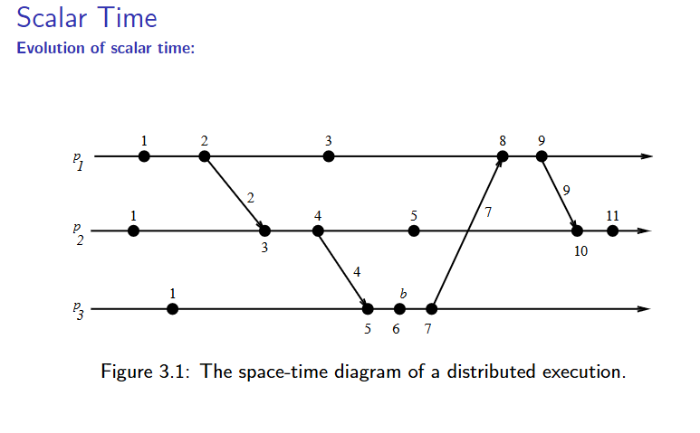
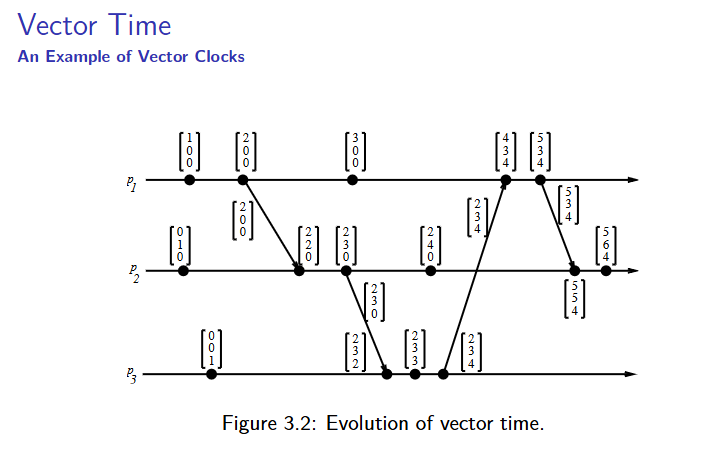
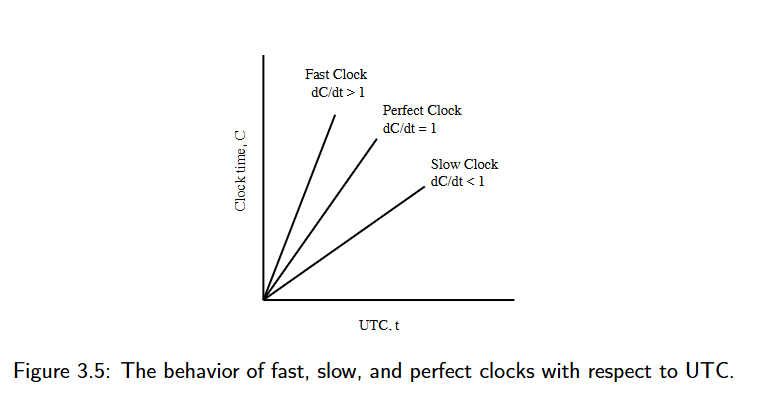
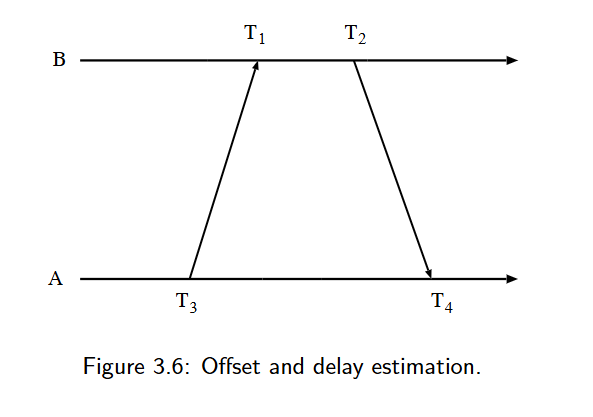

# 高级分布式系统
简介：一些通过通信网络交流连接的自主处理器。分布式系统是**若干独立自主计算机**的集合（硬件），这些计算机对于用户来说像是**单个耦合**系统（软件）——用户或者应用程序感觉系统是一个系统。

## CH-1

分布式系统的特性：
- 无共享物理时钟
- 无共享内存
- 地理上分隔的
- 自主性（计算节点硬件或者软件进程是独立的）与异构性

各软件组件之间的关系（从上到下）：
分布式应用-分布式软件（中间件库）-操作系统和网络协议栈（应用层、传输层、网络层和数据链路层）

分布式系统的设计动机：
1. inherently distributed computation（天然的分布式计算，如不同地区的业务）
2. 资源共享：多节点共享硬件、数据
3. 访问远程资源：跨网络访问资源
4. 提高性能/性价比：廉价节点集群实现高性能
5. 可靠性与可拓展性

并行系统：
1. 多处理器系统（直接访问共享内存，UMA model）
   - 互联网络：总线、多级交换机
2. 多计算机并行系统（无需直接访问共享内存，NUMA model）
   - 常用总线、环、mesh（无线网格网络）
3. 阵列处理器

UMA和NUMA（uniform memory access）
- uma 处理器和内存分离，通过内联网络实现对内存的共享，特点就是所有处理器访问内存的时间一致
- numa 处理器和内存绑定 节点间经过互连网络通信

OmegaNetwork

叽里咕噜的不知道说啥呢。反正就是n个处理器，n个内存；log2n个阶段，n/2个2*2容量的交换机通过互联函数形成某个拓扑结构。

Flynn’sTaxonomy 弗林分类法

分类及说明
- SISD（单指令流单数据流）
定义：单一指令流控制单一处理单元，处理单一数据流。
对应：传统串行计算机（如早期个人电脑）。
- SIMD（单指令流多数据流）
定义：单一指令流控制多个处理单元，同时处理多组数据流。
适用场景：科学计算、大型数组运算。
实例：向量处理器、脉动阵列、Pentium/SSE 指令集、DSP 芯片。
- MISD（多指令流单数据流）
定义：多个指令流控制不同处理单元，共同处理同一数据流。
实例：可视化场景（实际应用较少）。
- MIMD（多指令流多数据流）
定义：多个指令流分别控制不同处理单元，并行处理多组数据流。
适用场景：分布式系统、绝大多数并行系统（是当前主流并行架构）。

并行系统术语

- **耦合性（Coupling）**
定义：硬件 / 软件模块（如操作系统、中间件）之间的依赖 / 绑定程度。
解读：决定了系统的紧 / 松耦合特性（如 UMA 是紧耦合，NUMA 是松耦合）。
- **并行度（Parallelism）**
定义：T(1)/T(n)
（单处理单元耗时与 n 个处理单元耗时的比值）。
解读：由程序与系统共同决定，反映并行加速效果。
- 程序并发性（Concurrency of a program）
定义：衡量程序的有效 CPU 时间与同步等待时间的比例。
解读：并发性越高，CPU 利用率越高。
- 程序粒度（Granularity of a program）
定义：计算量与通信量的比值。
解读：细粒度程序适合紧耦合系统（通信延迟低），粗粒度程序适合松耦合系统。

Message-Passing vs. Shared Memory

消息传递与共享内存
- 基于共享内存模拟消息传递（Emulating MP over SM）：将共享地址空间分区，每个进程有专用的信箱。用内存的写/读来模拟消息的发送/接收
- 基于消息传递模拟共享内存（Emulating SM over MP）：将每个共享对象抽象为独立进程。实现方式：
  - 写共享对象：向拥有该对象的进程发送写消息；
  - 读共享对象：向拥有该对象的进程发送查询消息。

通信原语分类
- 同步（发/收）
  - 发送接收之前需要握手
  - 当接收完成发送才完成
  - 当数据拷贝到缓冲区接收才完成
- 异步（发）
  - 发送方当数据拷贝出用户缓冲区后，控制权立即返回进程
- Blocking（send/ receive ）and Nonblocking（send/ receive ） 阻塞与非阻塞通信原语
  - 阻塞：原语（无论 sync or async）操作完成后，控制权才返回调用进程
  - 非阻塞：调用后控制权立即返回进程，无需等待操作完成；发送：甚至在数据从用户缓冲区拷贝完成前就返回；接收：甚至在数据从发送方到达前就返回。

- Non-blocking Primitive 非阻塞原语的例子：当发起一个非阻塞的发送请求的时候，会返回一个$handle_k$句柄，然后在发送请求发出后，cpu可以去干别的事，直到你需要确认数据是否发送成功。确认的方式有持续检查（轮询）和发起等待（wait）两种，wait操作是阻塞的直到它等待的句柄之一被发布（实际上wait的常用的实现方法是基于硬件中断，除了一些HPC场景，它会把进程加入到一个等待名单中然后阻塞他，直到某个句柄发布然后检查下名单，将在等待对应句柄完成的进程ready）。

经典图片——阻塞/非阻塞；同步/异步；发送/接收原语

- 双横线 (=)：表示进程处于 Blocked（阻塞） 状态，暂停运行，什么都干不了。
- 单横线：表示进程处于 Running（运行） 状态，正在执行代码。
- 粗黑条：表示数据正在从用户缓冲区 复制 (Copy) 到内核缓冲区（或反之）的时间。
- Wait (W)：检查之前的非阻塞操作是否完成。

1. 阻塞同步发送：发送后阻塞，只有确定接收方接收完了，才解开阻塞
2. 非阻塞同步发送：发送后不阻塞，但是因为是同步的，还是要调用wait知道有没有接收完，接收完后才算发送完成。
3. 阻塞异步发送：进程仍会阻塞，但只阻塞到数据拷贝到本地内核缓冲区为止，也就是一旦把数据交给操作系统就算发送完成了
4. 非阻塞异步发送:调用完发送后函数立即返回。PS：系统只是记下了“你要发数据”这个请求，连数据拷贝都没做完，你就继续往下跑代码了。数据拷贝是在后台（由 DMA 或内核线程）默默进行的。当你需要重用你的数据缓冲区时，调用W来确认。

同步和异步的区别：同步总得把数据交给接收方，发送才算完成，不管阻塞不阻塞的；但是异步就不管了，把数据拷贝到内核就算完成。

阻塞和非阻塞的区别：阻塞的话进程会一直等待，不干别的事情；非阻塞的那么可以先进行别的事。

Asynchronous Executions; Mesage-passing System

异步执行基于一些最坏的情况考虑：
1. 没有处理器同步：不存在同步的处理器（处理器速率不一样），没有统一时钟且时钟的漂移无法预测（即使你在开始互相之间对准了，后续误差依旧无法预测）
2. 消息延迟有限但无上限 (Message delays are finite but unbounded)：消息不会丢（除非信道故障），但是你不知道它什么时候送达
3. 处理速度无上限：就是说我们不知道计算机处理一行代码要多久，可能在某个地方卡住了（硬盘什么的）要很久，也可能马上就好

同步执行，和异步执行刚好相反：
1. 处理器之间同步：任意两个处理器之间漂移是有界的。
2. 消息延迟 (message delivery) 发生在一个逻辑步骤或轮次 (logical step or round) 内。意味着消息的传输和交付有严格的时间限制。
3. 进程进行一个步骤所需的时间有一个明确已知的上限。

解释下这张图：取模是因为环形拓扑的需要，要把不存在的第n个进程转成第0个进程；然后消息在局部的邻居进程间传递，但不代表消息在每个round送不到其他进程，在同步执行模型中，一个进程可以在一个轮次内向所有其他进程发送消息（如果需要）

- 总的来说，要实现同步执行是很难的，毕竟要满足那三个条件，尤其是在广域网中。但可以模拟这种同步的抽象，使在应用层上表现得像同步模型。
- 虚拟同步:虚拟同步是一种旨在在异步环境（现实世界中的大多数分布式系统）中提供同步抽象的机制。
- 仿真：异步程序在同步系统上运行很简单，因为三个约束都能满足；但反过来就难了，需要引入一个同步器，同步器通过在软件层面引入协调机制（如全局快照、两阶段提交、或轮次同步协议），模拟同步系统的“轮次”和“有界延迟”特性，从而保证同步程序所需的时序和协调约束。这通常以牺牲性能为代价，因为它引入了额外的通信和等待时间。

- 如上图所示，共享内存和消息传递之间可以互相模拟——通信机制可以转换
- 然后异步和同步也是可以转换的，所以上述这四个系统之间一定情况下是可以转换的。但是基于两个规则：一是failure-free假设，即系统无故障。二是说，系统B模拟的系统A，如果A的问题在B上不可解，那么在A一定不可解；反之，如果A上可解，那么B也一定可解。 

……中间有关系统角度的挑战、算法设计上的难点就跳过了……

## CH-2

### 1. 分布式程序 (A Distributed Program) 的特征

*   **组成：** 由一组 $n$ 个**异步进程** ($P_1, P_2, \dots, P_n$) 组成。
*   **无共享内存和时钟：**
    *   进程**不共享全局内存**，仅通过**消息传递 (passing messages)** 进行通信。
    *   进程**不共享全局时钟**，即没有一个即时可访问的统一时间参考。
*   **异步性：** 进程执行和消息传输都是**异步**的。
*   **处理器假设：** 在不失一般性的前提下，假设每个进程运行在不同的处理器上。
*   **通信信道和消息：**
    *   $C_{ij}$：表示从进程 $P_i$ 到进程 $P_j$ 的通信信道。
    *   $m_{ij}$：表示由 $P_i$ 发送给 $P_j$ 的消息。
*   **消息延迟：** 消息传输延迟是**有限但不可预测 (finite and unpredictable)** 的。

### 2. 分布式执行模型 (A Model of Distributed Executions)

这部分将进程的执行形式化为一系列事件，用于构建逻辑时序。

*   **进程执行：** 进程的执行由其**动作的顺序执行**组成。
*   **原子动作/事件：** 进程的动作被建模为三种类型的**原子事件 (atomic events)**：
    1.  **内部事件 (internal events)：** 进程的本地计算。
    2.  **消息发送事件 (message send events)。**
    3.  **消息接收事件 (message receive events)。**
*   **事件表示法：**
    *   $e_i^x$：表示进程 $P_i$ 的第 $x$ 个事件。
    *   $send(m)$ 和 $rec(m)$：分别表示消息 $m$ 的**发送事件**和**接收事件**。
*   **状态变化：** 事件的发生会改变相应**进程**和**信道**的状态：
    *   **内部事件：** 改变**发生这个事件的进程**的状态。
    *   **发送事件：** 改变**发送消息的进程**的状态和**消息所在信道**的状态（例如，信道中增加了一个在途消息）。
    *   **接收事件：** 改变**接收消息的进程**的状态和**消息所在信道**的状态（例如，信道中减少了一个在途消息）。

*   **线性有序 (Linearly ordered)：** 在一个进程 $P_i$ 内部，事件是按照**发生顺序**进行**线性排序**的。
*   **进程执行历史 ($\mathcal{H}_i$)：** 进程 $P_i$ 的执行产生一个事件序列 $e_i^1, e_i^2, \dots, e_i^x, e_i^{x+1}, \dots$。
    *   $\mathcal{H}_i = (h_i, \rightarrow_i)$
        *   $h_i$：是进程 $P_i$ 产生的所有事件的集合。
        *   二元关系 $\rightarrow_i$：定义了这些事件上的**线性顺序 (linear order)**。
*   **因果依赖 (Causal dependencies)：** 关系 $\rightarrow_i$ 表示了进程 $P_i$ 内部事件之间的**因果依赖关系**（例如，一个事件的发生是下一个事件发生的必要条件）。

*   **消息传递与因果依赖：** 发送事件和接收事件标志着**进程间信息的流动 (flow of information)**，并建立了从**发送进程**到**接收进程**的**因果依赖关系**。
    *   **原因：** 消息的内容（发送者的状态信息）是接收者后续行为的**原因**。
*   **消息因果关系 ($\rightarrow_{msg}$)：** 定义一个关系 $\rightarrow_{msg}$ 来捕获由于消息交换而产生的**因果依赖关系**。
    *   对于两个进程之间交换的每条消息 $m$，我们有：
        $$\text{send}(m) \rightarrow_{msg} \text{rec}(m)$$
        *   这意味着**发送事件** $\text{send}(m)$ 是**接收事件** $\text{rec}(m)$ 的**直接原因**。
*   **定义：** 关系 $\rightarrow_{msg}$ 定义了相应**发送**和**接收事件对**之间的**因果依赖关系**。

*   **事件集 ($H$):** 令 $H = \bigcup_{i} h_i$ 表示分布式计算中所有进程 ($P_1, P_2, \dots$) 所执行的事件集合。
*   **关系 $\rightarrow$ 的定义：** 在事件集 $H$ 上定义一个二元关系 $\rightarrow$，它表达了分布式执行中事件之间的因果依赖关系。对于任意两个事件 $e_i^x, e_j^y \in H$，有 $e_i^x \rightarrow e_j^y$ 当且仅当满足以下**三条规则之一**：

    1.  **进程内顺序 (Intra-process order):**
        $$e_i^x \rightarrow_i e_j^y \quad \text{i.e., } (i = j) \land (x < y)$$
        *   **含义：** 如果 $e_i^x$ 和 $e_j^y$ 发生在**同一进程** ($P_i=P_j$) 中，并且 $e_i^x$ **先于** $e_j^y$ 发生，则 $e_i^x \rightarrow e_j^y$。

    2.  **消息传递顺序 (Message passing order):**
        $$e_i^x \rightarrow_{msg} e_j^y$$
        *   **含义：** 如果 $e_i^x$ 是一个消息 $m$ 的**发送事件**，而 $e_j^y$ 是同一个消息 $m$ 的**接收事件**，则 $e_i^x \rightarrow e_j^y$。

    3.  **传递性 (Transitivity):**
        $$\exists e_k^z \in H: e_i^x \rightarrow e_k^z \land e_k^z \rightarrow e_j^y$$
        *   **含义：** 如果存在另一个事件 $e_k^z$，使得 $e_i^x$ 先于 $e_k^z$ 发生，且 $e_k^z$ 先于 $e_j^y$ 发生，则 $e_i^x \rightarrow e_j^y$（即，因果关系是**可传递**的）。

*   **偏序关系 (Partial Order):** 因果优先关系 $\rightarrow$ 在分布式计算的事件上导出一个**不可自反的偏序关系 (irreflexive partial order)**，记为 $\mathcal{H}=(H, \rightarrow)$。

*   **Lamport 关系：** 关系 $\rightarrow$ 就是“发生在先” 关系。
*   **依赖性 (Dependency):**
    *   如果 $e_i \rightarrow e_j$，则事件 $e_j$ **直接或传递地依赖于 (directly or transitively dependent on)** 事件 $e_i$。 意味着在空间-时间图上，这意味着存在一条由**消息箭头**和**进程线段**组成的路径，从 $e_i$ 开始，到 $e_j$ 结束，且路径方向始终是**沿着时间增加的方向**。
    *   **信息流:** 关系 $e_i \rightarrow e_j$ 表示分布式计算中**信息流**的方向，它意味着所有在 $e_i$ 处可用的信息**可能**在 $e_j$ 处也是可访问的。
    *   **示例：** 在上图中，$e_2^6$ 已经获知图中所示的所有其他事件，因为从所有其他事件到 $e_2^6$ 都存在一条沿着时间增加方向的因果路径。
   
这张图片在上文定义了**因果先行关系 ($\rightarrow$)** 的基础上，进一步定义了其反面——**缺乏因果关系**以及**并发事件 (Concurrent events)** 的概念。

*   **定义：** 对于任意两个事件 $e_i$ 和 $e_j$，如果 $e_i \not\rightarrow e_j$，表示事件 $e_j$ **不直接或传递地依赖于**事件 $e_i$。
*   **含义：** 这意味着事件 $e_i$ 的执行**不会因果地影响 (causally affect)** 事件 $e_j$ 的执行。
*   **信息流：** 在这种情况下，事件 $e_j$ 不知道事件 $e_i$ 的执行或不知道任何发生在 $e_i$ 同个进程之后的事件。

*   **规则总结：**
    1.  $e_i \not\rightarrow e_j \not\Rightarrow e_j \not\rightarrow e_i$
    2.  $e_i \rightarrow e_j \Rightarrow e_j \not\rightarrow e_i$：这是偏序关系的**不可自反性**，即如果 $e_i$ 导致了 $e_j$，那么 $e_j$ 不可能再导致 $e_i$（无环）。

#### 并发事件 (Concurrent events)

*   **定义 ($\parallel$):** 对于任意两个事件 $e_i$ 和 $e_j$，如果**既没有** $e_i \rightarrow e_j$ **也没有** $e_j \rightarrow e_i$，则称事件 $e_i$ 和 $e_j$ **并发 (concurrent)**，记作 $e_i \parallel e_j$。
*   **含义：** 并发事件之间没有因果关系。它们可以被任意排序而不会改变分布式计算的逻辑结果（但它们的物理时间顺序是无法确定的）。

*   **非传递性 (Non-transitive):**
    *   **关系 $\parallel$ 是不传递的 (is not transitive)：** 即 $(e_i \parallel e_j) \land (e_j \parallel e_k)$ **不一定**意味着 $e_i \parallel e_k$。
    *   **示例：** 在图 2.1 中，$e_3^3 \parallel e_2^4$（$e_3^3$ 和 $e_2^4$ 并发）且 $e_2^4 \parallel e_1^5$（$e_2^4$ 和 $e_1^5$ 并发），但 $e_3^3 \not\parallel e_1^5$（因为 $e_3^3 \rightarrow e_2^4 \rightarrow e_1^5$ 成立，所以 $e_3^3 \rightarrow e_1^5$）。

*   **三元组关系:**
    *   在分布式执行中，对于任意两个事件 $e_i$ 和 $e_j$，它们之间的关系**必是以下三种之一**：
        $$e_i \rightarrow e_j \quad \text{or} \quad e_j \rightarrow e_i \quad \text{or} \quad e_i \parallel e_j$$
    *   这三种关系**互斥**且**完备**地划分了分布式系统中的所有事件对。

这张图片涵盖了两个重要的概念：**逻辑并发与物理并发 (Logical vs. Physical Concurrency)** 的区别，以及**通信网络的模型 (Models of Communication Networks)**。

#### 逻辑并发 vs. 物理并发 (Logical vs. Physical Concurrency)

这部分强调了在分布式系统中，**因果关系 (causality)** 比**物理时间** 顺序更重要的观点。

*   **逻辑并发 (Logical concurrency):**
    *   在分布式计算中，两个事件是**逻辑并发**的,当且仅当它们**不因果地影响彼此**。
    *   逻辑并发关系只取决于事件之间的**发生在先 ($\rightarrow$) 关系**。

*   **物理并发:**
    *   **物理并发**意味着事件在**物理时间的同一瞬间**发生。

*   **关系和重点：**
    *   **不同步：** 两个或多个事件可能**逻辑并发**，即使它们**没有在物理时间的同一瞬间发生**。
    *   **不影响结果：** 一组逻辑并发事件**是否在物理时间上重合，不会改变计算的结果**。
    *   **可假设：** 因此，即使一组逻辑并发事件在物理时间上并没有在同一瞬间发生，我们也可以**假设**它们在物理时间上是同时发生的，因为它们之间缺乏因果依赖，这种假设不会影响计算的逻辑正确性。

**核心思想：** 在分布式系统中，由于无法确定一个精确的全局时钟，**逻辑并发**（基于因果关系）是比**物理并发**更重要且更有用的概念。

### 3. 通信网络模型 (Models of Communication Networks)

*   **服务模型：** 通信网络提供了几种服务模型，特别是关于消息排序的：
    1.  **FIFO (First-In, First-Out)：** 先进先出。
    2.  **Non-FIFO (Non-First-In, Non-Out)：** 非先进先出。
    3.  **Causal Ordering (因果排序)。**

*   **FIFO 模型：**
    *   每个信道充当一个**先进先出的消息队列 (first-in first-out message queue)**。
    *   因此，**消息顺序由信道保持**。即，如果进程 A 发送消息 $m_1$ 给进程 B，紧接着发送 $m_2$，那么 B 接收 $m_1$ 的顺序一定在 $m_2$ 之前。

*   **Non-FIFO 模型：**
    *   一个信道充当一个**集合**。发送进程向其中添加消息，接收进程以**随机顺序** 从中移除消息。
    *   在非 FIFO 模型中，不保证消息的发送顺序与接收顺序一致。

*   **因果排序模型 (Causal Ordering Model)：** 它要求如果消息 $m_1$ **因果地发生在先**于 $m_2$，则所有接收者必须先接收 $m_1$ 再接收 $m_2$。

*   **基础：** **因果排序 (CO)** 模型基于 **Lamport 的“发生在先”关系** ($\rightarrow$)。

*   **定义：** 一个支持因果排序模型的系统满足以下特性 (CO)：
    $$ CO：\forall m_{ij}\And m_{kj}, \quad if: send(m_{ij}) \rightarrow send(m_{kj})，then:rec(m_{ij}) \rightarrow rec(m_{kj})
    $$。

*   **含义解释：**
    *   **前提 $send(m_{ij}) \rightarrow send(m_{kj})$：** 表示 $m_{ij}$ 的发送事件**因果地发生在先**于 $m_{kj}$ 的发送事件（可能是通过 $P_i$ 内部的事件序列或通过另一条消息传递）。
    *   **结论 $rec(m_{ij}) \rightarrow rec(m_{kj})$：** 保证**接收者 $P_j$ 必须先接收 $m_{ij}$，然后才能接收 $m_{kj}$**。

*   **作用：** 这个特性确保了发送给**同一目的地**的、**因果相关的消息**，将以**与其因果关系一致的顺序**交付。即，如果 $m_1$ 导致了 $m_2$ 的发送，那么 $m_2$ 永远不能在 $m_1$ 之前被接收。

#### 因果排序与其他模型的关系

*   **CO 蕴含于 FIFO：** 消息的因果有序交付**隐含着** FIFO 消息交付。
    *   **原因：** 如果 $P_i$ 连续发送 $m_1$ 和 $m_2$，则 $send(m_1) \rightarrow_i send(m_2)$。根据 CO 特性，必须 $rec(m_1) \rightarrow rec(m_2)$。这恰好是 FIFO 的定义。
    *   **层次关系：** 因果排序 $CO$ 是比 FIFO 更严格的保证，而 FIFO 又比 Non-FIFO 更严格。
$$\text{CO} \subset \text{FIFO} \subset \text{Non-FIFO}$$

*   **内置同步：** 因果排序模型极大地**简化了分布式算法的设计**，因为它**提供了内置的同步机制**。算法设计者不再需要手动追踪和保证因果关系，因为通信层已经保证了所有因果相关的消息都会按正确的顺序到达。   

这张图片定义了**分布式系统的全局状态 (Global State of a Distributed System)** 的概念，并提出了用于形式化表示状态和事件的**符号 (Notations)**。

### 4.分布式系统的全局状态 

*   **定义：** 分布式系统的全局状态是其所有**组件**的**局部状态 (local states)** 的集合，这些组件包括**进程**和**通信信道**。

*   **进程的局部状态:**
    *   由处理器寄存器、堆栈、局部内存等**内容**定义。
    *   取决于分布式应用程序的**局部上下文**。

*   **信道的局部状态:**
    *   由信道中**正在传输** 的消息集合给出。

*   **状态变化 (State changes):**
    *   事件的发生改变相应**进程**和**信道**的状态（上面有）：

#### 符号 (Notations)

这部分定义了用于表示进程局部状态和事件历史的形式化符号：

*   **$LS_i^x$:**
    *   表示进程 $P_i$ 在事件 $e_i^x$ **发生之后**、事件 $e_i^{x+1}$ **发生之前**的状态。
    *   **含义：** 这是一个**时间点**上的快照，是进程 $P_i$ 迄今为止执行的结果。

*   **$LS_i^0$:**
    *   表示进程 $P_i$ 的**初始状态**。

*   **$LS_i^x$ 的另一种理解：**
    *   $LS_i^x$ 是进程 $P_i$ **执行所有事件直到 $e_i^x$ 的结果**。

*   **$\text{send}(m) \le LS_i^x$:**
    *   表示**存在** 某个时间点 $y$（$1 \le y \le x$），使得进程 $P_i$ 的第 $y$ 个事件 $e_i^y$ **是发送消息 $m$ 的事件** ($e_i^y = \text{send}(m)$)。
    *   **含义：** 消息 $m$ 在 $P_i$ 记录的 $x$ 个事件中**被发送了**。

*   **$\text{rec}(m) \not\le LS_i^x$:**
    *   表示**对于所有** 时间点 $y$（$1 \le y \le x$），进程 $P_i$ 的第 $y$ 个事件 $e_i^y$ **都不是接收消息 $m$ 的事件** ($e_i^y \neq \text{rec}(m)$)。
    *   **含义：** 消息 $m$ 在 $P_i$ 记录的 $x$ 个事件中**尚未被接收**。

#### 信道状态 (A Channel State)

*   **信道状态的依赖：** 信道的状态取决于它所连接的**进程的状态**。
*   **符号 $SC_{ij}^{x,y}$ 的定义：**
    *   $SC_{ij}^{x,y}$ 表示从进程 $P_i$ 到进程 $P_j$ 的信道 $C_{ij}$ 的状态。
    *   **集合定义：**
        $$SC_{ij}^{x,y} = \{ m_{ij} \mid \text{send}(m_{ij}) \le e_i^x \land \text{rec}(m_{ij}) \not\le e_j^y \}$$
    *   **含义解释：** 集合 $SC_{ij}^{x,y}$ 包含了所有满足以下两个条件的消息 $m_{ij}$：
        1.  $\text{send}(m_{ij}) \le e_i^x$：消息 $m_{ij}$ 在 $P_i$ 执行到事件 $e_i^x$ **为止被发送了**。
        2.  $\text{rec}(m_{ij}) \not\le e_j^y$：消息 $m_{ij}$ 在 $P_j$ 执行到事件 $e_j^y$ **为止尚未被接收**。
    *   **结论：** $SC_{ij}^{x,y}$ 表示在 $P_i$ 记录了 $e_i^x$ 且 $P_j$ 记录了 $e_j^y$ 这一时刻，**信道 $C_{ij}$ 中所有正在传输的（在途）消息集合**。

#### 全局状态 (Global State)

*   **定义回顾：** 分布式系统的全局状态 $GS$ 是所有**进程的局部状态**和所有**信道的局部状态**的集合。
*   **符号定义：** 全局状态 $GS$ 被定义为：
    $$GS = \{ \bigcup_i LS_i^{x_i}, \bigcup_{j,k} SC_{jk}^{y_{j}, z_{k}} \}$$
    *   $LS_i^{x_i}$：所有进程 $P_i$ 的局部状态（记录到各自事件 $e_i^{x_i}$）。
    *   $SC_{jk}^{y_{j}, z_{k}}$：所有信道 $C_{jk}$ 的状态（在 $P_j$ 记录到 $e_j^{y_{j}}$ 且 $P_k$ 记录到 $e_k^{z_{k}}$ 时刻）。

*   **有意义的全局状态 (Meaningful Global State) 的挑战：**
    *   **要求：** 要使一个全局状态有意义，分布式系统中**所有组件的状态必须在同一瞬间被记录 (must be recorded at the same instant)**。
    *   只有在以下情况下才可能实现：
        1.  所有进程的局部时钟**完美同步**；
        2.  或存在一个进程可以**即时读取**的**全局系统时钟** (However, both are impossible.)**。

这张图片定义了分布式系统理论中最重要的概念之一：**一致性全局状态 (A Consistent Global State)**，并提供了形式化的条件和图示示例。

#### 一致性全局状态 (A Consistent Global State)

*   **核心思想：** 即使所有组件的状态不是在同一瞬间记录的，只要这个状态**不违反因果关系 (does not violate causality)**，它仍然是**有意义 (meaningful)** 的。
*   **因果律要求：**
    *   **效果不应先于原因：** 一个效果不应该在没有它的原因的情况下出现。
    *   **消息的发送与接收：** 一个消息的接收不能在它没有被发送的情况下发生。
    *   **一致性状态：** 满足上述因果律的状态被称为**一致性全局状态**，它们是有意义的全局状态。
*   **不一致性状态 (Inconsistent Global States):**
    *   不一致的全局状态是**无意义的**，因为一个分布式系统**永远不可能处于不一致的状态**（系统不可能接收到一个从未被发送的消息）。

####  一致性全局状态的形式化条件

一个全局状态 $GS$ 是**一致性全局状态**当且仅当对于任意消息 $m_{ij}$，以下条件成立：

$$\forall m_{ij}: \text{send}(m_{ij}) \not\le LS_j^{x_j} \iff m_{ij} \not\in SC_{ij}^{x_i, y_j} \land \text{rec}(m_{ij}) \not\le LS_i^{y_j}$$

*   就是说$SC_{ij}^{x_i, y_j}$和$LS_i^{y_j}$不能包含任何进程$p_i$在$e_i^{x_i}$后执行的消息。

*   **核心一致性条件 （最简形式）：**
    * **如果一个进程的局部状态记录了消息的接收，那么发送该消息的进程的局部状态必须记录了该消息的发送。**
    *   即，你不能**记录了效果 (接收)**，却没有**记录原因 (发送)**。

*   **全局状态 $GS_1$ 的局部状态：** $GS_1 = \{LS_1^1, LS_2^3, LS_3^3, LS_4^2\}$
    *   $LS_1^1$：进程 $P_1$ 记录到 $e_1^1$ 事件之后的状态。
    *   $LS_2^3$：进程 $P_2$ 记录到 $e_2^3$ 事件之后的状态。
    *   $LS_3^3$：进程 $P_3$ 记录到 $e_3^3$ 事件之后的状态。
    *   $LS_4^2$：进程 $P_4$ 记录到 $e_4^2$ 事件之后的状态。

*   **不一致性原因：** **$P_2$ 的状态 ($LS_2^3$) 已经记录了消息 $m_{12}$ 的接收**（因为 $\text{rec}(m_{12}) = e_2^2$，而 $e_2^2$ 发生在 $e_2^3$ 之前），**然而，$P_1$ 的状态 ($LS_1^1$) 却没有记录其发送**（因为 $\text{send}(m_{12}) = e_1^2$，而 $e_1^2$ 发生在 $e_1^1$ 之后）。
    *   **违反因果律：** 这违反了**一致性全局状态**的核心原则——**你不能记录了效果（接收），却没有记录原因（发送）**。在 $GS_1$ 这个快照点上，系统“看到”了 $P_2$ 接收了 $m_{12}$，但 $P_1$ 却还“不知道”它发送过 $m_{12}$。因此，$GS_1$ 是**不一致的**。

---

*   **全局状态 $GS_2$ 的局部状态：** $GS_2 = \{LS_1^2, LS_2^4, LS_3^4, LS_4^2\}$
    *   $LS_1^2$：进程 $P_1$ 记录到 $e_1^2$（**发送 $m_{12}$**）之后的状态。
    *   $LS_2^4$：进程 $P_2$ 记录到 $e_2^4$ 之后的状态（已经接收 $m_{12}$ 和 $m_{21}$ 的发送）。
    *   $LS_3^4$：进程 $P_3$ 记录到 $e_3^4$ 之后的状态。
    *   $LS_4^2$: 进程 $P_4$ 记录到 $e_4^2$ 之后的状态。

*   **一致性分析：**
    *   **消息 $m_{12}$：** $P_1$ ($LS_1^2$) 记录了发送，而 $P_2$ ($LS_2^4$) 记录了接收。**一致。**
    *   **消息 $m_{21}$：** $P_2$ ($LS_2^4$) 记录了发送 （$e_2^3$），而 $P_1$ ($LS_1^2$) **尚未**记录接收 （$e_1^3$ 发生在 $e_1^2$ 之后，但 $e_1^3$ 接收 $m_{21}$）。
        *   因此，$m_{21}$ 必须处于**在途状态**，即 $m_{21} \in SC_{21}^{4,2}$。
    *   **信道状态：** 描述称**所有信道都是空的，除了 $C_{21}$ 包含消息 $m_{21}$**。
    *   **结论：** 在 $GS_2$ 这个快照点：
        *   所有**已接收**的消息，其发送也一定被记录了。
        *   所有**已发送但未接收**的消息 $m_{21}$ 被正确地记录在了信道状态 $C_{21}$ 中。
        *   因此，$GS_2$ 是**一致的**。

### 5.切面
把分布式计算时空图分为过去和未来两个部分。简单来说，画切面的时候 PAST(C)可以包含已发送的信息，但是不能包含了已接收的信息却不包含该信息的发送事件。FUTURE( C) 即为切面右侧的部分

- 一致性切面：在一个一致性切面中，所有在切面的过去 (PAST) 部分接收到的消息，其发送事件也必须在切面的过去 (PAST) 部分。
- 在途消息 (In-transit Messages):
所有跨越切面，从过去 (PAST) 到未来 (FUTURE) 的消息，在对应的一致性全局状态中都被认为是在途的 (in transit)。
- 不一致性切面 (Inconsistent Cut):
如果一个消息跨越切面，从未来 (FUTURE) 到过去 (PAST)，那么这个切面是不一致的 (inconsistent)。

#### 事件的过去锥 (Past Cone of an Event)

*   **定义：**
    *   一个事件 $e_j$ 只可能受到所有满足因果关系 $e_i \to e_j$ 的事件 $e_i$ 的影响。
    *   在这种情况下，在 $e_i$ 处可用的所有信息都可以在 $e_j$ 处获取。
    *   所有这些事件 $e_i$ 都属于 $e_j$ 的**过去**。
    *   让 $Past(e_j)$ 表示计算 $(H, \to)$ 中 $e_j$ 的过去中的所有事件。

*   **数学表达式：**
    $$Past(e_j) = \{e_i | \forall e_i \in H, e_i \to e_j\}$$

-  局部过去 (Local Past) $Past_i(e_j)$：
    -   设 $Past_i(e_j)$ 是 $Past(e_j)$ 中所有发生在进程 $p_i$ 上的事件的集合。
    -   $Past_i(e_j)$ 是一个**全序集**，按照进程内部的偏序关系 $\to_i$ 排序。
    -   其**最大元素**记为 $\max(Past_i(e_j))$。
    -   $\max(Past_i(e_j))$ 是在进程 $p_i$ 上**影响**事件 $e_j$ 的**最晚**（最新）事件。

-  过去锥的表面 (Surface of the Past Cone) $Max\_Past(e_j)$：**

    -   定义 $Max\_Past(e_j)$ 为所有 $\max(Past_i(e_j))$ 集合的**并集**：
    -   $$Max\_Past(e_j) = \bigcup_{(\forall i)} \{\max(Past_i(e_j))\}$$
    -   $Max\_Past(e_j)$ 由**影响**事件 $e_j$ 的**每个进程**上的**最晚事件**组成，被称为 $e_j$ **过去锥的表面**。
    -   $Past(e_j)$ 代表了影响 $e_j$ 的**过去光锥**上的所有事件。

---

#### 事件的未来锥 (Future Cone of an Event)

*   **定义：**
    *   事件 $e_j$ 的未来，记为 $Future(e_j)$，包含所有被 $e_j$ **因果影响**的事件 $e_i$。
*   **数学表达式：**
    *   在计算 $(H, \to)$ 中，$Future(e_j)$ 定义为：
        $$Future(e_j) = \{e_i | \forall e_i \in H, e_j \to e_i\}$$
    *   （即：事件 $e_i$ 发生在 $e_j$ 之后，且 $e_j$ 能够影响到 $e_i$。）

这张图片接续了关于事件的过去锥和未来锥的定义，并重点阐述了未来锥的表面和并发事件集的概念。

以下是内容的中文总结：

- 局部未来 (Local Future) $Future_i(e_j)$：
    - 定义 $Future_i(e_j)$ 为 $Future(e_j)$ 中所有发生在进程 $p_i$ 上的事件的集合。

- 最小未来事件 (Minimum Future Event) $\min(Future_i(e_j))$：

    - 定义 $\min(Future_i(e_j))$ 为进程 $p_i$ 上**第一个**受 $e_j$ 影响的事件。

- 未来锥的表面 (Surface of the Future Cone) $Min\_Future(e_j)$：

    - 定义 $Min\_Future(e_j)$ 为所有 $\min(Future_i(e_j))$ 集合的**并集**：
    - $$Min\_Future(e_j) = \bigcup_{(\forall i)} \{\min(Future_i(e_j))\}$$
    - $Min\_Future(e_j)$ 由**每个进程**上**第一个**被事件 $e_j$ **因果影响**的事件组成。
    - $Min\_Future(e_j)$ 被称为 $e_j$ **未来锥的表面**。

---

#### 并发事件 (Concurrent Events)

**1. 进程内部的并发事件：**

*   在进程 $p_i$ 上，所有发生在 $\max(Past_i(e_j))$ **之后**，但在 $\min(Future_i(e_j))$ **之前**的事件，都与 $e_j$ **并发 (concurrent)**。
    *   （注：$\max(Past_i(e_j))$ 是 $p_i$ 上影响 $e_j$ 的最晚事件；$\min(Future_i(e_j))$ 是 $p_i$ 上被 $e_j$ 影响的第一个事件。发生在两者之间的事件与 $e_j$ 既没有因果先后关系，也不在同一进程上与 $e_j$ 直接关联，因此是并发的。）

**2. 整个计算的并发事件集：**

*   因此，计算 $H$ 中，所有且仅有属于集合 "**$H - Past(e_j) - Future(e_j)$**" 的事件与事件 $e_j$ **并发**。
    *   （$H$ 是所有事件的集合。从总事件集中，减去 $e_j$ 的过去事件集（因果发生于 $e_j$ 之前）和 $e_j$ 的未来事件集（因果发生于 $e_j$ 之后），剩下的事件集就是与 $e_j$ **没有因果关系**的并发事件集。）
*   
这张图片介绍了进程通信的两种基本模型：**同步通信（Synchronous Communication）** 和 **异步通信（Asynchronous Communication）**，并比较了它们的特点、优缺点。

以下是内容的中文总结：

### 6.进程通信模型 (Models of Process Communications)

进程通信有两种基本模型：**同步**和**异步**。

#### 1. 同步通信模型 (Synchronous Communication Model)

*   是一种**阻塞**类型。
*   当发送一个消息时，发送进程会**阻塞**，直到接收进程**接收**到该消息。
*   发送进程只有在得知接收进程已**接受**该消息后才会恢复执行。
*   因此，发送进程和接收进程**必须同步**才能交换消息。

#### 2. 异步通信模型 (Asynchronous Communication Model)

*   是一种**非阻塞**类型。
*   发送方和接收方**不进行同步**来交换消息。
*   发送进程在发送消息后，**不会等待**消息被递交给接收进程。
*   消息会被系统**缓冲**起来，并在接收进程**准备好接收**时被递交。

---

#### 通信模型的优缺点

*   **模型优劣：** 两种通信模型并无绝对的优劣之分。

1. 异步通信的优缺点：

*   **优点（并行性）：** 异步通信提供**更高的并行性**，因为发送进程可以在消息**在途**（in transit）时继续执行。
*   **缺点（缓冲）：**
    *   如果一个进程**突发性地**向另一个进程发送大量消息，可能会发生**缓冲区溢出**。
    *   因此，实现异步通信需要**更复杂的缓冲区管理**。
    *   由于更高的并行性和非确定性，**设计、验证和实现**基于异步通信的分布式算法**更加困难**。

2. 同步通信的优缺点：

*   **优点（简单性）：** 同步通信**更易于处理和实现**。
*   **缺点（性能与死锁）：** 然而，由于频繁的阻塞，它很可能导致**较差的性能**，并且**更容易发生死锁**。
*   

## CH3

### 因果关系与逻辑时间 (Causality and Logical Time)

#### 因果关系的基础性：

事件之间的**因果关系**概念对于并行和分布式计算及操作系统的设计与分析至关重要。
通常情况下，因果关系是通过**物理时间**来追踪的。
在分布式系统中，**不可能**拥有一个**全局物理时间**。
由于**异步**分布式计算是**间歇性**地进展的，**逻辑时间**足以捕获分布式系统中与因果关系相关的基本**单调性**（Monotonicity）特性。

这一章的内容相对来说比较简单，略。

### 逻辑时钟系统框架和实现

#### 1. 进程 $p_i$ 维护的两种时钟 (Two Clocks Maintained by Process $p_i$)

每个进程 $p_i$ 维护的数据结构需要提供以下两种能力：

1.  **本地逻辑时钟 (Local Logical Clock) $lc_i$：**
    *   记为 $lc_i$，它帮助进程 $p_i$ **衡量自身的进展**。

2.  **逻辑全局时钟 (Logical Global Clock) $gc_i$：**
    *   记为 $gc_i$，它是对进程 $p_i$ **本地**所见到的**逻辑全局时间**的表示。
    *   通常情况下，$lc_i$ 是 $gc_i$ 的**一部分**。

#### 2. 协议规则 (Protocol Rules)

*   该协议确保进程的逻辑时钟，以及它对全局时间的看法，得到**一致性**地管理。
*   该协议由以下两条规则组成：

    *   **R1（更新本地时钟的规则）：**
        *   这条规则规定了一个进程在执行一个事件时，应该如何**更新**其**本地逻辑时钟**。

    *   **R2（更新全局时钟的规则）：**
        *   这条规则规定了一个进程应该如何**更新**其**逻辑全局时钟**，以更新它对**全局时间**和**全局进展**的看法。

*   不同的逻辑时钟系统，其**逻辑时间的表示方式**（即 $gc_i$ 的数据结构）以及用于**更新逻辑时钟的协议**（即 R1 和 R2 的具体实现）有所不同。

这张图片介绍了实现逻辑时间的第一种方法：**标量时间 (Scalar Time)**，通常被称为 **Lamport 时钟 (Lamport Clock)**。

以下是内容的中文总结：

### 3. 标量时间 / Lamport 时钟 (Scalar Time / Lamport Clock)

*   **提出者：** 由 Lamport 在 1978 年提出，旨在尝试在分布式系统中对事件进行**全序排序**。
*   **时间域：** 时间域是**非负整数**的集合。
*   **时钟表示：** 进程 $p_i$ 的**本地逻辑时钟** $lc_i$ 和它对**全局时间**的本地视图 $gc_i$ 被压缩成一个**单一的整数变量 $C_i$**。

#### 更新时钟的规则 (Rules R1 and R2)

更新时钟的规则 $R1$ 和 $R2$ 如下：

**R1：本地事件规则 (Local Event Rule)**

*   **执行时机：** 在执行任何事件（发送、接收或内部事件）**之前**，进程 $p_i$ 执行以下操作：
    $$C_i := C_i + d \quad (d > 0)$$
*   **$d$ 的值：** 一般而言，每次执行 $R1$ 时，$d$ 可以有不同的值；但通常情况下，$d$ 被设置为 **1**。

**R2：消息接收规则 (Message Reception Rule)**

*   **消息携带：** 每条消息都**附加 (piggybacks)** 了发送方在发送时的**时钟值**。
*   **接收动作：** 当进程 $p_i$ 接收到一条带有时间戳 $C_{msg}$ 的消息时，它执行以下动作：
    1.  **更新时钟：**
        $$C_i := \max(C_i, C_{msg})$$
    2.  **执行 R1：**
        *   **执行 $R1$**，即 $C_i := C_i + d$ （通常是 $C_i := C_i + 1$）。
    3.  **递交消息：**
        *   将消息递交给应用程序。

#### 一致性属性 (Consistency Property)

*   **满足条件：** 标量时钟满足**单调性**，因此满足**一致性属性**：
    *   对于两个事件 $e_i$ 和 $e_j$，如果 $e_i \to e_j$ （$e_i$ 发生在 $e_j$ 之前），则 $C(e_i) < C(e_j)$。
    *   $$e_i \to e_j \Rightarrow C(e_i) < C(e_j)$$

#### 全序排序 (Total Ordering)

*   **用途：** 标量时钟可用于在分布式系统中对事件进行**全序排序**。
*   **主要问题（时间戳冲突）：** 实现全序排序的主要问题是，来自**不同进程**的两个或多个事件可能拥有**相同的时间戳**。
    *   （例如：在图 3.1 中，进程 $P_1$ 的第三个事件和进程 $P_2$ 的第二个事件具有相同的标量时间戳。）

#### 打破平局机制 (Tie-Breaking Mechanism)

*   为了对这类具有相同时间戳的事件进行排序，需要一个**打破平局的机制**。平局按以下方式打破：

    *   **进程标识符排序：** 进程标识符被**线性排序**，并且具有相同标量时间戳的事件之间的平局是基于它们的**进程标识符**来打破的。
    *   **优先级：** 在排序中，**进程标识符越小**，其优先级**越高**。
    *   **事件时间戳表示：** 一个事件的时间戳被表示为一个**有序对** $(t, i)$，其中 $t$ 是事件发生的**时间**（标量时间戳），$i$ 是事件发生所在**进程的标识符**。
    *   **全序关系定义：** 对于两个事件 $x$ 和 $y$，其时间戳分别为 $(h, i)$ 和 $(k, j)$，它们之间的**全序关系 $\prec$** 定义如下：
        $$x \prec y \iff (h < k) \quad \text{或} \quad (h = k \text{ 且 } i < j)$$
        （即：如果时间戳 $h$ 小于 $k$，则 $x \prec y$；如果时间戳 $h$ 等于 $k$，则比较进程标识符 $i$，如果 $i$ 小于 $j$，则 $x \prec y$。）

#### 事件计数 (Event Counting) / 事件高度 (Height of an Event)

*   **特性：** 如果增量值 $d$ 总是 **1**，标量时间具有以下有趣的属性：
    *   如果事件 $e$ 的时间戳是 $h$，那么 $h-1$ 代表了在事件 $e$ 产生之前所需的**最小逻辑持续时间**（以事件为单位计数），而**无需考虑**产生这些事件的进程。
*   **名称：** 我们称之为事件 $e$ 的**高度 (height)**。
*   **换句话说：** $h-1$ 个事件在事件 $e$ 之前已经**按顺序**产生了。
*   （例如：在图 3.1 中，有**五个**事件位于以 $b$ 结尾的最长因果路径上，因此 $b$ 的时间戳为 6。）

#### 不满足强一致性 (No Strong Consistency)

*   **不满足条件：** 标量时钟系统**不满足强一致性**。也就是说，对于两个事件 $e_i$ 和 $e_j$，从 $C(e_i) < C(e_j)$ **不能推导出** $e_i \to e_j$。
    $$C(e_i) < C(e_j) \not\Rightarrow e_i \to e_j$$
*   **实例：** （例如：在图 3.1 中，进程 $P_1$ 的第三个事件的时间戳小于进程 $P_2$ 的第三个事件的时间戳。然而，前者**并非**发生在后者之前。）
*   **不一致的原因：** 标量时钟不满足强一致性的原因是，进程的**本地时钟**和**逻辑全局时钟**被**压缩成一个单一变量**，这导致了**不同进程**间事件的**因果依赖信息丢失**。
*   **信息丢失的例子：** （例如：在图 3.1 中，当进程 $P_2$ 接收到来自进程 $P_1$ 的第一条消息时，它将自己的时钟更新为 3，从而**忘记了**它所依赖的 $P_1$ 上的最新事件的时间戳是 2。）

### 向量时间 (Vector Time)

*   **提出者：** 向量时钟系统由 Fidge, Mattern 和 Schmuck 独立开发。
*   **时间域：** 在向量时钟系统中，时间域由一组 **$n$ 维非负整数向量**表示（其中 $n$ 是进程总数）。
*   **时钟表示：**
    *   每个进程 $p_i$ 维护一个**向量 $vt_i[1..n]$**。
    *   $vt_i[i]$ 是进程 $p_i$ 的**本地逻辑时钟**，描述了进程 $p_i$ 的逻辑时间进展。
    *   $vt_i[j]$ 代表进程 $p_i$ 对进程 $p_j$ **本地时间进展的最新了解**。
    *   如果 $vt_i[j]=x$，则表示进程 $p_i$ 知道进程 $p_j$ 的本地时间已经进展到 $x$。
    *   **整个向量 $vt_i$** 构成了进程 $p_i$ 对**全局逻辑时间**的视图，并用于为事件打上时间戳。

#### 更新时钟的规则 (Rules R1 and R2)

进程 $p_i$ 使用以下两条规则 $R1$ 和 $R2$ 来更新其时钟：

**R1：本地事件规则 (Local Event Rule)**

*   **执行时机：** 在执行一个事件**之前**，进程 $p_i$ 按照如下方式更新其**本地逻辑时间**：
    $$vt_i[i] := vt_i[i] + d \quad (d > 0)$$
    *   （即，只更新进程 $p_i$ 自己的分量。）

**R2：消息接收规则 (Message Reception Rule)**

*   **消息携带：** 每条消息 $m$ 都**附加** 了发送进程在发送时的**向量时钟 $vt$**。
*   **接收动作：** 进程 $p_i$ 收到携带消息 $m$ 和向量时钟 $vt$ 的消息时，执行以下一系列动作：

    1.  **更新其逻辑全局时间：**
        *   对向量的**所有分量**进行更新：
            $$\text{对于 } 1 \le k \le n: \quad vt_i[k] := \max(vt_i[k], vt[k])$$
            *   （即，进程 $p_i$ 将它自己的每个分量 $k$ 更新为 $\max(\text{自己知道的} p_k \text{ 的时间}, \text{消息携带的 } p_k \text{ 的时间})$。）
    2.  **执行 R1：**
        *   执行 $R1$ (即更新自己的分量 $vt_i[i]$)。
    3.  **递交消息 $m$：**
        *   将消息递交给应用程序。

#### 1. 向量时间戳的一般比较关系

定义以下关系用于比较两个向量时间戳 $vh$ 和 $vk$：

*   **相等 (Equal) $vh = vk$：**
    $$vh = vk \iff \forall x: vh[x] = vk[x]$$
    （当且仅当所有分量都相等。）

*   **小于等于 (Less than or Equal) $vh \le vk$：**
    $$vh \le vk \iff \forall x: vh[x] \le vk[x]$$
    （当且仅当所有分量都小于或等于。）

*   **严格小于 (Strictly Less than) $vh < vk$：**
    $$vh < vk \iff vh \le vk \quad \text{且} \quad \exists x: vh[x] < vk[x]$$
    （当且仅当 $vh \le vk$，**并且**至少存在一个分量严格小于。）

*   **并发 (Concurrent) $vh \parallel vk$：**
    $$vh \parallel vk \iff \neg(vh < vk) \quad \land \quad \neg(vk < vh)$$
    （当且仅当 $vh$ 不严格小于 $vk$，**并且** $vk$ 不严格小于 $vh$。这意味着至少有一个分量 $vh[x] > vk[x]$，并且至少有一个分量 $vk[y] > vh[y]$。）

#### 2. 已知事件发生进程时的简化比较

*   如果已知事件发生的进程，比较两个时间戳的测试可以简化如下：
    *   设事件 $x$ 和 $y$ 分别发生在进程 $p_i$ 和 $p_j$，它们的时间戳分别是 $vh$ 和 $vk$。

    *   **因果关系 (Causal Precedence) $x \to y$：**
        $$x \to y \iff vh[i] \le vk[i]$$
        （当且仅当 $x$ 所在的进程 $p_i$ 的分量在 $y$ 的时间戳中大于等于 $x$ 的时间戳中的该分量。）

    *   **并发关系 (Concurrency) $x \parallel y$：**
        $$x \parallel y \iff vh[i] > vk[i] \quad \land \quad vh[j] < vk[j]$$
        （当且仅当 $x$ 知道 $p_i$ 的进展比 $y$ 知道的更靠前，**并且** $y$ 知道 $p_j$ 的进展比 $x$ 知道的更靠前。）

#### 向量时间的属性：同构性 (Isomorphism)

*   **核心属性：** 如果分布式系统中的事件使用向量时钟系统进行时间戳标记，那么我们拥有以下属性：
    *   **因果关系：** $$x \to y \iff vh < vk$$
    *   **并发关系：** $$x \parallel y \iff vh \parallel vk$$

*   **结论：** 因此，由分布式计算产生的**偏序事件集**与其**向量时间戳集**之间存在**同构性**。
    *   （这意味着向量时间戳完美地捕捉了事件之间的因果关系和并发关系，解决了标量时间不能满足强一致性的问题。）

### Singhal-Kshemkalyani 的差分技术 (Singhal-Kshemkalyani's Differential Technique)

#### 1. 基本思想

*   **观察依据：** 该差分技术基于一个观察结果：在**连续两次**发送给**同一个进程**的消息之间，发送进程的向量时钟中**只有少量分量**可能会发生变化。

#### 2. 发送方操作

*   **附加信息：** 当进程 $p_i$ 向进程 $p_j$ 发送消息时，它只在消息中**附加 (piggybacks)** 从上次发送消息给 $p_j$ 之后**发生变化**的向量时钟分量。
*   **压缩时间戳格式：** 如果向量时钟 $p_i$ 的分量 $i_1, i_2, \dots, i_{n_1}$ 自上次发送给 $p_j$ 的消息以来分别变化为 $v_1, v_2, \dots, v_{n_1}$，那么进程 $p_i$ 将一个**压缩时间戳**附加到发送给 $p_j$ 的下一条消息中，其形式为：
    $$\{(i_1, v_1), (i_2, v_2), \dots, (i_{n_1}, v_{n_1})\}$$
    *   （即只包含**变化分量的索引及其新值**的有序对。）

#### 3. 接收方操作

*   **时钟更新：** 当 $p_j$ 接收到这条消息时，它按照以下方式更新其向量时钟：
    $$\mathbf{vt}_j[i_k] := \max(\mathbf{vt}_j[i_k], v_k) \quad \text{对于 } k = 1, 2, \dots, n_1$$
    *   （即只对消息中包含的**变化分量**进行 $\max$ 操作。）

#### 4. 优势与代价

*   **优势：** 因此，这项技术**降低了**消息大小、通信带宽和缓冲区（用于存储消息）的要求。
*   **最坏情况 (Worst Case)：** 在**最坏情况**下（即自上次发送给 $p_j$ 以来，$p_i$ 的向量时钟的**每个元素**都已更新），从 $p_i$ 到 $p_j$ 的下一条消息将需要携带**整个**大小为 $n$ 的向量时间戳。
*   **平均情况 (Average Case)：** 然而，**平均而言**，消息上时间戳的大小将**小于 $n$**。

#### 优化实现 (Singhal-Kshemkalyani's Differential Technique - Optimized Implementation)

##### 1. 优化存储开销

*   **原始问题：** 实现该技术需要每个进程记住**上次**发送给**其他每个进程**的消息中的**向量时间戳**。
*   **直接实现开销：** 直接实现会导致每个进程的存储开销为 $O(n^2)$。（因为要存储n-1个进程的时间戳，并且每个进程的时间戳有n维）
*   **优化方案：** Singhal 和 Kshemkalyani 开发了一种巧妙的技术，将每个进程的存储开销降至 $O(n)$。

##### 2. 进程 $p_i$ 维护的辅助向量

为了实现 $O(n)$ 的存储开销，进程 $p_i$ 维护以下两个额外的向量：

1.  **最后发送 (Last Sent) $LS_i[1..n]$：**
    *   $LS_i[j]$：表示进程 $p_i$ **上次**向进程 $p_j$ 发送消息时，其**本地时钟 $vt_i[i]$** 的值。

2.  **最后更新 (Last Update) $LU_i[1..n]$：**
    *   $LU_i[j]$：表示进程 $p_i$ **上次更新**其向量时钟的**第 $j$ 个分量 $vt_i[j]$** 时，其**本地时钟 $vt_i[i]$** 的值。

*   **关系：**
    *   显然，$LU_i[i] = vt_i[i]$ 始终成立。
    *   $LU_i[j]$ **只需**在接收到消息导致 $p_i$ 更新分量 $vt_i[j]$ 时更新。
    *   $LS_i[j]$ **只需**在 $p_i$ 向 $p_j$ 发送消息时更新。

##### 3. 确定要发送的分量

*   **变化判断依据：** 由于上次从 $p_i$ 到 $p_j$ 的通信以来，只有满足 $LS_i[j] < LU_i[k]$ 的向量时钟分量 $vt_i[k]$ 才发生了变化。
*   **原因：**
    *   $LS_i[j]$ 是 $p_i$ 上次发送消息给 $p_j$ 时，其**本地时钟**（即 $vt_i[i]$）的值。
    *   $LU_i[k]$ 是 $p_i$ **上次更新**分量 $vt_i[k]$ 时，其**本地时钟**（即 $vt_i[i]$）的值。
    *   如果 $LS_i[j]$ 小于 $LU_i[k]$，则表示在上次发送消息给 $p_j$ 之后， $p_i$ 的本地时钟已经超过了 $LU_i[k]$，意味着 $vt_i[k]$ **在这期间被更新过**。
*   **发送数据：** 因此，只有这些分量需要在从 $p_i$ 到 $p_j$ 的消息中发送。当 $p_i$ 向 $p_j$ 发送消息时，它只发送以下形式的**有序对集合**：
    $$\{(x, vt_i[x]) | LS_i[j] < LU_i[x]\}$$
    作为发送给 $p_j$ 的向量时间戳，而不是发送大小为 $n$ 的整个向量。
    *   这使得**整个大小为 $n$ 的向量不会随消息一起发送**，而是只发送自上次发送给该进程以来发生变化的分量。

- 该技术要求通信信道遵循 **FIFO (First-In, First-Out) 消息递交规范**。

根据图片提供的信息，以下是关于**矩阵时间（Matrix Time）**系统的定义和更新规则的中文说明：

### 矩阵时间（据说这个时间不是重点可以简单搞搞？）

在一个矩阵时钟系统中，时间由一组**$n \times n$**的非负整数矩阵来表示。

每个进程 $p_i$ 维护一个矩阵 $mt_i[1..n, 1..n]$，该矩阵表示进程 $p_i$ 对**全局逻辑时间**的本地视图。

#### 矩阵元素定义

矩阵 $mt_i$ 中的元素具有特定的含义：

*   **$mt_i[i, i]$：** 表示进程 $p_i$ 的**本地逻辑时钟**，用于追踪其自身的计算进度。
*   **$mt_i[i, j]$：** 表示进程 $p_i$ 对进程 $p_j$ 的本地逻辑时钟 $mt_j[j, j]$ 所拥有的**最新知识**。
*   **$mt_i[j, k]$：** 表示进程 $p_i$ 对进程 $p_j$ 关于进程 $p_k$ 的本地逻辑时钟 $mt_k[k, k]$ 的最新知识的**了解**（即间接知识）。

---

#### 时钟更新规则

进程 $p_i$ 使用以下规则 **R1** 和 **R2** 来更新其时钟：

#### R1: 事件执行前（本地事件或发送事件）

在执行一个事件之前，进程 $p_i$ 会更新其本地逻辑时间，具体做法是增加其对角线元素（本地时钟）：

$$mt_i[i, i] := mt_i[i, i] + d \quad (d > 0)$$

#### R2: 接收消息时

每条消息 $m$ 都会附带一个矩阵时间 $mt$。当 $p_i$ 接收到来自进程 $p_j$ 的消息 $(m, mt)$ 时，$p_i$ 将按以下顺序执行一系列动作：

1.  **更新其全局逻辑时间：**
    *   **(a) 更新第 $i$ 行（直接知识）：** $p_i$ 用收到的矩阵时间 $mt$ 中的第 $j$ 行（即 $p_j$ 的知识）来更新自己的第 $i$ 行（即 $p_i$ 的直接知识）。
        $$1 \leq k \leq n : mt_i[i, k] := \max(mt_i[i, k], mt[j, k])$$
    *   **(b) 更新整个矩阵（间接知识）：** $p_i$ 用收到的整个矩阵 $mt$ 来更新自己的整个矩阵（以合并间接知识）。
        $$1 \leq k, l \leq n : mt_i[k, l] := \max(mt_i[k, l], mt[k, l])$$
2.  **执行 R1：** $p_i$ 增加其本地时钟 $mt_i[i, i]$。
3.  **传递消息 $m$。**

好的，这是图片中关于矩阵时钟（Matrix Clocks）基本性质和虚拟时间（Virtual Time）的中文解释：

#### 矩阵时钟的基本性质 (Basic Properties)

1.  **包含向量时钟的特性：**
    *   矩阵 $mt_i[i, \cdot]$ 的**第 $i$ 行**包含了所有向量时钟（Vector Clocks）的特性。
        *   *(回顾：向量时钟是一个一维数组，其中第 $k$ 个元素表示本地进程对 $p_k$ 本地时钟的最新了解。矩阵时钟的第 $i$ 行 $mt_i[i, \cdot]$ 正是 $p_i$ 的向量时钟。)*

2.  **关于进程知识的特性：**
    *   矩阵时钟具有以下特性：
        $$\min_k(mt_i[k, l]) \geq t \implies \text{进程 } p_i \text{ 知道每个其他进程 } p_k \text{ 都知道 } p_l \text{ 的本地时间已推进到 } t \text{。}$$
        *   **含义：** 如果矩阵 $mt_i$ 中所有行（即 $p_i$ 所知的各个进程的知识）对 $p_l$ 的了解的最小值都大于等于 $t$，那么 $p_i$ 就知道所有其他进程**都已获悉** $p_l$ 的本地时钟至少已达到 $t$。

    *   基于此推论：
        *   如果此特性成立，那么进程 $p_i$ 就能清楚地知道所有其他进程**都知道** $p_i$ 永远不会再发送本地时间 $\leq t$ 的信息。
        *   在许多应用中，这意味着进程将**不再需要** $p_i$ 的某些特定信息，并且可以利用这个事实来**丢弃过时的信息**（例如，垃圾回收）。

3.  **$d=1$ 时的简化含义：**
    *   如果在规则 **R1** 中时钟增量 $d$ 始终是 $1$，那么矩阵元素 $mt_i[k, l]$ 表示：
        > 在 $p_i$ 的知识范围内，进程 $p_l$ 发生的、且**被 $p_k$ 知晓的**事件数量。

---

### 虚拟时间 (Virtual Time)

**定义和基础：**

*   **范式：** 虚拟时间系统是一种用于**组织和同步**分布式系统的范式。
*   **Time Warp 机制：** 本节描述了虚拟时间及其使用 **Time Warp 机制**的实现。
*   **乐观假设：** 使用 Time Warp 机制实现虚拟时间是基于**乐观假设**（optimistic assumption）的——**同步冲突**以及由此导致的回滚**通常很少发生**。
*   **工作原理：** Time Warp 依赖于通用的**超前预测-回滚**（lookahead-rollback）机制。在这种机制中，每个进程都可以在**不顾及与其他进程同步冲突**的情况下执行。

**冲突处理和回滚：**

*   **发现冲突：** 如果发现冲突，**有问题的进程**（offending processes）将**回滚**到冲突发生前的那个时间点。
*   **重新执行：** 进程随后将沿着修正后的路径向前执行。
*   **用户透明性：** 冲突的检测和回滚对用户来说是**透明的**（transparent），用户不需要关心这些细节。

好的，这是关于**虚拟时间定义（Virtual Time Definition）**的中文解释：

#### 虚拟时间定义 (Virtual Time Definition)

**核心概念：**

> “虚拟时间是分布式计算中的一个**全局的、一维的、时间坐标系统**，用于衡量计算进度和定义同步。”

**系统特性：**

*   **分布式系统：** 虚拟时间系统是一个分布式系统，它与一个**使用虚拟时间的假想虚拟时钟**（imaginary virtual clock）协调执行。
*   **值的性质：** 虚拟时间是**实数值**，它们通过“小于”关系（"$\lt$"）被**完全排序**（totally ordered）。
*   **实现：** 虚拟时间是通过一组**松散同步的本地虚拟时钟**（loosely synchronized local virtual clocks）来实现的。
*   **时钟运动：** 这些本地虚拟时钟通常会向前推进到更高的虚拟时间；然而，**它们偶尔也会向后回退**（move backwards）。

**进程和消息：**

*   **进程行为：** 进程并发运行，并通过交换消息进行通信。
*   **消息的特征：** 每条消息都由以下四个值来表征（所以其实虚拟接收时间是由发送进程决定的）：
    a： **发送者名称** (Name of the sender)
    b： **虚拟发送时间** (Virtual send time)
    c： **接收者名称** (Name of the receiver)
    d： **虚拟接收时间** (Virtual receive time)
*   **时间的含义：**
    *   **虚拟发送时间** 是消息在发送者处**被发送**时的虚拟时间。
    *   **虚拟接收时间** 指定了消息在接收者处**必须被接收(和处理)**时的虚拟时间。
*   好的，这是关于虚拟时间定义中关于时钟规则和因果关系的部分的中文解释：

**延迟消息问题：**

*   当消息到达进程时发生**延迟**（late）时，就会出现一个问题。
*   延迟指的是：消息的**虚拟接收时间**小于消息到达时接收进程的**本地虚拟时间**。

**语义时钟规则（类似于 Lamport 的时钟条件）：**

虚拟时间系统遵循两条语义时钟规则：

*   **规则 1：** 每条消息的**虚拟发送时间** 必须 **小于** 该消息的**虚拟接收时间**（意味着发送者必须确保其设置的虚拟接收时间大于当前的虚拟发送时间，以模拟消息在虚拟时间中的传输延迟）。
    $$\text{消息的虚拟发送时间} < \text{该消息的虚拟接收时间}$$
*   **规则 2：** 进程中每个事件的**虚拟时间** 必须 **小于** 该进程中**下一个事件的虚拟时间**。
    $$\text{进程中某事件的虚拟时间} < \text{该进程中下一事件的虚拟时间}$$

**推论：**

*   上述两条规则意味着：
    *   一个进程总是以**虚拟发送时间的递增顺序**发送所有消息。
    *   一个进程总是以**虚拟接收时间的递增顺序**接收（并处理）所有消息。

**事件的因果关系（Causality）：**

*   **重要概念和约束：** 事件的因果关系是分布式系统中的一个重要概念，也是实现虚拟时间的主要约束。
*   **处理顺序：** 一个导致另一个事件发生的事件，应该在**被导致的事件**被处理之前**完全执行完毕**，这很重要。
*   **约束表述：** 虚拟时间实现中的约束可以表述如下：
    > “如果事件 **A** 导致事件 **B**，那么 **A** 和 **B** 的执行必须在实时中调度，以确保 **A** 在 **B** 开始之前完成。”

**因果关系和调度约束：**

*   **因果约束（重申）：** “如果事件 **A** 导致事件 **B**，那么 **A** 和 **B** 的执行必须在实时中调度，以确保 **A** 在 **B** 开始之前完成。”

**事件调度原则：**

*   **时间早于但无因果关系：** 如果事件 **A** 的虚拟时间**早于**事件 **B** 的虚拟时间，并且**A 到 B 之间没有因果链**，那么我们**需要**在 **B** 之前执行 **A**。
*   **性能优化：** 通过**并发调度 A 和 B**，或者**在 B 之后调度 A**，可以获得更好的性能。
    *   *(注：这个句子似乎在讨论一个需要小心避免的情况，或者是在说“更好的性能**可能**可以通过...实现”，但严格来说，如果 A 在虚拟时间上早于 B 且没有因果关系，并发或 B 在前可能会导致问题，需要结合具体的 Time Warp 机制理解其乐观的含义。)*
*   **虚拟时间相同：** 如果 **A** 和 **B** 具有**完全相同的虚拟时间坐标**，那么它们的调度顺序**没有限制**。
*   **不同事件：** 如果 **A** 和 **B** 是不同的事件，它们将拥有**不同的虚拟空间坐标**（因为它们发生在不同的进程上），并且它们之间**不会互为因果关系**。

**时间点总结：**

*   **总结而言：** 虚拟时间 **小于 $t$** 的事件必须在虚拟时间 **等于 $t$** 的事件开始之前完成。而虚拟时间 **大于 $t$** 的事件，**只有**在虚拟时间 **等于 $t$** 的事件完成后才能开始。

#### 虚拟时间的特性
- 虚拟时间系统不全是同构的，它可能是离散的或连续的。
- 虚拟时间可能只是**偏序的**，即并不是所有的事件都可以直接比较先后顺序，存在并发事件（换句话说，如果一个集合里任意两个事件都可以互相比较，那就是全序的）
- 虚拟时间可以与现实时间相关联也可以完全独立
- 可以是显式的（可以被编程或者操作），也可以是隐式的通过某种系统定义的规则自动管理

1. In Lamport’s logical clock： 为每个进程分配一个人工时钟，使用来自于全序集中的唯一标签，且这些标签必须符合事件的因果偏序关系。保守派：所有的时钟都是保守维护的，以确保永远不会违反因果律。这意味着系统会等待，直到确定没有更早的事件发生。
2. In virtual time： 反其道而行之，它假设每个事件都已经贴上了一个来自全序虚拟时间轴的时钟标签，并且这些标签满足lamport's 时钟条件。乐观派：时钟是乐观地向前推进的。系统假设不会发生冲突直接执行，如果随后检测到违反了因果律（例如收到了一个“过去”的消息），则会采取纠正措施（如回滚 Rollback）。

这两张图片进一步深入探讨了实现虚拟时间的核心技术——**Time Warp（时间翘曲）机制**。

它解释了为什么在分布式系统中实现“时间一致性”如此困难，以及 Time Warp 为什么要采用“乐观执行”策略。以下是详细解读：

### Time Warp Mechanism

时间翘曲机制：

*   **核心准则 (Timestamp Order)**：在 Time Warp 机制中，消息被处理的唯一正确顺序是**时间戳顺序**（由小到大）。每个进程都必须按这个顺序处理消息，这是保证系统逻辑正确的充分必要条件。
*   **性能瓶颈**：如果严格遵守这个顺序，会导致一个严重问题：由于分布式系统中各节点的计算速度、网络延迟千差万别，如果一个进程为了等待那个“按序到达”的消息而停下来，会导致系统极度缓慢且受限。在实际运行中，有些进程会由于任务轻或机器快而在虚拟时间轴上走得更远（超前），而有些进程则会滞后。

*   并且进程无法获取全局信息，这是一个非常关键的点。任何一个独立的进程，**仅凭自己手头已有的信息，是无法判断是否还有“更早”的消息正在网络中传输**。
*   **“迟到者”问题 (The Straggler Problem)**：永远存在这样一种可能：你已经处理完了虚拟时间为 `100` 的消息，结果下一秒收到了一个虚拟时间为 `95` 的消息。这个 `95` 的消息就是一个“迟到者”。
*   **Time Warp 的解决方案**：
    *   既然无法预知未来，也无法确定过去的消息是否全收到了，Time Warp 就采取了**乐观策略**：进程不等待，直接按现有消息向后跑。
    *   **核心挑战**：如果真的发生了“迟到者”打破因果律的情况，Time Warp 机制就会介入，通过某种方式（通常是回滚 Rollback）来修正错误。
*   **基本假设**：
    *   **可靠通信**：假设消息一定能送到，不会丢包。
    *   **非 FIFO（先入先出）**：承认现实中网络消息的到达顺序可能是乱的。

Time Warp 机制并不是一个单一的算法，而是由两个相互协作的部分组成的：

*   **局部控制机制 (Local Control Mechanism)**：它确保事件执行和信息处理是按照正确的顺序。
*   **全局控制机制 (Global Control Mechanism)**：负责整个系统的协调。处理那些单个进程管不了的事。全局进度、终止检测、IO错误等。

### 局部控制机制

**本地时钟的管理：**

*   **无全局时钟：** 在此实现中，**没有全局虚拟时钟变量**；每个进程都有一个**本地虚拟时钟**变量。
*   **时钟变化：** 进程的本地虚拟时钟在事件执行期间**不会改变**，它只在**事件之间**发生变化。
*   **时钟推进：** 在处理输入队列中的**下一条消息**时，进程会将其本地时钟**增加到**该消息的**时间戳**（即虚拟接收时间，进程会将本地虚拟时间更新为它准备处理的下一条消息的时间戳）。
*   **时钟透明性：** 在任何时刻，每个进程的虚拟时间值可能不同，但这个值对于系统中的其他进程是**透明的**（transparent）。

**消息处理和排序：**

*   **消息发送时的时间戳：** 发送消息时，**虚拟发送时间**是从发送者的虚拟时钟中复制而来的，而**接收者的名称**和**虚拟接收时间**则是基于应用特定的上下文（application specific context）来分配的。
*   **输入队列：** 到达进程的所有消息都按**时间戳（接收时间）的递增顺序**存储在**输入队列**中。
*   **延迟消息：** 由于进程的计算速率不同和网络延迟等因素，进程会接收到**延迟消息**（late messages）。
*   **语义要求：** 虚拟时间的语义要求每个进程**严格按照时间戳的顺序**接收传入消息。

好的，这是关于**反消息与回滚机制（Antimessages and the Rollback Mechanism）**的中文解释，这是 Time Warp 虚拟时间实现的核心部分：

### 反消息与回滚机制 (Antimessages and the Rollback Mechanism)

**进程的运行时组成：**

进程的运行时表示由以下部分组成：

*   **进程名称（Process name）：** 系统中唯一的虚拟空间坐标。
*   **本地虚拟时钟（Local virtual clock）：** 虚拟时间坐标。
*   **状态（State）：** 进程的数据空间，包括执行堆栈、程序计数器和自身的变量。
*   **状态队列（State queue）：** 包含进程最近状态的**已保存副本**，用于回滚。Time Warp 机制要求保存进程的状态。
*   **输入队列（Input queue）：** 包含所有**最近到达的**消息，按虚拟接收时间排序。已处理的消息不会从输入队列中删除，而是以**负号标记**（反消息/antimessage）保存在**输出队列**中，以便于将来的回滚。
*   **输出队列（Output queue）：** 包含进程最近按虚拟发送时间顺序**发送**的负副本消息（反消息）。它们在发生回滚时是必需的。（所以输出队列其实包含发送过的消息和接收处理消息的反消息）

**反消息的定义：**

*   对于每条消息，都存在一个**反消息**（antimessage），其内容相同，但**符号相反**。

**反消息的细节：**

1.  **发送消息时的操作：**
    *   每当一个进程发送一条消息时，该消息的**一个副本**被传输到接收者的输入队列。
    *   同时，该消息的**一个负副本（反消息）**被保留在**发送者**的**输出队列**中，用于发送者回滚时的操作。

2.  **反消息的湮灭（Annihilation）：**
    *   无论一条消息和它的反消息以何种顺序出现在**同一队列**中，它们会**立即相互湮灭**（annihilate each other），导致队列缩短一条消息的长度。

3.  **消息的正常处理：**
    *   当一条消息到达进程的输入队列时，如果它的时间戳（虚拟接收时间）**大于**目标进程的本地虚拟时钟时间，它会被**简单地放入队列**（入队/enqueued）。

4.  **回滚的触发条件：**
    *   当**目标进程的虚拟时间** **大于** 所接收消息的**虚拟时间**时（即收到了一个**延迟消息**），进程**必须执行回滚**（rollback）。
        *   *(注：这是 Time Warp 的核心机制。因为进程是乐观执行的，如果收到的消息带有更早的虚拟接收时间，说明进程在不应该执行的时候执行了后续操作，必须回退到消息的虚拟接收时间点进行重新处理。)*   

#### 回滚机制 (Rollback Mechanism)

当进程 $P$ 接收到一个**延迟消息**（其虚拟接收时间小于 $P$ 的本地虚拟时间）时，它必须回滚。步骤如下：

1.  **恢复状态：**
    *   在“状态队列”（State queue）**中搜索**时间戳小于**所接收消息时间戳的**最后一个已保存状态**，并将其恢复。

2.  **更新时钟并丢弃未来状态：**
    *   将**接收到的消息的时间戳**设置为本地虚拟时钟的值。
    *   从状态队列中**丢弃**在此时间之后保存的所有状态。
    *   然后，从恢复的状态点**向前恢复执行**。

3.  **撤销已发送的消息（“Unsend”）：**
    *   现在，所有在**当前状态（恢复点）和更早状态之间**发送的消息都必须被**“撤销发送”**（unsent）。
    *   这通过执行一个简单的规则来处理：
        > **“要撤销发送一条消息，只需传输它的反消息。”**

4.  **反消息的传播：**
    *   这导致反消息紧随其对应的**正向消息**之后传输到目的地。
    *   如果这个**负消息**（反消息）的虚拟接收时间**小于**接收者的虚拟时间，它会在**目的地**引起一次**回滚**。

#### 接收端（Receiver's End）的几种可能性

根据消息到达接收者的时机，可能会出现几种情况：

1.  **第一种情况：**
    *   原始的**正向消息**已经到达，但**尚未被接收者处理**。
    *   **结果：** 在这种情况下，**负消息不会引起回滚**。然而，它会与正向消息**相互湮灭**，使接收者**没有任何**关于该消息的记录。

2.  **第二种情况：**
    *   原始的**正向消息**已经被接收者**部分或完全处理**。
    *   **结果：** 在这种情况下，负消息会使接收者**回滚**到接收该正向消息时的虚拟时间。
    *   同时，它也会**湮灭**那个正向消息，使接收者**没有任何**关于该消息存在的记录。当接收者**再次执行**时，它将**假定**这条消息从未存在过。

3.  **传播回滚：**
    *   一个**已回滚的进程**可能会向其他进程发送**反消息**，从而可能在其他进程中引起连锁的回滚。

**反消息的特殊情况和优化：**

*   **反消息先到达：** 负消息（反消息）也可能**先于**它的正向消息到达目的地。在这种情况下，它会被**放入队列**（入队/enqueued），并在正向消息到达时被**湮灭**。
*   **执行反消息：** 如果轮到负消息在一个进程的输入队列中被执行，接收者可能会采取像 **无操作（no-op）** 这样的动作。
    *   **后果：** 采取的任何动作最终都会在相应的正向消息到达时被**回滚**。
*   **性能优化（跳过反消息）：** 一种优化措施是**跳过**输入队列中的反消息，并将其视为**无操作**。当相应的正向消息到达时，它将**湮灭**该负消息，并**阻止任何回滚**的发生。   

反消息协议具有以下几个优点：

1.  **鲁棒性：** 它**极其健壮**（extremely robust），并且在所有可能的情况下都能工作。
2.  **无死锁：** 它**没有死锁**（deadlocks），因为它不涉及任何阻塞（blocking）。
3.  **无多米诺效应：** 它也**没有多米诺效应**（domino effects）。
    *   *(注：这指的是回滚不会无限蔓延，每个回滚都是精确的。)*
4.  **最坏情况：** 在**最坏情况**下，系统中的所有进程会**回滚**到与最初导致回滚的进程**相同的虚拟时间**，然后再次向前推进。

### 物理时钟同步：NTP (Physical Clock Synchronization: NTP)

#### 动机 (Motivation)

**集中式系统中的时间：**

*   在集中式系统中，**只有一个时钟**。进程只需通过向内核发出一个系统调用（system call）就可以获取时间。

**分布式系统中的问题：**

*   在分布式系统中，**没有全局时钟或共享内存**。每个处理器都有自己的**内部时钟**和**自己的时间概念**。
*   这些时钟**很容易**每天漂移几秒（drift seconds per day），随着时间的推移会累积显著的误差。
*   此外，由于不同的时钟以**不同的速率跳动**（tick at different rates），它们可能无法保持同步，尽管它们在开始时可能是同步的。
*   这给依赖**同步时间概念**的应用带来了严重的**问题**。

**分布式应用对时间的需求：**

*   对于运行在分布式系统中的大多数应用和算法，我们需要了解以下一个或多个上下文中的时间：
    *   网络中**特定机器上事件发生**时的**一天中的时间**（time of the day）。
    *   网络中**不同机器上发生的两个事件之间**的**时间间隔**（time interval）。
    *   网络中**不同机器上发生的事件**的**相对顺序**（relative ordering）。
*   除非每台机器上的时钟都有**共同的时间概念**（a common notion of time），否则基于时间的查询**无法得到回答**。
*   时钟同步对许多问题都有**显著影响**，例如安全系统、故障诊断和恢复、调度操作、数据库系统和真实世界的时钟值。

**核心定义：**

*   **时钟同步（Clock synchronization）**是确保物理分布的处理器具有**共同时间概念**（a common notion of time）的过程。
*   由于时钟速率不同，不同站点的时钟会随时间**发散**（diverge），因此必须**定期执行时钟同步**来纠正分布式系统中的这种**时钟偏差**（clock skew）。
*   时钟会与一个准确的**实时标准**（real-time standard）同步，例如 **UTC**（世界协调时间/Universal Coordinated Time）。
*   那些不仅必须相互同步，而且还必须**遵循物理时间**的时钟被称为**物理时钟**（physical clocks）。

---

#### 定义与术语 (Definitions and Terminology)

令 $C_a$ 和 $C_b$ 为任意两个时钟。

1.  **时间 (Time)：**
    *   机器 $p$ 上的时钟时间由函数 $C_p(t)$ 给出，其中对于一个**完美时钟**（perfect clock）有 $C_p(t) = t$。
    *   *（注：$t$ 是真实时间， $C_p(t)$ 是时钟 $p$ 在真实时间 $t$ 报告的值。）*

2.  **频率 (Frequency)：**
    *   频率是时钟推进的**速率**。
    *   时钟 $C_a$ 在时间 $t$ 的频率是 **$C_a'(t)$**（即 $C_a(t)$ 对 $t$ 的一阶导数）。

3.  **偏差 (Offset)：**
    *   时钟偏差是时钟报告的时间与**真实时间**之间的**差值**。
    *   时钟 $C_a$ 的偏差由 $C_a(t) - t$ 给出。
    *   时钟 $C_a$ 相对于 $C_b$ 在时间 $t \geq 0$ 的偏差由 **$C_a(t) - C_b(t)$** 给出。

4.  **漂移 (Skew)：**
    *   时钟漂移是时钟频率与**完美时钟频率**（完美时钟的频率是 1）之间的**差值**。
    *   时钟 $C_a$ 相对于时钟 $C_b$ 在时间 $t$ 的漂移是 **$C_a'(t) - C_b'(t)$**。
    *   如果漂移被 $\rho$ 限制，那么根据公式 (1)，时钟值被允许在 $1-\rho$ 到 $1+\rho$ 的速率范围内发散。

5.  **漂移率 (Drift/rate)：**
    *   时钟 $C_a$ 的漂移率是时钟值的**二阶导数**（即 $C_a(t)$ 的二阶导数），表示为 **$C_a''(t)$**。
    *   时钟 $C_a$ 相对于时钟 $C_b$ 在时间 $t$ 的漂移率是 **$C_a''(t) - C_b''(t)$**。

#### 时钟不准确性 (Clock Inaccuracies)

*   **同步目标：** 物理时钟通常与一个准确的实时标准同步，例如 **UTC**（世界协调时间/Universal Coordinated Time）。

*   **规格内的运行：** 然而，由于前面讨论的**时钟不准确性**，一个计时器（时钟）如果满足以下规格，则被称为在**其规格内运行**（working within its specification）：

    $$1 - \rho \leq \frac{dC}{dt} \leq 1 + \rho \quad \cdots (1)$$
    *   其中，常数 $\rho$ 是制造商指定的**最大漂移率**（maximum skew rate）。
    *   *（注：$\frac{dC}{dt}$ 是时钟 $C$ 相对于真实时间 $t$ 的速率，它应尽可能接近 1。$\rho$ 定义了它允许偏离 1 的最大范围。）*

*   **图示：** **图 3.5** 阐释了**快时钟（Fast Clock）、慢时钟（Slow Clock）和完美时钟（Perfect Clock）**相对于 **UTC**（真实时间）的行为。

    *   **完美时钟 (Perfect Clock):** $\frac{dC}{dt} = 1$ （斜率为 1，与真实时间同步）。
    *   **快时钟 (Fast Clock):** $\frac{dC}{dt} > 1$ （斜率大于 1，时钟跑得比真实时间快）。
    *   **慢时钟 (Slow Clock):** $\frac{dC}{dt} < 1$ （斜率小于 1，时钟跑得比真实时间慢）。

#### 偏差延迟估计算法 (Offset delay estimation method)

*   **NTP 的基础：** 广泛用于互联网时钟同步的**网络时间协议（Network Time Protocol, NTP）**使用的是**偏差延迟估计算法**（The Offset Delay Estimation Method）。
*   **NTP 的设计：** NTP 的设计涉及一个**时间服务器的层次结构树**（hierarchical tree of time servers）。
    *   **根节点：** 根节点处的**主服务器**与 **UTC**（世界协调时间）同步。
    *   **下一层：** 下一层包含**辅助服务器**，它们充当主服务器的备份。
    *   **最底层：** 最底层是**同步子网**，其中包含客户端。

#### 时钟偏差和延迟估计 (Clock offset and delay estimation)

*   **实际问题：** 在实际应用中，由于节点之间**多变的消息或网络延迟**（varying message or network delays），源节点**无法准确地**估计目标节点的本地时间。
*   **协议实践：** 该协议采用了一种常见做法，即**执行多次尝试**（several trials），并选择**延迟最小**的那次尝试。
*   **时间戳交换：** **图 3.6** 展示了对等实体 **A** 和 **B** 之间 **NTP 时间戳**是如何编号和交换的。
*   **时间戳定义：** 令 $T_1, T_2, T_3, T_4$ 为图示的**四个最近时间戳**的值。
*   **假设：** 假设时钟 **A** 和 **B** 是**稳定的**（stable）且以**相同的速度**运行。

#### 偏差和延迟估计 (Offset and Delay Estimation)

图 3.6 展示了两个对等实体 **A** 和 **B** 之间用于估算时钟偏差和网络延迟的四步时间戳交换过程：

*   $T_1$：A 发送请求时，B 接收到消息的时间（B 的时钟）。
*   $T_2$：B 发送回复时，B 记录的时间（B 的时钟）。
*   $T_3$：A 发送请求时，A 记录的时间（A 的时钟）。
*   $T_4$：A 接收到回复时，A 记录的时间（A 的时钟）。

**计算定义：**

1.  定义 $a = T_2 - T_1$
2.  定义 $b = T_4 - T_3$

**时钟偏差和往返延迟的近似计算：**

*   如果从 A 到 B 和从 B 到 A 的网络延迟差（称为 **differential delay**，即 **微分延迟**）很小，则 B 相对于 A 在时间 $T_4$ 的**时钟偏差** $\theta$ 和**往返延迟** $\delta$ 近似由以下公式给出：

$$\theta = \frac{a + b}{2} = \frac{(T_2 - T_1) + (T_4 - T_3)}{2}$$

$$\delta = a - b = (T_2 - T_1) - (T_4 - T_3)$$

**NTP 消息内容：**

*   每条 NTP 消息都包含最近的**三个时间戳** $T_1$、$T_2$ 和 $T_3$（在发送时确定），而 $T_4$ 是在**消息到达时**确定的。

**独立计算能力：**

*   因此，对等实体 **A** 和 **B** 都可以**独立地**计算延迟和偏差。图 3.7（未显示）展示了如何使用单个双向消息流来执行此操作。
*   

#### 网络时间协议同步协议 (The Network Time Protocol synchronization protocol)

**图 3.7：两个服务器的时序图**

图 3.7 展示了服务器 **A** 和 **B** 之间双向消息流的简化时序图，其中使用了 $T$ 带有后缀的符号来表示时间戳：

*   **$T_{i-2}$：** 服务器 A 发送消息时，A 记录的时间。
*   **$T_{i-3}$：** 服务器 B 接收到消息时，B 记录的时间。
*   **$T_{i-1}$：** 服务器 A 接收到回复时，A 记录的时间。
*   **$T_i$：** 服务器 B 收到下一条消息（或发送回复）时，B 记录的时间。

*(注：这里的 $T_{i-2}$、$T_{i-3}$ 对应于上一页的 $T_3$、$T_1$；而 $T_{i-1}$、$T_i$ 对应于上一页的 $T_4$、$T_2$，但图 3.7 描绘的是一个连续的消息流，时间戳是随着 $i$ 递增的。)*

**协议运作细节：**

1.  **对称模式交换：** 一对处于**对称模式**的服务器交换**成对的计时消息**。

2.  **数据存储：** 随后，关于服务器之间关系的数据（**偏差和延迟的配对**）被建立起来。具体来说，假设每个对等实体维护一对 $\left(O_i, D_i\right)$，其中：
    *   $O_i$ - **偏差** ($\theta$) 的度量。
    *   $D_i$ - **两条消息**的**传输延迟** ($\delta$)。

3.  **最小延迟的选择：**
    *   **选择**与**最小延迟**相对应的偏差。
    *   具体地，延迟和偏差的计算如下：
        *   假设消息 $m$ 传输需要时间 $t$，消息 $m'$ 传输需要时间 $t'$。

**基本关系式：**

*   假设 **A** 的时钟和 **B** 的时钟之间的**偏差**是 $O$。
*   如果 $A$ 的本地时钟时间是 $A(t)$，$B$ 的本地时钟时间是 $B(t)$，那么我们有：
    $$A(t) = B(t) + O \quad \cdots (3)$$

**基于时间戳的传输方程：**

接下来，基于图 3.7 中的四个时间戳 $T_{i-2}$（A 发送）、$T_{i-3}$（B 接收）、$T_{i-1}$（A 接收）和 $T_i$（B 发送/接收），以及消息 $m$ 的传输时间 $t$ 和消息 $m'$ 的传输时间 $t'$，可以建立以下关系：

1.  **消息 A $\to$ B 的到达时间 ($T_{i-2} \to T_{i-3}$)：**
    A 发送时间 $T_{i-2}$ 等于 B 接收时间 $T_{i-3}$ 加上传输延迟 $t$，再减去时钟偏差 $O$（因为 $T_{i-2}$ 是 A 的时间，比 $T_{i-3}$ 的 B 时间快 $O$）：
    $$T_{i-2} = T_{i-3} + t + O \quad \cdots (4)$$
    *（注：式 (4) 应为 $T_{i-3} \text{ (B's time)} = T_{i-2} \text{ (A's time)} - O + t$，原式是一个等价的表示。）*

2.  **消息 B $\to$ A 的到达时间 ($T_i \to T_{i-1}$)：**
    A 接收时间 $T_{i-1}$ 等于 B 发送时间 $T_i$ 加上传输延迟 $t'$，再减去时钟偏差 $O$：
    $$T_{i-1} = T_i + t' + O \implies T_i = T_{i-1} - O + t' \quad \cdots (5)$$
    *（注：式 (5) 描述的是 $T_i$ 相对于 $T_{i-1}$ 的关系，其原式应为 $T_{i-1} \text{ (A's time)} = T_i \text{ (B's time)} + t' + O$，或等价于 $T_i = T_{i-1} - O - t'$，原式是一个调整后的表示。）*

**偏差 $O_i$ 的估算：**

*   **假设：** 假设**双向延迟相等**，即 $t = t'$，则偏差 $O_i$ 可以估算为：
    $$O_i = (T_{i-2} - T_{i-3} + T_{i-1} - T_i) / 2 \quad \cdots (6)$$
    *（这可以通过 $(4) - (5)$ 得到 $O = \frac{T_{i-2} - T_{i-3} + T_{i-1} - T_i}{2}$）*

**往返延迟 $D_i$ 的估算：**

*   往返延迟 $D_i$ 估算为：
    $$D_i = (T_{i-1} - T_{i-3}) - (T_i - T_{i-2}) \quad \cdots (7)$$
    *（注：这等价于 $D_i = (T_1 - T_3) + (T_2 - T_4)$ 的形式，即往返总时间减去本地处理时间。）*

**同步策略：**

*   系统会保留**最近八对** $\left(O_i, D_i\right)$ 的数据。
*   选择与**最小延迟 $D_i$** 相对应的 $O_i$ 值来估算最终的偏差 $O$。
    *   *（注：这是基于**延迟最小**的那次测量的网络传输环境最理想，因此估算出的偏差最接近真实的假设。）*