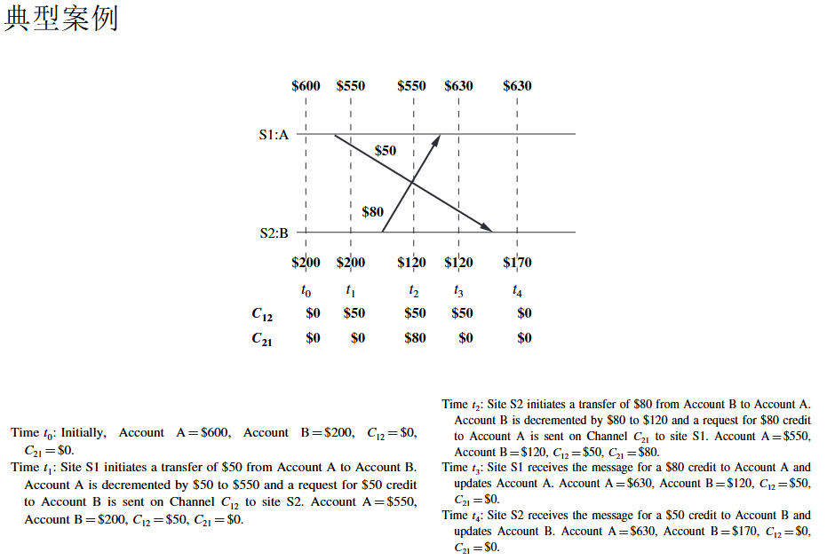
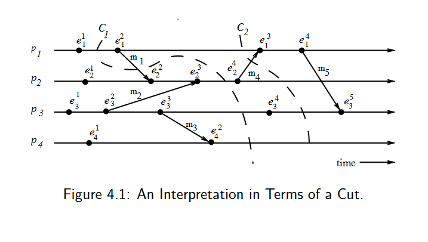

## CH4

### 1. 核心主题
本讲主要探讨如何在分布式系统中实时地（on-the-fly）记录系统的**全局状态**。这在分布式系统的调试、检查点恢复（checkpointing）和死锁检测中非常重要。

### 2. 主要难点（为什么这个问题很复杂）
PPT指出，在分布式系统中记录全局状态并非易事，主要面临以下挑战：
*   **缺乏全局共享内存**：各个节点无法直接看到其他节点的实时状态。
*   **缺乏全局统一时钟**：不同节点的时钟可能不同步，很难确定“同一时刻”。
*   **不可预测的消息延迟**：节点间通信存在延迟，且延迟时间不确定。

### 3. 本章学习目标与结构
这一章节的内容将分为以下几个部分展开：
*   **定义一致性全局状态 (Consistent Global States)**：首先明确什么是“一致的”状态，即如何定义一个在逻辑上合理的分布式系统“瞬间”。
*   **探讨计算一致性快照的问题**：讨论在实现快照过程中需要解决的关键问题和技术难点。
*   **介绍算法**：针对不同类型的网络环境，介绍几种用于实时获取分布式快照的具体算法（例如著名的 Chandy-Lamport 算法通常就在这一章讲解）。

典型案例，说明了一个一致性的系统快照需要能捕捉到节点的状态和当时正在信道中传输的信息。

### 系统模型的基础定义
*   **系统构成**：系统由一组 $n$ 个进程 $p_1, p_2, \dots, p_n$ 组成，这些进程之间通过信道（channels）相互连接。
*   **环境假设**：系统中不存在全局共享内存，也没有物理上的全局时钟；进程之间完全通过在通信信道中传递消息来进行交互。
*   **信道表示**：$C_{ij}$ 表示从进程 $p_i$ 到进程 $p_j$ 的单向信道，其状态记为 $SC_{ij}$。
*   **动作建模**：进程执行的动作被建模为三种类型的事件：**内部事件**（Internal events）、**消息发送事件**（the message send event）以及**消息接收事件**（the message receive event）。
*   **消息标识**：对于从进程 $p_i$ 发送到进程 $p_j$ 的消息 $m_{ij}$，使用 $send(m_{ij})$ 表示其发送事件，使用 $rec(m_{ij})$ 表示其接收事件。

### 进程状态与在途消息
*   **局部状态定义**：在任何时刻，进程 $p_i$ 的状态（记为 $LS_i$）是该进程截至该时刻所执行的所有事件序列共同作用的结果。
*   **事件归属判定（已发生）**：对于一个事件 $e$ 和一个进程状态 $LS_i$，当且仅当 $e$ 属于促使进程 $p_i$ 达到状态 $LS_i$ 的事件序列时，判定为 $e \in LS_i$。
*   **事件归属判定（未发生）**：对于一个事件 $e$ 和一个进程状态 $LS_i$，当且仅当 $e$ 不属于促使进程 $p_i$ 达到状态 $LS_i$ 的事件序列时，判定为 $e \notin LS_i$。
*   **信道消息集定义**：对于一条信道 $C_{ij}$，可以根据发送方进程 $p_i$ 和接收方进程 $p_j$ 的局部状态，定义如下的消息集合：
    *   **在途消息（Transit）**：$transit(LS_i, LS_j) = \{ m_{ij} \mid send(m_{ij}) \in LS_i \wedge rec(m_{ij}) \notin LS_j \}$。
    *   **补充说明**：这个公式是全篇的核心，它定义了哪些消息属于“正在路上”。即：发送方 $p_i$ 的记录里已经显示消息已发出（$send \in LS_i$），但接收方 $p_j$ 的记录里还没有收到这条消息（$rec \notin LS_j$）。在做分布式快照时，这些“在途”的消息必须被捕捉到，否则系统的全局状态就不完整。

### 通信模型 (Models of communication)
*   **三种模型回顾**：回顾一下，通信模型主要有三种：FIFO（先进先出）、非 FIFO 以及 Co（因果序通信）。
*   **FIFO 模型**：在 FIFO 模型中，每个信道都充当一个先进先出的消息队列，因此，信道会保持消息的发送顺序。
*   **非 FIFO 模型**：在非 FIFO 模型中，信道表现得像一个集合（Set），发送进程向其中添加消息，而接收进程则以随机顺序从中取出消息。
*   **因果序模型 (Co)**：一个支持消息因果传递（Causal delivery）的系统满足以下属性：“对于任意两条消息 $m_{ij}$ 和 $m_{kj}$，如果发送事件之间存在因果关系，即 $send(m_{ij}) \longrightarrow send(m_{kj})$，那么接收顺序也必须满足 $rec(m_{ij}) \longrightarrow rec(m_{kj})$。”（补充：这确保了如果消息 A 的发送触发了消息 B 的发送，那么任何节点收到 B 之前必然已经收到了 A）。

### 一致性全局状态 (Consistent global state)
*   **全局状态的组成**：分布式系统的全局状态是所有进程的局部状态（Local states）和所有信道状态（Channel states）的集合。
*   **数学定义**：在符号表示上，全局状态 $GS$ 定义为：$GS = \{ \bigcup_i LS_i, \bigcup_{i,j} SC_{ij} \}$。（补充：即所有进程 $p_i$ 的局部状态 $LS_i$ 与所有信道 $C_{ij}$ 的状态 $SC_{ij}$ 的并集）。
*   **一致性判别标准**：一个全局状态 $GS$ 当且仅当满足以下两个条件时，才被称为**一致性全局状态**：
    *   **条件 C1**：$send(m_{ij}) \in LS_i \implies m_{ij} \in SC_{ij} \oplus rec(m_{ij}) \in LS_j$。
        *   （注：$\oplus$ 是异或算子）。
        *   （补充解析：这意味着如果发送方 $p_i$ 记录了消息已发送，那么在全局状态中，这封信要么还在路上 $SC_{ij}$，要么已经被接收方收到 $LS_j$，二者必居其一。这保证了信息不会凭空消失，也不会被重复计算）。
    *   **条件 C2**：$send(m_{ij}) \notin LS_i \implies m_{ij} \notin SC_{ij} \wedge rec(m_{ij}) \notin LS_j$。
        *   （补充解析：这意味着如果发送方 $p_i$ 的状态显示还没发送这条消息，那么在全局状态中，信道里绝对不能有这条消息，接收方也绝对不可能已经收到了这条消息。这杜绝了“未发先收”的逻辑错误，即所谓的“幽灵消息”）。

### 基于“割”（Cuts）视角的解读
*   **割的定义**：在时空图（space-time diagram）中，**割（Cut）**是连接每个进程线上任意一点的一条线，它将整个时空图切分为**“过去”（PAST）**和**“未来”（FUTURE）**两个部分。
*   **一致性状态的对应关系**：一个一致性的全局状态，对应于这样一个割：即在该割的PAST部分接收到的信息也已经在PAST部分发送了。满足上述条件的割被称为**一致性割（consistent cut）**。
*   **实例分析**：例如，考虑图 4.1 中所示的计算过程时空图（图中包含四个进程 $p_1$ 到 $p_4$ 以及若干消息传递事件）。
*   **关于割 C1 的判定**：**割 C1 是不一致的**。其原因是消息 $m_1$ 正在从“未来”流向“过去”。
*   **关于割 C2 的判定**：**割 C2 是一致的**。在这种情况下，消息 $m_4$ 必须作为信道 $C_{21}$ 的状态被捕捉到。（补充：因为 $m_4$ 的发送发生在 C2 的左侧，而接收发生在 C2 的右侧，它属于“已发出但尚未接收”的在途消息。根据前面 PPT 的定义，它应计入信道状态，且这种‘从过去流向未来’的消息不破坏割的一致性）。

### 记录全局状态面临的问题
*   **需要解决的两个核心问题**：在记录全局状态时，必须妥善处理以下两个议题：
*   **议题 I1：如何区分哪些消息应当被记录在快照中，哪些不应当。**
    *   任何进程在记录其局部快照**之前**发送的消息，都必须被记录在全局快照中（这遵循了一致性条件 C1）。
    *   任何进程在记录其局部快照**之后**发送的消息，都绝不能被记录在全局快照中（这遵循了一致性条件 C2）。
*   **议题 I2：如何确定进程执行快照的时刻。**
    *   进程 $p_j$ 必须在处理任何由进程 $p_i$ 在记录快照**之后**发送的消息 $m_{ij}$ **之前**，先完成自己的快照记录。（补充：这保证了因果逻辑的正确性，防止“未来”的消息影响“过去”的快照）。

### 针对 FIFO 信道的快照算法：Chandy-Lamport 算法
*   **算法核心**：Chandy-Lamport 算法使用一种特殊的控制消息，称为**标记（marker）**。在 FIFO（先进先出）系统中，它的作用是充当信道中消息的“分隔符”。
*   **发送流程**：在一个站点记录完其局部快照后，它会在发送任何其他后续消息之前，向其所有的传出信道（outgoing channels）发送一个“标记”。
*   **标记的作用**：该“标记”将信道中的消息序列分成了两类：一类是应当被包含在快照中的消息，另一类则是那些不应被记录在快照中的消息。
*   **快照触发时机**：一个进程记录其局部快照的时刻，**不得晚于**它从其任何传入信道（incoming channels）收到“标记”的时刻。（补充：这意味着如果进程还没主动拍快照，一旦收到别人的标记，就必须立刻强制执行快照记录）。

#### Chandy-Lamport 算法的基本流程
*   **算法启动**：该算法可以由系统中的任何进程发起。发起进程通过执行**标记发送规则 (Marker Sending Rule)** 来启动算法，在此规则下，进程会记录其局部状态，并向其每一个传出信道发送一个“标记”（marker）。
*   **收到标记时的处理**：当一个进程收到“标记”时，它会执行**标记接收规则 (Marker Receiving Rule)**。如果该进程尚未记录自己的局部状态，它会将收到标记的那个信道的状态记录为“空”，并执行“标记发送规则”来记录其局部状态。
*   **算法终止条件**：在每一个进程都从其所有的传入信道收到了标记之后，算法即告终止。
*   **全局状态确定**：所有的局部快照随后会被分发给所有其他进程，从而使所有进程都能确定系统的全局状态。

#### Chandy-Lamport 算法的核心规则
*   **进程 $i$ 的标记发送规则 (Marker Sending Rule)**：
    1.  进程 $i$ 记录其当前状态。
    2.  对于每一个尚未发送过标记的传出信道 $C$，进程 $i$ 在沿信道 $C$ 发送任何进一步的消息之前，必须先沿该信道发送一个“标记”。（补充：这确保了“标记”充当了快照前消息与快照后消息的分隔符）。

*   **进程 $j$ 的标记接收规则 (Marker Receiving Rule)**：
    *   当进程 $j$ 沿信道 $C$ 收到一个“标记”时：
    *   **如果进程 $j$ 尚未记录其状态**：
        1.  将信道 $C$ 的状态记录为**空集**。（补充：因为收到标记意味着信道中在快照点之前的消息已经全部收完，没有在途消息）。
        2.  紧接着执行“标记发送规则”（即记录自身状态并向外广播标记）。
    *   **否则（即进程 $j$ 之前已经记录过自己的状态）**：
        1.  将信道 $C$ 的状态记录为一组消息的集合，这些消息是指：**在进程 $j$ 记录自身状态之后、且在进程 $j$ 沿信道 $C$ 收到该标记之前**，通过信道 $C$ 接收到的所有消息。（补充：这些就是算法定义中“正在路上”的在途消息）。

#### 算法的正确性与复杂性
*   **正确性说明**：
    *   由于信道具有 **FIFO（先进先出）属性**，可以推断出，在信道上位于“标记”（marker）之后发送的任何消息，都不会被记录在该信道的状态中。因此，**条件 C2 得到了满足**。（补充：这确保了快照中不会包含“未来”才发出的消息）。
    *   当进程 $p_j$ 接收到信道 $C_{ij}$ 上先于“标记”到达的消息 $m_{ij}$ 时，它按如下方式操作：如果进程 $p_j$ 尚未进行快照记录，则将 $m_{ij}$ 包含在其记录的快照中；否则，它将 $m_{ij}$ 记录在信道 $C_{ij}$ 的状态中。因此，**条件 C1 得到了满足**。（补充：这保证了所有在快照时刻已经发出但未被处理的消息都会被记录，不会凭空消失）。
*   **复杂度分析**：
    *   单次运行该算法的记录部分需要 **$O(e)$** 条消息和 **$O(d)$** 的时间复杂度，其中 $e$ 是网络中的边（信道）数量，$d$ 是网络的直径。

#### 所记录全局状态的性质
*   **状态的真实性问题**：记录下来的全局状态**可能并不对应**于计算过程中实际发生过的任何一个全局状态。
*   **发生原因**：这种情况之所以会发生，是因为进程可以在它发送的“标记”被其他站点接收并记录状态之前，异步地改变自身状态。（补充：由于各节点拍照有先后，记录下的可能是一个“拼凑”出来的瞬间）。
*   **等价性与实用价值**：
    *   但是，系统在某些**等价执行**（equivalent executions）中可能已经经历过这个被记录的全局状态。
    *   记录的全局状态在等价执行中是一个**有效状态**；并且，如果某种**稳定属性**（stable property，即一旦变为真就保持为真的属性，如死锁或系统终止）在快照算法开始前就在系统中成立，那么它在记录的全局快照中也必然成立。
    *   因此，记录的全局状态在**检测稳定属性**方面非常有用。

这两张 PPT 介绍了 **Spezialetti-Kearns 算法**，该算法是对 Chandy-Lamport 算法的改进，特别针对系统中存在**多个并发发起者**的情况进行了优化。以下是内容的逐句还原与解析：

#### Spezialetti-Kearns 算法的核心机制
*   **获取快照的两个阶段**：获取全局快照包含两个阶段：一是在每个进程上进行局部快照的记录，二是将生成的全局快照分发给所有的发起者。
*   **高效的快照记录流程**：
    *   在 Spezialetti-Kearns 算法中，标记（markers）携带了算法发起者的标识符。每个进程都维护一个名为 `master` 的变量，用于跟踪启动该算法的发起者。
    *   算法优化中使用的一个核心概念是系统中的**区域（region）**。一个“区域”包含了所有 `master` 字段存储了相同发起者标识符的进程。
    *   当进程从信道收到一个标记，且该标记中的发起者标识符与自身 `master` 变量中的值不同时，说明该标记的发送者处于不同的区域。
    *   此时，这个并发发起者的标识符会被记录在局部变量 `id-border-set`（边界 ID 集合）中。（这说明了这个process处在两个或多个master的边界，但是它的master取决于最早收到的标记）
*   **信道与进程状态的记录细节**：
    *   信道状态的记录方式与 Chandy-Lamport 算法完全相同（这也包括那些跨越区域边界的信道）。
    *   对于一个进程而言，当它从自己的所有信道都收到了标记后，其局部快照记录工作即告完成。
    *   在每个进程都完成了快照记录后，整个系统会被划分为若干个区域，区域的数量等同于算法并发发起的次数。
    *   进程中的变量 `id-border-set` 存储了所有邻近区域的标识符。

#### 高效分发已记录的快照
*   **已记录快照的高效分发**：
    *   在快照记录阶段，系统中会隐式地创建出一个**生成树森林（a forest of spanning trees）**。
    *   算法的每一个发起者都是其对应生成树的根节点，而其所在区域内的所有进程都属于这棵生成树。
*   **生成树中的父子关系**：如果进程 $p_i$ 从 $p_j$ 接收到了它的第一个标记（marker），那么在生成树中，进程 $p_j$ 就是进程 $p_i$ 的父节点。（补充：这定义了快照信息回传的路径，第一个传给你标记的节点就是你的“上线”）。
*   **中间进程的汇聚行为**：当生成树中的一个中间进程接收到了来自其所有子进程记录的状态，并且已经记录了其所有传入信道的状态时，它会将自身记录的状态以及其所有后代进程记录的状态一并转发给它的父节点。（补充：这是一种自底向上的数据聚合机制，确保信息能逐级向根节点汇总）。
*   **发起者的组装任务**：当发起者（即生成树的根节点）从其子进程那里接收到了所有后代进程的记录状态时，它会为自己所在区域内的所有进程以及与这些进程相关的信道组装出本区域的快照。
*   **区域间的快照交换**：发起者会分轮次地与相邻区域的发起者交换各自区域的快照。（补充：通过这种方式，原本被“瓜分”的各局部快照最终被拼凑成完整的全局状态）。
*   **复杂度分析**：
    *   **快照记录阶段**的消息复杂度为 **$O(e)$**，且该复杂度与算法并发发起的次数无关。（补充：这是该算法最大的优势，即无论有多少人同时发起快照，记录阶段的总消息数只与系统总信道数 $e$ 相关，避免了重复开销）。
    *   **组装和分发快照阶段**的消息复杂度为 **$O(rn^2)$**，其中 $r$ 是并发发起的次数，$n$ 是进程总数。

### 非 FIFO 信道下的快照挑战
*   **标记机制的失效**：在非 FIFO 系统中，由于消息可以乱序到达，**“标记”（marker）不能再被用来区分**哪些消息应当被记录在全局状态中，哪些不应当。（补充：在 FIFO 中，标记像隔板；但在非 FIFO 中，标记后的消息可能比标记先跑到，导致分类失效）。
*   **解决思路**：在非 FIFO 系统中，为了捕捉乱序消息，要么需要某种程度的**抑制（inhibition）**，要么需要将控制信息**搭便车（piggybacking）**在普通的计算消息上。

### Lai-Yang 算法（基于染色方案）
Lai-Yang 算法通过在计算消息上使用一套**“染色方案” (coloring scheme)**，在非 FIFO 系统中实现了类似“标记”的功能。其运作机制如下：
1.  **进程变色**：每个进程最初都是**白色 (white)** 的，在进行快照时会变为**红色 (red)**。当进程变红的那一刻，就相当于执行了“标记发送规则”。
2.  **消息染色**：由白色进程发送的每一条消息都被染成白色；由红色进程发送的每一条消息都被染成红色。
3.  **颜色的含义**：因此，一条**白色消息**代表该消息是在发送方记录局部快照**之前**发送的；而一条**红色消息**代表该消息是在发送方记录局部快照**之后**发送的。
4.  **强制快照时机**：每一个白色进程可以根据自己的方便选择记录快照的时机，但其记录时刻**不得晚于**它接收到红色消息的那一刻。（补充：这意味着如果你还是白色，却收到了红色的“未来消息”，你必须立刻变红并记录快照，以保证因果一致性）。

这张 PPT 承接前一页，继续详细解释了 **Lai-Yang 算法** 在非 FIFO 环境下如何记录消息历史并计算信道状态。以下是内容的逐句还原与解析：

#### Lai-Yang 算法的具体操作与信道状态计算

*   **记录历史**：每一个处于白色状态的进程，都会记录它在各个信道上发送或接收的所有**白色消息**的历史记录。
*   **发送数据**：当一个进程变红（即执行局部快照记录）时，它会将这些记录下来的历史信息，连同它的局部快照一起发送给负责收集全局快照的**发起进程（initiator process）**。
*   **计算在途消息（信道状态）**：发起进程通过评估 $transit(LS_i, LS_j)$ 来计算信道 $C_{ij}$ 的状态，计算方式如下：
    *   $SC_{ij} = $ 进程 $p_i$ 在信道 $C_{ij}$ 上发送的白色消息集合 **减去** 进程 $p_j$ 在该信道上接收到的白色消息集合。（通过这种方式就解决了non-FIFO信道可能产生的接收进程红色而信道中还有白色消息的问题）
    *   **形式化定义**：$SC_{ij} = \{ send(m_{ij}) \mid send(m_{ij}) \in LS_i \} - \{ rec(m_{ij}) \mid rec(m_{ij}) \in LS_j \}$。

**补充说明：**
由于在非 FIFO（非先进先出）系统中，消息的到达顺序是不可预测的，我们不能像 Chandy-Lamport 算法那样简单地靠“标记”来截断消息流。

Lai-Yang 算法的巧妙之处在于采用了**集合减法**的思想：
1.  **发送方的视野**：$p_i$ 记录了所有在快照时刻之前（变红前）发出的“白色信件”。
2.  **接收方的视野**：$p_j$ 记录了所有在快照时刻之前（变红前）收到的“白色信件”。
3.  **逻辑差集**：发起者把这两份名单拿来对比，如果有一封信在 $p_i$ 的发送名单里，但不在 $p_j$ 的接收名单里，那么这封信在逻辑快照那一刻，就一定**正在信道中传输（即在途消息）**。

通过这种“对账”的方式，即使信道里的消息跑得再乱，发起者也能准确地把那些“漏掉”的在途消息找回来，拼凑成一个完整的一致性全局状态。

Mattern 算法是一种基于向量时钟（Vector Clocks）的分布式快照算法。该算法假设系统中只有一个发起者（Initiator）进程，其具体工作流程如下：

### **Mattern 算法的基本步骤**

1.  **启动与广播：** 发起者进程将其本地时钟“滴答”增加，并选择一个未来的向量时间 $s$ 作为记录全局快照的时间点。随后，它广播这个时间 $s$，并冻结自身的所有活动，直到收到所有其他进程对该广播的确认（acknowledgements）。
2.  **确认机制：** 当其他进程收到该广播时，会记录下数值 $s$，并向发起者返回一个确认消息。
3.  **触发阶段：** 在收到所有进程的确认后，发起者将其向量时钟增加到 $s$，并向所有进程广播一条“哑消息”（dummy message）。
4.  **强制更新：** 每个接收者在收到这条哑消息后，如果其本地时钟尚未达到 $s$，则会被强制将其时钟增加到某个大于或等于 $s$ 的值。
5.  **记录本地快照：** 每个进程在本地时钟从小于 $s$ 的值增加到大于或等于 $s$ 的值那一刻（即刚好在增加之前），拍摄本地快照（Local Snapshot, $LS$）并将其发送给发起者。
6.  **确定信道状态：** 信道 $C_{ij}$ 的状态被定义为：所有沿该信道发送、且时间戳小于 $s$ 的消息，并且这些消息是在接收进程 $p_j$ 记录完其本地快照 $LS_j$ 之后才被收到的。

### **非 FIFO 信道下的终止检测**

在非 FIFO（先入先出）信道中，由于消息可能乱序到达，需要一种终止检测方案来确保没有“白色消息”（即在快照时间点 $s$ 之前发送的消息）仍在传输途中。

**具体方法如下：**

*   **维护计数器：** 每个进程 $i$ 维护一个计数器 $cntr_i$。该计数器用于记录在拍摄快照之前，该进程发送的白色消息数量与收到的白色消息数量之间的差值。
*   **报告与转发：** 进程将此计数器的值随其本地快照一起报告给发起者进程。在此之后，该进程若收到任何白色消息，都会将其转发给发起者。
*   **终止条件：** 当发起者收到的转发白色消息的总数量等于所有进程报告的计数器之和（即 $\sum_i cntr_i$）时，快照收集过程正式终止。

**补充说明：**
所谓“白色消息”是指那些在发送者逻辑时钟达到 $s$ 之前发出的消息。在非 FIFO 环境下，这些消息可能在快照拍摄后很久才到达，因此需要通过计数器确保所有发出的白色消息都已被接收并记录在信道状态中，从而保证全局快照的一致性。

针对你提供的 Mattern 算法的“第二种方法”（Second method），这同样是解决**在非 FIFO 环境下如何知道信道快照收集何时结束**的问题。

以下是该 PPT 内容的中文还原及补充说明：

### **Mattern 算法：第二种方法 (Second Method)**

这是另一种用于检测快照终止的方案，与第一种依赖“全局计数器之和”不同，这种方法更侧重于**点对点**的感知：

*   **红色消息捎带计数：** 每个进程在拍摄本地快照后（变为红色）发送的每条**红色消息**中，都会捎带一个数值。这个数值表示：在拍摄快照之前，该进程在**该特定信道**上总共发送了多少条**白色消息**。
*   **接收端计数：** 每个进程都会为自己所有的入站信道维护一个计数器，专门统计在每个信道上已经收到了多少条白色消息。
*   **局部终止检测：** 当一个进程在某个入站信道上收到的白色消息总数，**等于**该信道上收到的红色消息所捎带的那个数值时，它就可以确定该特定信道的快照记录已经完成（即所有该收的白色消息都已收到）。

### **进一步的补充与对比（帮助理解）**

为了让你更清楚为什么有这个方法，以及它和之前的区别，可以参考以下几点：

#### **1. 它如何解决非 FIFO 带来的困扰？**
在非 FIFO 信道中，发送方先发的白色消息 $W$ 可能会比后发的红色消息 $R$ 晚到。
*   **如果没有这个方法：** 接收方收到红色消息 $R$ 后，它不知道后面是否还有“迷路”的白色消息 $W$。
*   **有了这个方法：** 红色消息 $R$ 变成了一个“通知单”。比如 $R$ 告诉接收方：“我在记录快照前一共给你发了 10 条白色消息。” 即使 $R$ 跑得快先到了，接收方数了数手里只有 9 条白消息，它就知道：“哦，还有 1 条在路上，我得继续等，直到那条到齐了，这个信道的快照才算收完。”

#### **2. 与“第一种方法”的区别**
*   **第一种方法（全局汇总）：** 每个进程把自己的差值报告给**发起者**，由发起者统一做减法，看最后是不是等于 0。这是一种**集中式**的检测。
*   **第二种方法（局部验证）：** 每个接收进程自己就能根据收到的红色消息判断某个信道是否已经“收全了”。这是一种更具**分布式**色彩的检测方式。

#### mattern相对于laiyang的改进之处
laiyang虽然通过染色机制让它可以应用在non-fifo信道中，但是依然存在不完备性。即没有内部机制去解决终止检测的问题。具体地说，虽然laiyang对进程i,j的状态做减法可以得知信道中存在在途的信息，但是它不知道什么时候结束，即不知道在途信息什么时候送达（因为laiyang没有强制转发机制）。

还有个就是目标值是动态地上报给发起者进程的，即使知道了进程A和B的之间发送-接收的差值也无法确定准确的差值是多少的，因为可能还存在进程C没有上报，而C和B之间可能也发了信息

mattern的第一种方法，它会强制所有进程上报$cntr_i$，这样发起者就知道整个系统还有多少白色消息没到达，当cntr清零，发起者就知道快照结束了；第二种方法呢，则是把检测信道结束的状态下放给了接收者，当接收者确认白色信息的数目对了，这个信道的快照就结束了。
