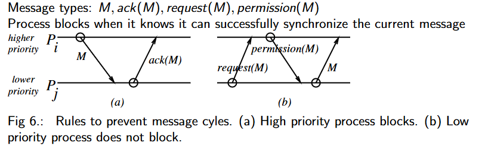
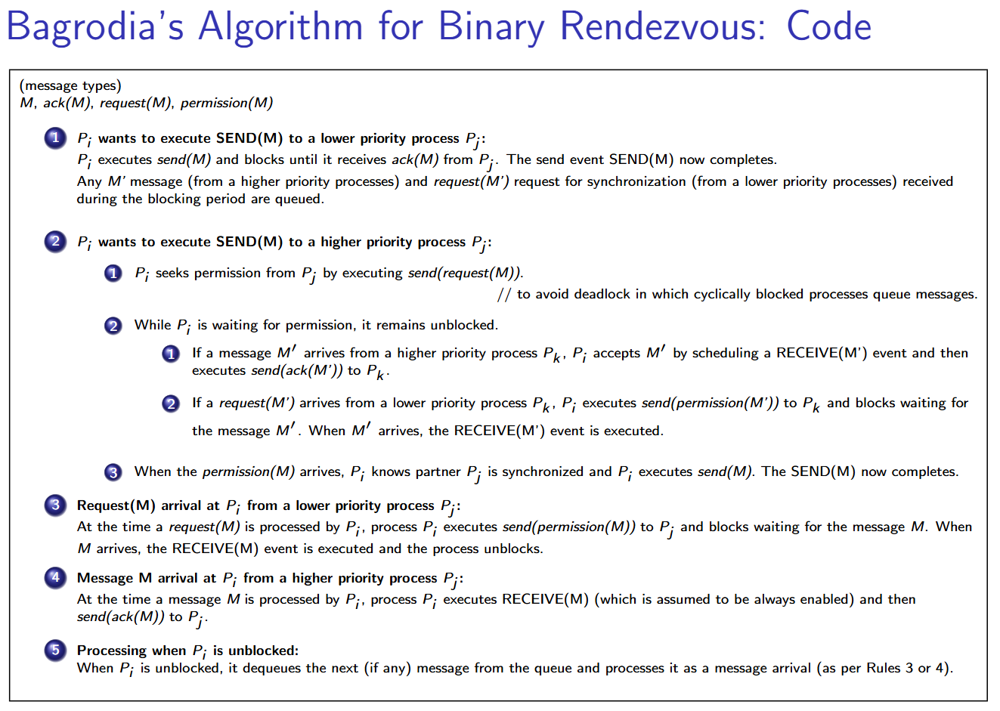
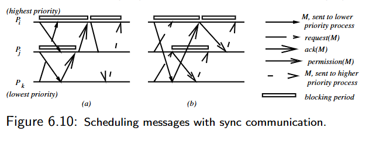
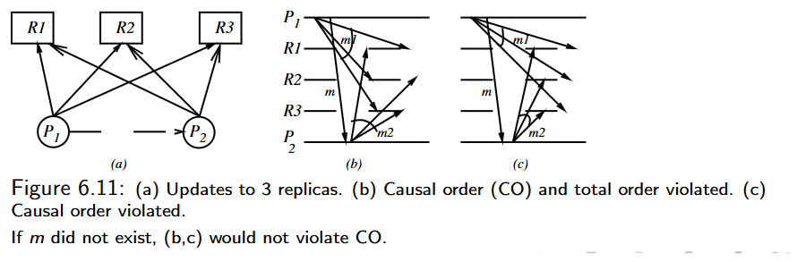
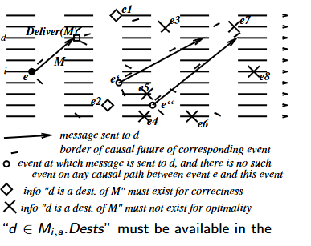

## CH4

### 1. 核心主题
本讲主要探讨如何在分布式系统中实时地（on-the-fly）记录系统的**全局状态**。这在分布式系统的调试、检查点恢复（checkpointing）和死锁检测中非常重要。

### 2. 主要难点（为什么这个问题很复杂）
PPT指出，在分布式系统中记录全局状态并非易事，主要面临以下挑战：
*   **缺乏全局共享内存**：各个节点无法直接看到其他节点的实时状态。
*   **缺乏全局统一时钟**：不同节点的时钟可能不同步，很难确定“同一时刻”。
*   **不可预测的消息延迟**：节点间通信存在延迟，且延迟时间不确定。

### 3. 本章学习目标与结构
这一章节的内容将分为以下几个部分展开：
*   **定义一致性全局状态 (Consistent Global States)**：首先明确什么是“一致的”状态，即如何定义一个在逻辑上合理的分布式系统“瞬间”。
*   **探讨计算一致性快照的问题**：讨论在实现快照过程中需要解决的关键问题和技术难点。
*   **介绍算法**：针对不同类型的网络环境，介绍几种用于实时获取分布式快照的具体算法（例如著名的 Chandy-Lamport 算法通常就在这一章讲解）。

典型案例，说明了一个一致性的系统快照需要能捕捉到节点的状态和当时正在信道中传输的信息。

### 系统模型的基础定义
*   **系统构成**：系统由一组 $n$ 个进程 $p_1, p_2, \dots, p_n$ 组成，这些进程之间通过信道（channels）相互连接。
*   **环境假设**：系统中不存在全局共享内存，也没有物理上的全局时钟；进程之间完全通过在通信信道中传递消息来进行交互。
*   **信道表示**：$C_{ij}$ 表示从进程 $p_i$ 到进程 $p_j$ 的单向信道，其状态记为 $SC_{ij}$。
*   **动作建模**：进程执行的动作被建模为三种类型的事件：**内部事件**（Internal events）、**消息发送事件**（the message send event）以及**消息接收事件**（the message receive event）。
*   **消息标识**：对于从进程 $p_i$ 发送到进程 $p_j$ 的消息 $m_{ij}$，使用 $send(m_{ij})$ 表示其发送事件，使用 $rec(m_{ij})$ 表示其接收事件。

### 进程状态与在途消息
*   **局部状态定义**：在任何时刻，进程 $p_i$ 的状态（记为 $LS_i$）是该进程截至该时刻所执行的所有事件序列共同作用的结果。
*   **事件归属判定（已发生）**：对于一个事件 $e$ 和一个进程状态 $LS_i$，当且仅当 $e$ 属于促使进程 $p_i$ 达到状态 $LS_i$ 的事件序列时，判定为 $e \in LS_i$。
*   **事件归属判定（未发生）**：对于一个事件 $e$ 和一个进程状态 $LS_i$，当且仅当 $e$ 不属于促使进程 $p_i$ 达到状态 $LS_i$ 的事件序列时，判定为 $e \notin LS_i$。
*   **信道消息集定义**：对于一条信道 $C_{ij}$，可以根据发送方进程 $p_i$ 和接收方进程 $p_j$ 的局部状态，定义如下的消息集合：
    *   **在途消息（Transit）**：$transit(LS_i, LS_j) = \{ m_{ij} \mid send(m_{ij}) \in LS_i \wedge rec(m_{ij}) \notin LS_j \}$。
    *   **补充说明**：这个公式是全篇的核心，它定义了哪些消息属于“正在路上”。即：发送方 $p_i$ 的记录里已经显示消息已发出（$send \in LS_i$），但接收方 $p_j$ 的记录里还没有收到这条消息（$rec \notin LS_j$）。在做分布式快照时，这些“在途”的消息必须被捕捉到，否则系统的全局状态就不完整。

### 通信模型 (Models of communication)
*   **三种模型回顾**：回顾一下，通信模型主要有三种：FIFO（先进先出）、非 FIFO 以及 Co（因果序通信）。
*   **FIFO 模型**：在 FIFO 模型中，每个信道都充当一个先进先出的消息队列，因此，信道会保持消息的发送顺序。
*   **非 FIFO 模型**：在非 FIFO 模型中，信道表现得像一个集合（Set），发送进程向其中添加消息，而接收进程则以随机顺序从中取出消息。
*   **因果序模型 (Co)**：一个支持消息因果传递（Causal delivery）的系统满足以下属性：“对于任意两条消息 $m_{ij}$ 和 $m_{kj}$，如果发送事件之间存在因果关系，即 $send(m_{ij}) \longrightarrow send(m_{kj})$，那么接收顺序也必须满足 $rec(m_{ij}) \longrightarrow rec(m_{kj})$。”（补充：这确保了如果消息 A 的发送触发了消息 B 的发送，那么任何节点收到 B 之前必然已经收到了 A）。

### 一致性全局状态 (Consistent global state)
*   **全局状态的组成**：分布式系统的全局状态是所有进程的局部状态（Local states）和所有信道状态（Channel states）的集合。
*   **数学定义**：在符号表示上，全局状态 $GS$ 定义为：$GS = \{ \bigcup_i LS_i, \bigcup_{i,j} SC_{ij} \}$。（补充：即所有进程 $p_i$ 的局部状态 $LS_i$ 与所有信道 $C_{ij}$ 的状态 $SC_{ij}$ 的并集）。
*   **一致性判别标准**：一个全局状态 $GS$ 当且仅当满足以下两个条件时，才被称为**一致性全局状态**：
    *   **条件 C1**：$send(m_{ij}) \in LS_i \implies m_{ij} \in SC_{ij} \oplus rec(m_{ij}) \in LS_j$。
        *   （注：$\oplus$ 是异或算子）。
        *   （补充解析：这意味着如果发送方 $p_i$ 记录了消息已发送，那么在全局状态中，这封信要么还在路上 $SC_{ij}$，要么已经被接收方收到 $LS_j$，二者必居其一。这保证了信息不会凭空消失，也不会被重复计算）。
    *   **条件 C2**：$send(m_{ij}) \notin LS_i \implies m_{ij} \notin SC_{ij} \wedge rec(m_{ij}) \notin LS_j$。
        *   （补充解析：这意味着如果发送方 $p_i$ 的状态显示还没发送这条消息，那么在全局状态中，信道里绝对不能有这条消息，接收方也绝对不可能已经收到了这条消息。这杜绝了“未发先收”的逻辑错误，即所谓的“幽灵消息”）。

### 基于“割”（Cuts）视角的解读
*   **割的定义**：在时空图（space-time diagram）中，**割（Cut）**是连接每个进程线上任意一点的一条线，它将整个时空图切分为**“过去”（PAST）**和**“未来”（FUTURE）**两个部分。
*   **一致性状态的对应关系**：一个一致性的全局状态，对应于这样一个割：即在该割的PAST部分接收到的信息也已经在PAST部分发送了。满足上述条件的割被称为**一致性割（consistent cut）**。
*   **实例分析**：例如，考虑图 4.1 中所示的计算过程时空图（图中包含四个进程 $p_1$ 到 $p_4$ 以及若干消息传递事件）。
*   **关于割 C1 的判定**：**割 C1 是不一致的**。其原因是消息 $m_1$ 正在从“未来”流向“过去”。
*   **关于割 C2 的判定**：**割 C2 是一致的**。在这种情况下，消息 $m_4$ 必须作为信道 $C_{21}$ 的状态被捕捉到。（补充：因为 $m_4$ 的发送发生在 C2 的左侧，而接收发生在 C2 的右侧，它属于“已发出但尚未接收”的在途消息。根据前面 PPT 的定义，它应计入信道状态，且这种‘从过去流向未来’的消息不破坏割的一致性）。

### 记录全局状态面临的问题
*   **需要解决的两个核心问题**：在记录全局状态时，必须妥善处理以下两个议题：
*   **议题 I1：如何区分哪些消息应当被记录在快照中，哪些不应当。**
    *   任何进程在记录其局部快照**之前**发送的消息，都必须被记录在全局快照中（这遵循了一致性条件 C1）。
    *   任何进程在记录其局部快照**之后**发送的消息，都绝不能被记录在全局快照中（这遵循了一致性条件 C2）。
*   **议题 I2：如何确定进程执行快照的时刻。**
    *   进程 $p_j$ 必须在处理任何由进程 $p_i$ 在记录快照**之后**发送的消息 $m_{ij}$ **之前**，先完成自己的快照记录。（补充：这保证了因果逻辑的正确性，防止“未来”的消息影响“过去”的快照）。

### 针对 FIFO 信道的快照算法：Chandy-Lamport 算法
*   **算法核心**：Chandy-Lamport 算法使用一种特殊的控制消息，称为**标记（marker）**。在 FIFO（先进先出）系统中，它的作用是充当信道中消息的“分隔符”。
*   **发送流程**：在一个站点记录完其局部快照后，它会在发送任何其他后续消息之前，向其所有的传出信道（outgoing channels）发送一个“标记”。
*   **标记的作用**：该“标记”将信道中的消息序列分成了两类：一类是应当被包含在快照中的消息，另一类则是那些不应被记录在快照中的消息。
*   **快照触发时机**：一个进程记录其局部快照的时刻，**不得晚于**它从其任何传入信道（incoming channels）收到“标记”的时刻。（补充：这意味着如果进程还没主动拍快照，一旦收到别人的标记，就必须立刻强制执行快照记录）。

#### Chandy-Lamport 算法的基本流程
*   **算法启动**：该算法可以由系统中的任何进程发起。发起进程通过执行**标记发送规则 (Marker Sending Rule)** 来启动算法，在此规则下，进程会记录其局部状态，并向其每一个传出信道发送一个“标记”（marker）。
*   **收到标记时的处理**：当一个进程收到“标记”时，它会执行**标记接收规则 (Marker Receiving Rule)**。如果该进程尚未记录自己的局部状态，它会将收到标记的那个信道的状态记录为“空”，并执行“标记发送规则”来记录其局部状态。
*   **算法终止条件**：在每一个进程都从其所有的传入信道收到了标记之后，算法即告终止。
*   **全局状态确定**：所有的局部快照随后会被分发给所有其他进程，从而使所有进程都能确定系统的全局状态。

#### Chandy-Lamport 算法的核心规则
*   **进程 $i$ 的标记发送规则 (Marker Sending Rule)**：
    1.  进程 $i$ 记录其当前状态。
    2.  对于每一个尚未发送过标记的传出信道 $C$，进程 $i$ 在沿信道 $C$ 发送任何进一步的消息之前，必须先沿该信道发送一个“标记”。（补充：这确保了“标记”充当了快照前消息与快照后消息的分隔符）。

*   **进程 $j$ 的标记接收规则 (Marker Receiving Rule)**：
    *   当进程 $j$ 沿信道 $C$ 收到一个“标记”时：
    *   **如果进程 $j$ 尚未记录其状态**：
        1.  将信道 $C$ 的状态记录为**空集**。（补充：因为收到标记意味着信道中在快照点之前的消息已经全部收完，没有在途消息）。
        2.  紧接着执行“标记发送规则”（即记录自身状态并向外广播标记）。
    *   **否则（即进程 $j$ 之前已经记录过自己的状态）**：
        1.  将信道 $C$ 的状态记录为一组消息的集合，这些消息是指：**在进程 $j$ 记录自身状态之后、且在进程 $j$ 沿信道 $C$ 收到该标记之前**，通过信道 $C$ 接收到的所有消息。（补充：这些就是算法定义中“正在路上”的在途消息）。

#### 算法的正确性与复杂性
*   **正确性说明**：
    *   由于信道具有 **FIFO（先进先出）属性**，可以推断出，在信道上位于“标记”（marker）之后发送的任何消息，都不会被记录在该信道的状态中。因此，**条件 C2 得到了满足**。（补充：这确保了快照中不会包含“未来”才发出的消息）。
    *   当进程 $p_j$ 接收到信道 $C_{ij}$ 上先于“标记”到达的消息 $m_{ij}$ 时，它按如下方式操作：如果进程 $p_j$ 尚未进行快照记录，则将 $m_{ij}$ 包含在其记录的快照中；否则，它将 $m_{ij}$ 记录在信道 $C_{ij}$ 的状态中。因此，**条件 C1 得到了满足**。（补充：这保证了所有在快照时刻已经发出但未被处理的消息都会被记录，不会凭空消失）。
*   **复杂度分析**：
    *   单次运行该算法的记录部分需要 **$O(e)$** 条消息和 **$O(d)$** 的时间复杂度，其中 $e$ 是网络中的边（信道）数量，$d$ 是网络的直径。

#### 所记录全局状态的性质
*   **状态的真实性问题**：记录下来的全局状态**可能并不对应**于计算过程中实际发生过的任何一个全局状态。
*   **发生原因**：这种情况之所以会发生，是因为进程可以在它发送的“标记”被其他站点接收并记录状态之前，异步地改变自身状态。（补充：由于各节点拍照有先后，记录下的可能是一个“拼凑”出来的瞬间）。
*   **等价性与实用价值**：
    *   但是，系统在某些**等价执行**（equivalent executions）中可能已经经历过这个被记录的全局状态。
    *   记录的全局状态在等价执行中是一个**有效状态**；并且，如果某种**稳定属性**（stable property，即一旦变为真就保持为真的属性，如死锁或系统终止）在快照算法开始前就在系统中成立，那么它在记录的全局快照中也必然成立。
    *   因此，记录的全局状态在**检测稳定属性**方面非常有用。

这两张 PPT 介绍了 **Spezialetti-Kearns 算法**，该算法是对 Chandy-Lamport 算法的改进，特别针对系统中存在**多个并发发起者**的情况进行了优化。以下是内容的逐句还原与解析：

#### Spezialetti-Kearns 算法的核心机制
*   **获取快照的两个阶段**：获取全局快照包含两个阶段：一是在每个进程上进行局部快照的记录，二是将生成的全局快照分发给所有的发起者。
*   **高效的快照记录流程**：
    *   在 Spezialetti-Kearns 算法中，标记（markers）携带了算法发起者的标识符。每个进程都维护一个名为 `master` 的变量，用于跟踪启动该算法的发起者。
    *   算法优化中使用的一个核心概念是系统中的**区域（region）**。一个“区域”包含了所有 `master` 字段存储了相同发起者标识符的进程。
    *   当进程从信道收到一个标记，且该标记中的发起者标识符与自身 `master` 变量中的值不同时，说明该标记的发送者处于不同的区域。
    *   此时，这个并发发起者的标识符会被记录在局部变量 `id-border-set`（边界 ID 集合）中。（这说明了这个process处在两个或多个master的边界，但是它的master取决于最早收到的标记）
*   **信道与进程状态的记录细节**：
    *   信道状态的记录方式与 Chandy-Lamport 算法完全相同（这也包括那些跨越区域边界的信道）。
    *   对于一个进程而言，当它从自己的所有信道都收到了标记后，其局部快照记录工作即告完成。
    *   在每个进程都完成了快照记录后，整个系统会被划分为若干个区域，区域的数量等同于算法并发发起的次数。
    *   进程中的变量 `id-border-set` 存储了所有邻近区域的标识符。

#### 高效分发已记录的快照
*   **已记录快照的高效分发**：
    *   在快照记录阶段，系统中会隐式地创建出一个**生成树森林（a forest of spanning trees）**。
    *   算法的每一个发起者都是其对应生成树的根节点，而其所在区域内的所有进程都属于这棵生成树。
*   **生成树中的父子关系**：如果进程 $p_i$ 从 $p_j$ 接收到了它的第一个标记（marker），那么在生成树中，进程 $p_j$ 就是进程 $p_i$ 的父节点。（补充：这定义了快照信息回传的路径，第一个传给你标记的节点就是你的“上线”）。
*   **中间进程的汇聚行为**：当生成树中的一个中间进程接收到了来自其所有子进程记录的状态，并且已经记录了其所有传入信道的状态时，它会将自身记录的状态以及其所有后代进程记录的状态一并转发给它的父节点。（补充：这是一种自底向上的数据聚合机制，确保信息能逐级向根节点汇总）。
*   **发起者的组装任务**：当发起者（即生成树的根节点）从其子进程那里接收到了所有后代进程的记录状态时，它会为自己所在区域内的所有进程以及与这些进程相关的信道组装出本区域的快照。
*   **区域间的快照交换**：发起者会分轮次地与相邻区域的发起者交换各自区域的快照。（补充：通过这种方式，原本被“瓜分”的各局部快照最终被拼凑成完整的全局状态）。
*   **复杂度分析**：
    *   **快照记录阶段**的消息复杂度为 **$O(e)$**，且该复杂度与算法并发发起的次数无关。（补充：这是该算法最大的优势，即无论有多少人同时发起快照，记录阶段的总消息数只与系统总信道数 $e$ 相关，避免了重复开销）。
    *   **组装和分发快照阶段**的消息复杂度为 **$O(rn^2)$**，其中 $r$ 是并发发起的次数，$n$ 是进程总数。

### 非 FIFO 信道下的快照挑战
*   **标记机制的失效**：在非 FIFO 系统中，由于消息可以乱序到达，**“标记”（marker）不能再被用来区分**哪些消息应当被记录在全局状态中，哪些不应当。（补充：在 FIFO 中，标记像隔板；但在非 FIFO 中，标记后的消息可能比标记先跑到，导致分类失效）。
*   **解决思路**：在非 FIFO 系统中，为了捕捉乱序消息，要么需要某种程度的**抑制（inhibition）**，要么需要将控制信息**搭便车（piggybacking）**在普通的计算消息上。

### Lai-Yang 算法（基于染色方案）
Lai-Yang 算法通过在计算消息上使用一套**“染色方案” (coloring scheme)**，在非 FIFO 系统中实现了类似“标记”的功能。其运作机制如下：
1.  **进程变色**：每个进程最初都是**白色 (white)** 的，在进行快照时会变为**红色 (red)**。当进程变红的那一刻，就相当于执行了“标记发送规则”。
2.  **消息染色**：由白色进程发送的每一条消息都被染成白色；由红色进程发送的每一条消息都被染成红色。
3.  **颜色的含义**：因此，一条**白色消息**代表该消息是在发送方记录局部快照**之前**发送的；而一条**红色消息**代表该消息是在发送方记录局部快照**之后**发送的。
4.  **强制快照时机**：每一个白色进程可以根据自己的方便选择记录快照的时机，但其记录时刻**不得晚于**它接收到红色消息的那一刻。（补充：这意味着如果你还是白色，却收到了红色的“未来消息”，你必须立刻变红并记录快照，以保证因果一致性）。

这张 PPT 承接前一页，继续详细解释了 **Lai-Yang 算法** 在非 FIFO 环境下如何记录消息历史并计算信道状态。以下是内容的逐句还原与解析：

#### Lai-Yang 算法的具体操作与信道状态计算

*   **记录历史**：每一个处于白色状态的进程，都会记录它在各个信道上发送或接收的所有**白色消息**的历史记录。
*   **发送数据**：当一个进程变红（即执行局部快照记录）时，它会将这些记录下来的历史信息，连同它的局部快照一起发送给负责收集全局快照的**发起进程（initiator process）**。
*   **计算在途消息（信道状态）**：发起进程通过评估 $transit(LS_i, LS_j)$ 来计算信道 $C_{ij}$ 的状态，计算方式如下：
    *   $SC_{ij} = $ 进程 $p_i$ 在信道 $C_{ij}$ 上发送的白色消息集合 **减去** 进程 $p_j$ 在该信道上接收到的白色消息集合。（通过这种方式就解决了non-FIFO信道可能产生的接收进程红色而信道中还有白色消息的问题）
    *   **形式化定义**：$SC_{ij} = \{ send(m_{ij}) \mid send(m_{ij}) \in LS_i \} - \{ rec(m_{ij}) \mid rec(m_{ij}) \in LS_j \}$。

**补充说明：**
由于在非 FIFO（非先进先出）系统中，消息的到达顺序是不可预测的，我们不能像 Chandy-Lamport 算法那样简单地靠“标记”来截断消息流。

Lai-Yang 算法的巧妙之处在于采用了**集合减法**的思想：
1.  **发送方的视野**：$p_i$ 记录了所有在快照时刻之前（变红前）发出的“白色信件”。
2.  **接收方的视野**：$p_j$ 记录了所有在快照时刻之前（变红前）收到的“白色信件”。
3.  **逻辑差集**：发起者把这两份名单拿来对比，如果有一封信在 $p_i$ 的发送名单里，但不在 $p_j$ 的接收名单里，那么这封信在逻辑快照那一刻，就一定**正在信道中传输（即在途消息）**。

通过这种“对账”的方式，即使信道里的消息跑得再乱，发起者也能准确地把那些“漏掉”的在途消息找回来，拼凑成一个完整的一致性全局状态。

Mattern 算法是一种基于向量时钟（Vector Clocks）的分布式快照算法。该算法假设系统中只有一个发起者（Initiator）进程，其具体工作流程如下：

### **Mattern 算法的基本步骤**

1.  **启动与广播：** 发起者进程将其本地时钟“滴答”增加，并选择一个未来的向量时间 $s$ 作为记录全局快照的时间点。随后，它广播这个时间 $s$，并冻结自身的所有活动，直到收到所有其他进程对该广播的确认（acknowledgements）。
2.  **确认机制：** 当其他进程收到该广播时，会记录下数值 $s$，并向发起者返回一个确认消息。
3.  **触发阶段：** 在收到所有进程的确认后，发起者将其向量时钟增加到 $s$，并向所有进程广播一条“哑消息”（dummy message）。
4.  **强制更新：** 每个接收者在收到这条哑消息后，如果其本地时钟尚未达到 $s$，则会被强制将其时钟增加到某个大于或等于 $s$ 的值。
5.  **记录本地快照：** 每个进程在本地时钟从小于 $s$ 的值增加到大于或等于 $s$ 的值那一刻（即刚好在增加之前），拍摄本地快照（Local Snapshot, $LS$）并将其发送给发起者。
6.  **确定信道状态：** 信道 $C_{ij}$ 的状态被定义为：所有沿该信道发送、且时间戳小于 $s$ 的消息，并且这些消息是在接收进程 $p_j$ 记录完其本地快照 $LS_j$ 之后才被收到的。

### **非 FIFO 信道下的终止检测**

在非 FIFO（先入先出）信道中，由于消息可能乱序到达，需要一种终止检测方案来确保没有“白色消息”（即在快照时间点 $s$ 之前发送的消息）仍在传输途中。

**具体方法如下：**

*   **维护计数器：** 每个进程 $i$ 维护一个计数器 $cntr_i$。该计数器用于记录在拍摄快照之前，该进程发送的白色消息数量与收到的白色消息数量之间的差值。
*   **报告与转发：** 进程将此计数器的值随其本地快照一起报告给发起者进程。在此之后，该进程若收到任何白色消息，都会将其转发给发起者。
*   **终止条件：** 当发起者收到的转发白色消息的总数量等于所有进程报告的计数器之和（即 $\sum_i cntr_i$）时，快照收集过程正式终止。

**补充说明：**
所谓“白色消息”是指那些在发送者逻辑时钟达到 $s$ 之前发出的消息。在非 FIFO 环境下，这些消息可能在快照拍摄后很久才到达，因此需要通过计数器确保所有发出的白色消息都已被接收并记录在信道状态中，从而保证全局快照的一致性。

针对你提供的 Mattern 算法的“第二种方法”（Second method），这同样是解决**在非 FIFO 环境下如何知道信道快照收集何时结束**的问题。

以下是该 PPT 内容的中文还原及补充说明：

### **Mattern 算法：第二种方法 (Second Method)**

这是另一种用于检测快照终止的方案，与第一种依赖“全局计数器之和”不同，这种方法更侧重于**点对点**的感知：

*   **红色消息捎带计数：** 每个进程在拍摄本地快照后（变为红色）发送的每条**红色消息**中，都会捎带一个数值。这个数值表示：在拍摄快照之前，该进程在**该特定信道**上总共发送了多少条**白色消息**。
*   **接收端计数：** 每个进程都会为自己所有的入站信道维护一个计数器，专门统计在每个信道上已经收到了多少条白色消息。
*   **局部终止检测：** 当一个进程在某个入站信道上收到的白色消息总数，**等于**该信道上收到的红色消息所捎带的那个数值时，它就可以确定该特定信道的快照记录已经完成（即所有该收的白色消息都已收到）。

### **进一步的补充与对比（帮助理解）**

为了让你更清楚为什么有这个方法，以及它和之前的区别，可以参考以下几点：

#### **1. 它如何解决非 FIFO 带来的困扰？**
在非 FIFO 信道中，发送方先发的白色消息 $W$ 可能会比后发的红色消息 $R$ 晚到。
*   **如果没有这个方法：** 接收方收到红色消息 $R$ 后，它不知道后面是否还有“迷路”的白色消息 $W$。
*   **有了这个方法：** 红色消息 $R$ 变成了一个“通知单”。比如 $R$ 告诉接收方：“我在记录快照前一共给你发了 10 条白色消息。” 即使 $R$ 跑得快先到了，接收方数了数手里只有 9 条白消息，它就知道：“哦，还有 1 条在路上，我得继续等，直到那条到齐了，这个信道的快照才算收完。”

#### **2. 与“第一种方法”的区别**
*   **第一种方法（全局汇总）：** 每个进程把自己的差值报告给**发起者**，由发起者统一做减法，看最后是不是等于 0。这是一种**集中式**的检测。
*   **第二种方法（局部验证）：** 每个接收进程自己就能根据收到的红色消息判断某个信道是否已经“收全了”。这是一种更具**分布式**色彩的检测方式。

#### mattern相对于laiyang的改进之处
laiyang虽然通过染色机制让它可以应用在non-fifo信道中，但是依然存在不完备性。即没有内部机制去解决终止检测的问题。具体地说，虽然laiyang对进程i,j的状态做减法可以得知信道中存在在途的信息，但是它不知道什么时候结束，即不知道在途信息什么时候送达（因为laiyang没有强制转发机制）。

还有个就是目标值是动态地上报给发起者进程的，即使知道了进程A和B的之间发送-接收的差值也无法确定准确的差值是多少的，因为可能还存在进程C没有上报，而C和B之间可能也发了信息

mattern的第一种方法，它会强制所有进程上报$cntr_i$，这样发起者就知道整个系统还有多少白色消息没到达，当cntr清零，发起者就知道快照结束了；第二种方法呢，则是把检测信道结束的状态下放给了接收者，当接收者确认白色信息的数目对了，这个信道的快照就结束了。

这两张 PPT 讨论的是在**支持因果交付（Causal Delivery）**的分布式系统中，如何进行全局快照（Global Snapshot）记录。

在这种特定的系统环境下，快照算法可以利用底层的因果序属性进行简化。PPT 提到了两个著名的算法：**Acharya-Badrinath 算法**和 **Alagar-Venkatesan 算法**。

以下是对 PPT 内容的完整还原、详细解释以及额外的知识补充。

---

### 因果交付系统中的快照 (Snapshots in a causal delivery system)

*   **因果消息交付属性 (CO)**：提供了内置的消息同步机制，用于控制消息和计算消息。
*   **两种全局快照记录算法**：即 **Acharya-Badrinath** 算法和 **Alagar-Venkatesan** 算法。它们都假设底层系统支持因果消息交付。
*   在这两个算法中，**进程状态（Process State）的记录方式是相同的**，步骤如下：
    1.  一个**发起者进程（Initiator process）**向包括它自己在内的所有进程广播一个令牌（token）。
    2.  记进程 $p_i$ 接收到的令牌副本为 $token_i$。
    3.  进程 $p_i$ 在接收到 $token_i$ 时，记录其**本地快照 $LS_i$**，并将记录好的快照发送给发起者。
    4.  当发起者收到每个进程记录的快照时，算法**终止**。

#### 正确性证明 (Correctness)

对于任意两个进程 $p_i$ 和 $p_j$，满足以下属性（一致性状态的核心条件）：
$$send(m_{ij}) \notin LS_i \Rightarrow rec(m_{ij}) \notin LS_j$$
*（解释：如果消息 $m_{ij}$ 的发送动作没有被记录在 $p_i$ 的快照里，那么该消息的接收动作也绝不会出现在 $p_j$ 的快照里。）*

**证明逻辑如下：**
这是由于底层系统的**因果排序属性**（Causal Ordering Property）决定的：
*   假设有一条消息 $m_{ij}$，满足 $rec(token_i) \longrightarrow send(m_{ij})$（即 $p_i$ 在记录快照后才发送消息）。
*   由于令牌是广播的，那么存在因果链：$send(token_j) \longrightarrow send(m_{ij})$。
*   底层因果排序属性确保：$rec(token_j)$（即进程 $p_j$ 记录 $LS_j$ 的时刻）必然发生在 $rec(m_{ij})$ **之前**。
*   因此，发送动作未记录在 $LS_i$ 中的消息 $m_{ij}$，其接收动作也不会被记录在 $LS_j$ 中。

*   **注意**：这两个算法在**通道状态**的记录方法上有所不同，将在后续讨论。

> 什么是因果排序属性 (CO)？
> 这是分布式系统中的一个强约束。如果一个进程发送了 $m_1$ 接着发送了 $m_2$，或者一个进程收到 $m_1$ 后触发了 $m_2$ 的发送，那么系统必须保证所有目的地进程都在收到 $m_2$ 之前收到 $m_1$。

这两张 PPT 详细介绍了在支持因果交付（Causal Delivery）的系统中，**Acharya-Badrinath 算法**是如何记录**通道状态（Channel State）**的。

以下是对 PPT 内容的中文解释、原文还原以及相关补充知识。

---

### Acharya-Badrinath 算法中的通道状态记录

*   每个进程 $p_i$ 维护两个数组：$SENT_i[1, \dots, N]$ 和 $RECD_i[1, \dots, N]$。
    *   $SENT_i[j]$：由进程 $p_i$ 发送给进程 $p_j$ 的消息总数。
    *   $RECD_i[j]$：进程 $p_i$ 从进程 $p_j$ 接收到的消息总数。
*   **通道状态记录方式如下**：
    当进程 $p_i$ 在接收到 $token_i$ 并记录其本地快照 $LS_i$ 时，它会将 $RECD_i$ 和 $SENT_i$ 数组包含在本地状态中，然后再将快照发送给发起者（Initiator）。

当算法终止时，发起者按如下方式确定各通道的状态：

*   **从发起者到每个进程的通道状态**：为空（Empty）。
*   **从进程 $p_i$ 到进程 $p_j$ 的通道状态**：是指这样一组消息，其序列号由以下集合给定：
    $$\{RECD_j[i] + 1, \dots, SENT_i[j]\}$$
    *（解释：即 $p_i$ 发送了但 $p_j$ 尚未收到的那部分消息序列。序号从j已接收的消息下一个开始记录到i发送的最后一个消息的序号）*

**复杂度 (Complexity)**：
*   该算法需要 **$2n$ 条消息**和 **2 个时间单位**来进行快照的记录和汇聚（假设消息传递需要 1 个时间单位）。
    *   *1 个时间单位用于广播 token，$n$ 条消息。*
    *   *1 个时间单位用于各进程发回快照，$n$ 条消息。*
*   如果需要通道状态中**消息的具体内容**，则算法额外需要 $2n$ 条消息和 2 个时间单位。

---

#### 核心原理解析

1. 为什么只需要“计数”就能确定通道状态？
在普通的分布式系统（非因果序）中，为了知道通道里有哪些消息，我们需要非常复杂的机制（如 Chandy-Lamport 的 Marker）。
但在 **因果交付 (CO)** 系统中，消息是严格按序到达的。
*   如果进程 $p_i$ 说：“我给 $p_j$ 发了 10 条消息（$SENT_i[j]=10$）”。
*   进程 $p_j$ 说：“我只收到了 $p_i$ 的 7 条消息（$RECD_j[i]=7$）”。
*   由于因果序保证了消息不会乱序或跳跃，那么第 8、9、10 这三条消息**必然**还在通道中。

2. 为什么从发起者出发的通道为空？
发起者是第一个记录快照并发出 `token` 的。根据因果排序属性，发起者在拍完快照后发送的任何消息，其发送动作都在 `token` 之后。因此，这些消息到达接收者时，接收者必然已经收到了 `token` 并拍好了快照。
所以，这些消息既不在发送者的快照里，也不在接收者的快照里，它们不属于“通道状态”（即不属于“已发送但未接收”的消息）。

3. 关于“额外 $2n$ 条消息”的补充
PPT 提到，基础算法只通过 $SENT$ 和 $RECD$ 数组确定了**哪些编号**的消息在通道中（例如“第 8, 9, 10 条消息在途”）。
但发起者此时并没有这些消息的**实际内容**（Payload）。如果全局快照要求保存消息内容，发起者必须再向 $p_i$ 请求这些具体的编号消息，这就会产生额外的通信开销。

### Alagar-Venkatesan 算法中的通道状态记录

在因果交付系统中，消息被分为两类：
*   **旧消息 (old)**：如果消息的发送在因果关系上**先于**令牌（token）的发送，则称该消息为“旧”消息。
*   **新消息 (new)**：否则，该消息被称为“新”消息。

**Alagar-Venkatesan 算法记录通道状态的步骤如下：**
1.  **第一阶段**：当一个进程收到 `token` 时，它执行以下操作：
    *   记录其本地快照（Snapshot）。
    *   将所有通道的状态初始化为**空**。
    *   向发起者（Initiator）返回一条 `Done` 消息。
    *   **从此往后**，进程仅在收到“旧消息”时，才将其计入通道状态中。
2.  **第二阶段**：当发起者收到来自所有进程的 `Done` 消息后，它广播一条 `Terminate`（终止）消息。
3.  **第三阶段**：进程在收到 `Terminate` 消息后，停止快照算法（不再记录通道状态）。

#### 1. “旧消息”与“新消息”的判定原理
在支持 **CO（因果排序）** 的系统中，每个消息通常带有向量时钟（Vector Clock）。当 $p_i$ 收到 `token` 时，它会记录下当前的向量时钟 $V_{snapshot}$。
*   如果收到的消息 $m$ 携带的时钟 $V_m < V_{snapshot}$，则它是“旧消息”。
*   在 Alagar-Venkatesan 算法中，通道状态就是：**在拍完快照后收到的所有“旧消息”**。

#### 2. 为什么需要 `Terminate` 消息？
这是 Alagar-Venkatesan 算法与 Acharya-Badrinath 算法的最大区别：
*   **Acharya-Badrinath** 是“算”出来的。发起者收集所有 $SENT$ 和 $RECD$ 计数，然后在后台减一下就知道哪些在途。
*   **Alagar-Venkatesan** 是“等”出来的。每个进程在拍完快照后，进入一个“监听模式”，专门收集那些还没到的“旧消息”。
*   **问题是：要等到什么时候为止？** 进程不知道“旧消息”是否已经全部拿到了。因此需要发起者作为一个中心节点，确认大家都拍完快照了（收到所有 `Done`），再发一个 `Terminate` 通知大家可以停止监听了。

#### 3. 算法复杂度对比 ($2n$ vs $3n$)
*   **Acharya-Badrinath ($2n$ 消息)**：
    1. 发起者广播 Token ($n$)。
    2. 大家发回快照和计数 ($n$)。
    *总计 $2n$。*
*   **Alagar-Venkatesan ($3n$ 消息)**：
    1. 发起者广播 Token ($n$)。
    2. 大家发回 `Done` ($n$)。
    3. 发起者广播 `Terminate` ($n$)。
    *总计 $3n$。*

#### 4. 补充：为什么叫“分布式”计算通道状态？
在 **Acharya-Badrinath** 中，通道状态是在发起者那里算出来的（发起者拥有全局计数信息）。
在 **Alagar-Venkatesan** 中，每个进程在“监听模式”下自己就把发给自己的在途消息收集全了，然后每个进程各保存一部分通道状态，这被称为“分布式计算”。

#### 总结
Alagar-Venkatesan 算法利用了因果系统的属性，将“在途消息”转化为“快照后到达的旧消息”。虽然它比 Acharya-Badrinath 多了一轮消息传递（$3n$ vs $2n$），但它的逻辑更符合在线处理的直觉——实时捕获那些迟到的“旧消息”。

### 各快照算法总结对比 (Algorithms Comparison)

| 算法名称 | 特点与复杂度 |
| :--- | :--- |
| **Chandy-Lamport** | 基准算法。要求 FIFO 通道。复杂度为 $O(e)$ 条消息，$O(d)$ 时间。 |
| **Spezialetti-Kearns** | 支持并发发起者，高效的快照汇聚与分发。假设双向通道。$O(e)$ 记录，$O(rn^2)$ 汇聚分发。 |
| **Lai-Yang** | 适用于**非 FIFO** 通道。标记（Markers）搭在计算消息上。需要消息历史记录来计算通道状态。 |
| **Li et al.** | 需要较小的消息历史记录，因为通道状态是增量计算的。 |
| **Mattern** | 不需要消息历史记录。需要**终止检测（Termination detection）**来计算通道状态。 |
| **Acharya-Badrinath** | 要求因果交付支持。**集中式**计算通道状态。无需知道消息内容。需 $2n$ 消息，2 时间单位。 |
| **Alagar-Venkatesan** | 要求因果交付支持。**分布式**计算通道状态。需 $3n$ 消息，3 时间单位，消息体积小。 |

*注：$n$ = 进程数，$e$ = 通道数，$d$ = 网络直径，$r$ = 并发发起者数量。*

### 一致性全局快照的充要条件 

*   许多应用要求在执行过程中或事后（Post mortem）定期记录并分析本地进程状态。
*   进程在执行过程中保存的中间状态被称为该进程的一个**本地检查点（Local Checkpoint）**。
*   一个**一致性快照（Consistent Snapshot）**由一组并发发生、或具有同时发生潜力的本地状态组成。
*   进程**异步地**设置检查点。进程 $p_p$ 的第 $i$ 个（$i \ge 0$）检查点被赋予序列号 $i$，记作 **$C_{p,i}$**。
*   我们假设：每个进程在执行开始前有一个**初始检查点**，在执行结束后有一个**虚拟检查点**。
*   进程 $p_p$ 的**第 $i$ 个检查点区间（Checkpoint interval）**定义为：在其第 $(i-1)$ 个和第 $i$ 个检查点之间执行的所有计算（包括第 $(i-1)$ 个检查点，但不包括第 $i$ 个）。

*   **核心观点**：即使两个本地检查点之间没有因果路径（即互不达），它们也可能**不属于**同一个一致性全局快照。
*   **示例分析**（参考 Figure 4.2，虽然图中未画出，但给出了结论）：
    *   尽管检查点 $C_{1,1}$ 和 $C_{3,2}$ 都没有在对方之前发生（即它们在因果序上是并行的），但它们无法与进程 $p_2$ 上的任何检查点组合形成一个一致性的全局快照。
    
---

*   为了描述一致性快照的充分必要条件，Netzer 和 Xu 对 Lamport 的“因果先于（happen before）”关系进行了推广，定义了 **Z-路径（zigzag path）**。
*   两个检查点之间的 Z-路径类似于一条因果路径，但它允许路径中的**某条消息在上一条消息被接收之前就发出**。
*   在图 4.2 中，虽然从 $C_{1,1}$ 到 $C_{3,2}$ 不存在因果路径，但确实存在一条从 $C_{1,1}$ 到 $C_{3,2}$ 的 **Z-路径**。
*   这条 Z-路径意味着：在这次执行过程中，**不存在**任何包含 $C_{1,1}$ 和 $C_{3,2}$ 的一致性快照。

### Z-路径与一致性全局快照

**定义 (Definition)：**
从检查点 $C_{x,i}$ 到检查点 $C_{y,j}$ 存在一条 **Z-路径**，当且仅当存在消息序列 $m_1, m_2, \dots, m_n (n \ge 1)$ 满足以下条件：
1.  消息 $m_1$ 是由进程 $p_x$ 在 $C_{x,i}$ **之后**发送的。
2.  对于序列中的每一对相邻消息，如果 $m_k (1 \le k \le n)$ 被进程 $p_z$ 接收，那么 $m_{k+1}$ 是由 $p_z$ 在**同一个或更晚的**检查点区间内发送的（即便 $m_{k+1}$ 可能在 $m_k$ 被接收之前(或之后)就已经发出了）。
3.  消息 $m_n$ 被进程 $p_y$ 在 $C_{y,j}$ **之前**接收。

**示例 (Example)：**
在图 4.2 中，由于消息 $m_3$ 和 $m_4$ 的存在，从 $C_{1,1}$ 到 $C_{3,2}$ 存在一条 Z-路径。

> ### 核心原理解析：为什么 Z-路径如此重要？
> 
>#### 1. 它是对因果序的“增强版”
>*   **因果路径 (Causal Path)** 要求：$C \to send(m_1) \to recv(m_1) \to send>(m_2) \to recv(m_2) \dots$（时间上必须是一直向后的）。
>*   **Z-路径 (Zigzag Path)** 允许：$C \to send(m_1) \to [ \text{某个区间} ] >\leftarrow send(m_2) \to recv(m_2) \dots$
>    *   在定义第 2 条中，关键在于“**同一个检查点区间**”。
>    *   这意味着在同一个区间内，发送动作可以比接收动作更早发生。这种“逆流而上”的逻辑>流依然会传递一种“**不兼容性**”。
>
>#### 2. 直观解释 Z-路径的破坏力
>我们可以把检查点看作“存档点”。
>*   如果 $C_{x,i} \xrightarrow{Z-path} C_{y,j}$，说明这两个存档点之间存在某种逻辑>冲突。
>*   如果你试图同时读取这两个存档，你可能会发现：**根据 $p_y$ 的存档，它已经收到了某>个东西；但根据 $p_x$ 的存档，那个东西根本还没发出来。**
>*   即便中间隔了千山万水（多个进程），只要这根 Z 字型的链条连上了，一致性就被打破了。
>
>#### 3. 重新审视图 4.2 的例子
>*   $m_3$ 在 $C_{1,1}$ **之后**发出（满足条件 1）。
>*   $p_2$ 接收了 $m_3$，而 $m_4$ 是在 $p_2$ 的**同一个检查点区间**（即 $C_{2,1}$ >到 $C_{2,2}$ 之间）发出的（满足条件 2）。
>*   $m_4$ 在 $C_{3,2}$ **之前**被 $p_3$ 接收（满足条件 3）。
>*   **结果**：链条打通，$C_{1,1}$ 和 $C_{3,2}$ 彻底绝缘，无法共存。

### Z-环 (Zigzag cycle)

**定义 (Definition)：**
一个检查点 $C$ 参与了一个 **Z-环**，当且仅当存在一条从 $C$ 到其自身的 **Z-路径**。

*   **图 4.3 示例**：检查点 $C_{2,1}$ 处于由消息 $m_1$ 和 $m_2$ 形成的 Z-环上。
*   **Z-环路径追踪**：
    1.  从 $C_{2,1}$ 出发：进程 $p_2$ 在拍完 $C_{2,1}$ 后发送了消息 $m_2$。
    2.  到达 $p_1$：$p_1$ 接收了 $m_2$，接收点位于检查点区间 $[C_{1,0}, C_{1,1}]$ 内。
    3.  折返：在同一个检查点区间 $[C_{1,0}, C_{1,1}]$ 内，$p_1$ 之前发送过消息 $m_1$。根据 Z-路径定义，即使 $m_1$ 发送早于 $m_2$ 接收，由于它们在同一个区间，逻辑上可连通。
    4.  回到起点：消息 $m_1$ 被 $p_2$ 接收，且接收点位于 $C_{2,1}$ **之前**。
    5.  **结论**：形成了一条 $C_{2,1} \to \dots \to C_{2,1}$ 前的闭环。
    
---

>#### 为什么 Z-环非常致命？因为无论怎么画线，一定有消息是只有接收而无发送的，一致性失效了。
>在分布式快照理论中，Netzer 和 Xu 证明了一个重要结论：
>**如果一个检查点 $C$ 参与了一个 Z-环，那么它就是“无用的（Unuseful）”。**
>这意味着，无论其他进程如何配合，都找不到任何一个一致性全局快照能包含这个检查点。在系>统崩溃恢复时，这个存档点永远无法被使用，必须回滚到更早的状态。
### Z-路径与因果路径的区别 (Difference between a zigzag path and a causal path)

*   **因果路径**：从检查点 A 到检查点 B 存在因果路径，当且仅当存在一条消息链，链条起始于 A 之后，结束于 B 之前，且链中**每条消息的发送都必须晚于前一条消息的接收**（严格遵守时间流向）。
*   **Z-路径**：也由类似的消息链组成，但是，只要发送和接收动作处于**同一个检查点区间**内，链中的消息**可以早于前一条消息的接收而被发送**。
*   **包含关系**：因此，因果路径永远是 Z-路径，但 Z-路径不一定是因果路径。
*   **成环特性**：另一个区别是，**Z-路径可以形成环（Cycle）**，而因果路径永远不会形成环（因为因果律在物理时间上是单向向前的）。
*   

这两张 PPT 总结了 **Z-路径理论** 的最终结论，并引入了一套形式化的符号系统，用于在复杂的分布式计算中寻找和构建一致性全局快照。

以下是对 PPT 内容的中文解释、详细还原以及相关背景知识的补充。

---

### 一致性全局快照

**核心结论：**
Netzer 和 Xu 证明了：如果一组检查点集合 $S$ 中的**任意两个**检查点之间都不存在 **Z-路径**（或 **Z-环**），那么就一定可以形成一个包含该集合 $S$ 的一致性快照；反之亦然。

*   **因果路径 vs Z-路径**：
    *   检查点之间**不存在因果路径**只是形成一致性快照的**必要条件**（即：如果有因果路径，一定不一致；但没有因果路径，也不一定一致）。
    *   检查点之间**不存在 Z-路径**则是形成一致性快照的**充分必要条件**
*   **集合的扩展性**：一组检查点 $S$ 可以被“补完”（扩展）成一个完整的一致性全局快照，当且仅当 $S$ 内部的检查点之间没有互相指向的 Z-路径。
*   **检查点的有效性**：一个本地检查点能够出现在某个一致性快照中，当且仅当它自身没有卷入 **Z-环（Z-cycle）** 中。如果一个检查点在 Z-环上，它就是“废档”，永远无法用于恢复。

---

### 在分布式计算中寻找一致性全局快照

*   **研究目标**：讨论如何将各进程独立的本地检查点与其他进程的检查点结合，形成一致的全局快照。
*   **参考文献**：Manivannan、Netzer 和 Singhal 对“如何从给定的检查点集合 $S$ 构建出所有可能的一致性快照”进行了深入分析。
*   **符号定义 ($\rightsquigarrow$)**：
    为了方便表述，引入关系符号 $\rightsquigarrow$ 来表示 **Z-路径** 关系。设 $A, B$ 为单个检查点，$R, S$ 为检查点集合：
    1.  **$A \rightsquigarrow B$**：表示从检查点 $A$ 到 $B$ 存在一条 Z-路径。
    2.  **$A \rightsquigarrow S$**：表示从检查点 $A$ 到集合 $S$ 中的**某个**成员存在一条 Z-路径。
    3.  **$S \rightsquigarrow A$**：表示从集合 $S$ 中的**某个**成员到检查点 $A$ 存在一条 Z-路径。
    4.  **$R \rightsquigarrow S$**：表示从集合 $R$ 中的**某个**成员到集合 $S$ 中的**某个**成员存在一条 Z-路径。

为了使描述更加严谨，这里使用了数学符号表示。$S \not\rightsquigarrow S$ 定义为：在集合 $S$ 中，不存在从其任何成员到任何其他成员（包括自身）的 **Z-路径**（这也就排除了 **Z-环**）。这个定义隐含了一个前提：$S$ 中的检查点都来自于不同的进程。

在此符号体系下，Netzer 和 Xu 的研究成果可以总结为以下定理：

*   **定理 4.1 (Theorem 4.1)**：一个检查点集合 $S$ 能够被扩展（补充）成一个完整的一致性全局快照，**当且仅当** $S \not\rightsquigarrow S$。
*   **推论 4.1 (Corollary 4.1)**：单个检查点 $C$ 能够成为某个一致性全局快照的一部分，**当且仅当**它没有卷入 **Z-环** 之中。
*   **推论 4.2 (Corollary 4.2)**：一个检查点集合 $S$ **本身就是一个**一致性全局快照，**当且仅当** $S \not\rightsquigarrow S$ 且 $|S| = N$（其中 $N$ 是系统中进程的总数）。

---

### 寻找一致性全局快照的候选成员

当我们已经拥有一个满足 $S \not\rightsquigarrow S$ 条件的检查点集合 $S$ 时（这意味着 $S$ 是有潜力的），下一步就是讨论：其他进程中的哪些检查点可以被拿来与 $S$ 组合，从而构建出一个更大的、且依然保持一致性的全局快照。

**首要观察结论 (First Observation)：**
1.  **排除项**：任何与 $S$ 中的检查点存在 Z-路径（无论是从 $S$ 指向它，还是它指向 $S$）的检查点都**不能**被使用。
2.  **入选条件**：只有那些与 $S$ 中所有检查点都**没有**双向 Z-路径的检查点，才是构建一致性快照的合格候选者。

---

#### Z-锥（Z-cone）与 C-锥（C-cone）的定义及关系

为了量化上述候选者的范围，PPT 引入了两个“锥”的概念：

*   **Z-锥 (Z-cone of $S$)**：指所有与 $S$ 中检查点**没有** Z-路径关系的检查点集合。这些是真正的、符合一致性充要条件的候选人。
*   **C-锥 (C-cone of $S$)**：指所有与 $S$ 中检查点**没有因果路径（Causal path）**关系的检查点集合。
*   **两者之间的关系**：
    *   由于因果路径本身就是一种特殊的 Z-路径，因此，如果两个点之间没有 Z-路径，那它们之间也一定没有因果路径。
    *   由此推导出：对于任意集合 $S$，**$S$ 的 Z-锥始终是 $S$ 的 C-锥的一个子集**（即：Z-cone $\subseteq$ C-cone）。
    

---

在确定候选检查点时，仅仅处于 Z-锥中是不够的，还需要排除掉那些“天生有缺陷”的检查点。

*   **再观察 (Second Observation)**：虽然构建一致性快照的候选检查点必须位于 $S$ 的 **Z-锥** 中，但并非 Z-锥内的所有检查点都能与 $S$ 组合形成一致性快照。
*   **核心理由**：如果 Z-锥中的某个检查点本身卷入了 **Z-环（Z-cycle）**，那么它就永远无法成为任何一致性快照的一部分（因为它无法满足自己到自己的一致性要求）。

---

#### 有用检查点集合（$S_{useful}$）的定义

**定义 (Definition)：**
假设 $S$ 是一个满足 $S \not\rightsquigarrow S$（即内部一致）的检查点集合。对于每个进程 $p_q$，**相对于 $S$ 的有用检查点集合 $S_{useful}^q$** 定义为：
$$S_{useful}^q = \{ C_{q,i} \mid (S \not\rightsquigarrow C_{q,i}) \wedge (C_{q,i} \not\rightsquigarrow S) \wedge (C_{q,i} \not\rightsquigarrow C_{q,i}) \}$$

**定义解读：**
一个检查点 $C_{q,i}$ 要想对 $S$ 来说是“有用的”，必须同时满足三个条件：
1.  **$S \not\rightsquigarrow C_{q,i}$**：不存在从 $S$ 到该点的 Z-路径（防止在该点看来，$S$ 变成了“未来”）。
2.  **$C_{q,i} \not\rightsquigarrow S$**：不存在从该点到 $S$ 的 Z-路径（防止在 $S$ 看来，该点变成了“未来”）。
3.  **$C_{q,i} \not\rightsquigarrow C_{q,i}$**：该点本身不能在 Z-环上（确保该点自身是有效的）。

此外，我们将所有进程的有用检查点取并集，定义为**全局有用集合**：
$$S_{useful} = \bigcup_q S_{useful}^q$$

---

### 寻找一致性快照的关键引理

这个引理为我们“扩充”快照提供了理论保证。

**引理 4.1 (Lemma 4.1)：**
“设 $S$ 是一个满足 $S \not\rightsquigarrow S$ 的检查点集合。设 $C_{q,i}$ 是进程 $p_q$ 上不属于 $S$ 的任意一个检查点。那么，集合 $S \cup \{C_{q,i}\}$ 可以被扩展为一个一致性全局快照，**当且仅当** $C_{q,i} \in S_{useful}$。”

**引理意义说明：**
引理 4.1 指出，如果我们已知一个一致的初始集合 $S$，那么我们可以确信：从 $S_{useful}$ 中挑选出的**任何单个**检查点，都可以安全地与 $S$ 结合，并最终拼凑成一个完整的、一致的全局快照。

---

### 第三个观察 (Third observation)

在之前的讨论中，我们定义了 $S_{useful}$（有用检查点集合）。接下来的观察揭示了构建完整快照时的最后一个关键约束。

*   **第三个观察 (Third observation)**：
    *   虽然 $S_{useful}$ 中的任何检查点与集合 $S$ 之间都没有 Z-路径（即它们与 $S$ 兼容），但 **$S_{useful}$ 的成员之间可能存在 Z-路径**。
    *   因此，当我们从 $S_{useful}$ 中挑选一个子集 $T$ 来补全快照时，必须加上最后一个约束：**$T$ 内部的检查点之间不能有 Z-路径**。此外，基于定理 4.1，既然 $S \not\rightsquigarrow S$，那么至少存在一个这样的 $T$。

*   **定理 4.2 (Theorem 4.2)**：
    设 $S$ 为一个满足 $S \not\rightsquigarrow S$ 的检查点集合，设 $T$ 为任何与 $S$ 不相交（$S \cap T = \emptyset$）的检查点集合。那么，$S \cup T$ 是一个一致性全局快照，**当且仅当**满足以下三个条件：
    1.  **$T \subseteq S_{useful}$**（$T$ 中的每个点都必须对 $S$ 有用，且自身不含 Z-环）。
    2.  **$T \not\rightsquigarrow T$**（$T$ 内部各点之间互不冲突，没有 Z-路径）。
    3.  **$|S \cup T| = N$**（合并后的集合涵盖了系统中所有的 $N$ 个进程）。

---

### Manivannan-Netzer-Singhal (MNS) 枚举一致性快照算法

这一部分给出了由 Manivannan、Netzer 和 Singhal 提出的算法伪代码，其目标是计算出**所有**包含给定集合 $S$ 的一致性快照。

**算法逻辑还原与步骤说明：**

1.  **`ComputeAllCgs(S)` (主函数)**：
    *   初始化结果集 $G$ 为空。
    *   首先检查 $S$ 本身是否内部一致（$S \not\rightsquigarrow S$）。
    *   如果一致，找到 $S$ 中尚未代表的所有进程集合 `AllProcs`（即那些在 $S$ 中没有检查点的进程）。
    *   调用递归辅助函数 `ComputeAllCgsFrom(S, AllProcs)` 开始搜索。
    *   最后返回所有找到的一致性快照集合 $G$。

2.  **`ComputeAllCgsFrom(T, ProcSet)` (递归搜索函数)**：
    *   **基准情况**：如果待处理进程集 `ProcSet` 为空，说明当前集合 $T$ 已经覆盖了所有进程，是一个完整的一致性快照，将其加入结果集 $G$。
    *   **递归步骤**：
        *   从 `ProcSet` 中任选一个进程 $p_q$。
        *   遍历该进程 $p_q$ 所有的“有用检查点” $C$（即属于 $T^q_{useful}$ 的点）。注意，这里的 $T^q_{useful}$ 是相对于当前已选集合 $T$ 来计算的。
        *   将该检查点 $C$ 加入集合 $T$，并从进程集中移除 $p_q$，然后进行下一层的递归调用。

---

这两张 PPT 讨论了 **Manivannan-Netzer-Singhal (MNS) 算法**的正确性，并引入了一个重要的工具——**回退依赖图 (Rollback-dependency Graph, R-graph)**，用于在离线状态下检测分布式计算中的 Z-路径。

以下是对 PPT 内容的详细还原、中文解释及额外知识补充。

---

### Manivannan-Netzer-Singhal (MNS) 算法

该算法的核心思想是将搜索范围严格限制在集合 $S$ 的 **Z-锥 (Z-cone)** 内，并排除掉其中包含 **Z-环 (Z-cycle)** 的检查点。

*   **算法逻辑**：算法仅选择那些与 $S$ 既没有 Z-路径指向、也没有从 $S$ 指出的检查点，同时在这些候选点中检查是否存在自指向的 Z-路径（即 Z-环）。
*   **定理 4.3 (Theorem 4.3)**：
    设 $S$ 为一个检查点集合，而 $G$ 是由函数 `ComputeAllCgs(S)` 返回的结果集。
    如果 $S \not\rightsquigarrow S$（即 $S$ 内部是一致的），那么 $T \in G$ 当且仅当 $T$ 是一个包含 $S$ 的一致性快照。
    **结论**：这意味着结果集 $G$ **准确且无遗漏地**包含了所有涵盖集合 $S$ 的一致性全局快照。

---

### 在分布式计算中寻找 Z-路径

这部分讨论如何判定已经终止或停止运行的分布式计算中，任意两个检查点之间是否存在 Z-路径。为了解决这个问题，引入了**回退依赖图 (R-graph)**。

*   **背景**：确定 Z-路径的存在是分析快照一致性的前提。在计算停止后（事后分析），我们可以构建一个全局依赖图来简化这种判定。
*   **回退依赖图 (R-graph) 的定义**：
    分布式计算的回退依赖图是一个有向图 $G = (V, E)$，其中：
    *   **顶点 $V$**：是该分布式计算中所有的本地检查点（Checkpoints）。
    *   **边 $(C_{p,i}, C_{q,j})$**：从检查点 $C_{p,i}$ 指向检查点 $C_{q,j}$ 的边属于集合 $E$，当且仅当满足以下任一条件：
        1.  **本地依赖**：$p = q$ 且 $j = i + 1$。
            *（解释：同一个进程中，后一个检查点依赖于前一个检查点，反映了时间的线性流动。）*
        2.  **消息依赖**：$p \neq q$，且有一条消息 $m$ 是从进程 $p_p$ 的**第 $i$ 个检查点区间**发送的，并在进程 $p_q$ 的**第 $j$ 个检查点区间**被接收（其中 $i, j > 0$）。
            *（解释：如果消息在 $C_{p,i}$ 之后发出，在 $C_{q,j}$ 之前被接收，则建立一条从发送方检查点到接收方检查点的边。）*

---

### 回退依赖图（R-graph）示例

*   **图 4.6 与图 4.5 的关系**：PPT 指出图 4.6（即 R-graph）是根据图 4.5 所示的分布式计算过程构建出来的。
*   **易失性检查点（Volatile Checkpoints）**：在图 4.6 中，出现了 $C_{1,3}$、$C_{2,3}$ 和 $C_{3,3}$。
    *   这些被称为**易失性检查点**，它们代表了每个进程在终止（Terminating）前所达到的**最后一个状态**。
    *   由于它们通常存在于内存中而非持久化存储，所以被称为“易失性”的。
*   **路径表示符号 ($\rightsquigarrow^{rd}$)**：
    *   使用 $C \rightsquigarrow^{rd} D$ 表示在 R-graph 中存在一条从检查点 $C$ 到检查点 $D$ 的**有向路径**。
    *   需要注意：这个符号仅仅表示路径的“存在性”，并不特指某一条具体的路径。

这张 PPT 是关于分布式系统快照理论的一个核心总结，它确立了逻辑上的 **Z-路径（Zigzag Path）** 与图论中的 **回退依赖图（R-graph）** 路径之间的等价关系。

简单来说，这页 PPT 告诉我们：**如何通过回退依赖图（R-graph）中的“可达性”来自动检测复杂的“Z-路径”和“Z-环”。**

---

下面的定理确立了 **R-graph 中的路径** 与 **检查点之间的 Z-路径** 之间的对应关系。

**定理 (Theorem)：**
设 $G = (V, E)$ 为分布式计算的回退依赖图（R-graph）。那么，对于任意两个检查点 $C_{p,i}$ 和 $C_{q,j}$，存在从 $C_{p,i}$ 到 $C_{q,j}$ 的 **Z-路径**（记作 $C_{p,i} \rightsquigarrow C_{q,j}$）当且仅当满足以下条件之一：
1.  **$p = q$ 且 $i < j$**；（即：在同一个进程中，后面的检查点天然与前面的检查点存在逻辑顺序）。
2.  **在图 $G$ 中，从 $C_{p,i+1}$ 到 $C_{q,j}$ 存在一条路径**（记作 $C_{p,i+1} \rightsquigarrow^{rd} C_{q,j}$）。在此情况下，$p$ 和 $q$ 也可以是同一个进程。

**示例 (Examples)：**
*   在图 4.5 中，存在一条从 $C_{1,1}$ 到 $C_{3,1}$ 的 Z-路径。这是因为在对应的回退依赖图（图 4.6）中，存在路径 **$C_{1,2} \rightsquigarrow^{rd} C_{3,1}$**。
*   同样地，检查点 **$C_{2,1}$ 位于一个 Z-环（Z-cycle）上**。这是因为在对应的图 4.6 中，存在路径 **$C_{2,2} \rightsquigarrow^{rd} C_{2,1}$**。（注：根据定理，如果从 $C_{2,1+1}$ 能回到 $C_{2,1}$，即意味着存在从 $C_{2,1}$ 到自身的 Z-路径）。

>#### 1. 为什么定理中是 $C_{p,i+1}$ 而不是 $C_{p,i}$？
>这是理解这个定理最关键的细节。
>*   根据 **Z-路径的定义**，路径中的第一条消息 $m_1$ 必须是在检查点 $C_{p,i}$ **>后**发送的。
>*   根据 **R-graph 边的定义**，如果在检查点 $C_{p,i}$ 之后发送了一条消息，那么在>退依赖图中，这条消息对应的边是从 **$C_{p,i+1}$** 出发的（因为 R-graph 的规则是将>间 $i+1$ 内的发送事件归结为指向其结束边界的依赖）。
>*   **结论**：因此，要检测一个“从 $C_{p,i}$ 之后开始”的 Z-路径，我们在图中必须从>的下一个检查点 **$C_{p,i+1}$** 开始寻找路径。
>
>#### 2. 定理如何判定 Z-环？
>*   **Z-环**的定义是：存在一条从检查点 $C$ 回到它自身的 Z-路径。
>*   根据定理条件 2，如果我们要看 $C_{2,1}$ 是否在 Z-环上，我们就去图中看能不能从>**$C_{2,2}$** 走到 **$C_{2,1}$**。
>*   如果能走到（如图 4.6 所示），就说明 $C_{2,1}$ 参与了一个逻辑冲突，它是一个“>用”的检查点，永远不能出现在任何一致性快照中。
>
>#### 3. $\rightsquigarrow$ 与 $\rightsquigarrow^{rd}$ 的符号区别
>*   **$\rightsquigarrow$（Z-路径）**：是 Netzer 和 Xu 定义的**逻辑概念**，涉及“>字形”的消息收发。
>*   **$\rightsquigarrow^{rd}$（R-graph 路径）**：是**图论概念**，表示有向图中节>之间的连通性。
>*   这页 PPT 的伟大之处在于将一个复杂的逻辑问题（找 Z-路径）转化为了一个简单的计算>算法问题（图的可达性搜索，如使用广度优先搜索 BFS）。

## CH5
暂跳

## CH6

### 大纲与符号 (Outline and Notations)

#### 1. 大纲 (Outline)
*   **消息排序 (Message orders)：** 探讨非 FIFO、FIFO（先入先出）、因果顺序（Causal order）和同步顺序（Synchronous order）。
*   **组通信与多播 (Group communication with multicast)：** 重点关注多播环境下的因果顺序和全序（Total order）。
*   **故障发生时的期望行为语义：** 讨论系统在节点或网络失效时的可靠性表现。
*   **多播的实现层级：** 包括应用层叠加网（Overlays）以及网络层多播。

#### 2. 记号说明 (Notations)
*   **网络表示：** $(N, L)$，其中 $N$ 是节点集合，$L$ 是链路集合。
*   **事件集：** $(E, \prec)$，其中 $E$ 是事件集合，$\prec$ 表示偏序关系（通常指 Lamport 的“先发生”关系）。
*   **消息 $m^i$：** 包含发送事件 $s^i$ 和接收事件 $r^i$。
*   **对应事件：** $a \sim b$ 表示事件 $a$ 和 $b$ 发生在同一个进程上。
*   **发送-接收对集合 $\mathcal{T}$：** $\mathcal{T} = \{(s, r) \in E_i \times E_j \mid s \text{ 对应于 } r\}$，即所有成功匹配的发送和接收事件对。

---

### 异步执行与 FIFO 执行

#### 2. 异步执行 (Asynchronous executions)
*   **定义：** 一个 $A$-执行是一个因果关系为**偏序**的集合 $(E, \prec)$。
*   **特性：**
    *   不存在因果环（No causality cycles）。
    *   **逻辑链路：** 在逻辑层面上，链路不一定是 FIFO 的。例如网络层的 IPv4 是无连接协议，不保证报文按序到达。
    *   **物理链路：** 通常假设所有物理链路都遵循 FIFO 原则。

#### 3. FIFO 执行 (FIFO executions)
*   **形式化定义：** 对于所有属于 $\mathcal{T}$ 的发送-接收对 $(s, r)$ 和 $(s', r')$，如果：
    $(s \sim s' \text{ 且 } r \sim r' \text{ 且 } s \prec s') \implies r \prec r'$
    *通俗解释：如果同一个进程先发送了消息 1 后发送消息 2，且它们发往同一个目的地，那么目的地也必须先接收消息 1 后接收消息 2。*
*   **现实应用：**
    *   虽然底层逻辑链路是非 FIFO 的，但我们可以通过传输层协议（如 **TCP**）来提供面向连接、保证顺序的服务。
*   **如何实现（在非 FIFO 链路上实现 FIFO）：**
    *   **序号机制：** 为每个消息分配 $\langle seq\_num, conn\_id \rangle$（序列号和连接标识）。
    *   **缓存重排：** 接收方如果先收到高序号的消息，会将其存入**缓存（Buffer）**，等待低序号的消息到达后再按序交给应用层。

---

### 因果顺序：定义

**因果顺序 (Causal Order, CO)**
一个 CO 执行是一个 A-执行，其中对于所有的 $(s, r)$ 和 $(s', r') \in \mathcal{T}$，满足：
$(r \sim r' \text{ 且 } s \prec s') \implies r \prec r'$

*   如果发送事件 $s$ 和 $s'$ 之间存在因果排序关系（**而非物理时间排序**），那么它们对应的接收事件 $r$ 和 $r'$ 在所有共同的目的地也必须按相同的顺序发生。
*   如果 $s$ 和 $s'$ 之间没有因果关系，则 CO 视为自动满足（空满足）。

**图 6.2 说明：**
*   **(a) 违反了 CO：** 因为 $s^1 \prec s^3$（通过进程 $P_3$ 到 $P_2$ 的消息传递建立了因果链），但在 $P_1$ 处 $r^3 \prec r^1$（消息 3 先于消息 1 被接收）。
*   **(b) 满足 CO。**
*   **(c) 满足 CO：** 发送事件之间不存在因果关系。
*   **(d) 满足 CO。**

---

### 因果顺序：从实现角度定义

**CO 的备选定义**
如果 $\text{send}(m^1) \prec \text{send}(m^2)$，那么对于消息 $m^1$ 和 $m^2$ 的每一个共同目的地 $d$，必须满足 $\text{deliver}_d(m^1) \prec \text{deliver}_d(m^2)$。

*   **消息到达 (Arrival) vs. 交付 (Delivery)：**
    *   到达进程 $P_i$ 操作系统缓冲区的消息 $m$ 可能需要被延迟交付，直到那些在因果上先于 $m$ 发送给 $P_i$ 的消息（即“被超越”的消息）全部到达。
    *   应用程序处理已到达消息的事件被称为**交付 (delivery)** 事件，而非简单的接收 (receive) 事件。
*   在同一对（发送者，接收者）之间，没有任何消息会被一系列消息构成的“消息链”超越。例如在图 6.1(a) 中，$m_1$ 被消息链 $\langle m_2, m_3 \rangle$ 超越。
*   当 $m^1, m^2$ 由同一个进程发送时，**CO 退化为 FIFO**。
*   **用途：** 共享数据的更新、实现分布式共享内存、公平资源分配；协作应用、事件通知系统、分布式虚拟环境。

### 因果顺序：其他表征 (1)

**消息顺序 (Message Order, MO)**
一个 A-执行，其中对于所有的 $(s, r)$ 和 $(s', r') \in \mathcal{T}$，满足：
$s \prec s' \implies \neg(r' \prec r)$

*   **图 6.2(a)：** $s^1 \prec s^3$ 但 $\neg(r^3 \prec r^1)$ 为假（即 $r^3 \prec r^1$ 成立）$\implies$ 不满足 MO。
*   消息 $m$ 不能被消息链超越。

---

### 因果顺序：其他表征 (2)

**空区间 (Empty-Interval, EI) 属性**
如果对于每个 $(s, r) \in \mathcal{T}$，偏序关系中的开区间集合 $\{x \in E \mid s \prec x \prec r\}$ 是空的，则 $(E, \prec)$ 是一个 EI 执行。

*   **图 6.2(b)：** 考虑消息 $M^2$。不存在事件 $x$ 满足 $s^2 \prec x \prec r^2$。这一结论对所有消息都成立 $\implies$ 满足 EI。
*   对于 EI 执行中的 $(s, r)$，存在某种**线性扩展 (linear extension)** $^1$ $<$ ，使得对应的区间 $\{x \in E \mid s < x < r\}$ 也是空的。
*   在线性扩展中，一个空的 $\langle s, r \rangle$ 区间意味着 $s$ 和 $r$ 可以无限接近；在时空图中可以用**垂直箭头**表示。
*   一个执行 $E$ 是 CO 的，当且仅当对于其中的每个消息 $M$，都存在**某种**时空图，使得该消息可以被画成垂直箭头。

$^1$ **部分排序 $(E, \prec)$ 的线性扩展**是指任何保持了原偏序关系中所有排序关系的全序 $(E, <)$。

---

### 因果顺序：其他表征 (3)

*   **CO $\not\implies$ 所有消息都能在“同一张”时空图中被画成垂直箭头**。
    *   如果所有消息的 $\langle s, r \rangle$ 区间在**同一个**线性扩展中都是空的，那么这被称为**同步执行 (Synchronous Execution)**。
    *   *注：对于 CO 而言，每个消息都可以找到某一种画法使其垂直，但可能无法让所有消息在同一张图中同时垂直。*

**共同过去与未来 (Common Past and Future)**
一个执行 $(E, \prec)$ 是 CO 的，当且仅当对于每一对发送-接收对 $(s, r) \in \mathcal{T}$ 和每一个事件 $e \in E$：
*   **弱共同过去 (Weak common past)：** $e \prec r \implies \neg(s \prec e)$
    *（即：如果一个事件在接收之前发生，它不能是在发送之后才开始的）*
*   **弱共同未来 (Weak common future)：** $s \prec e \implies \neg(e \prec r)$
    *（即：如果一个事件在发送之后发生，它不能在接收之前就结束）*

*   如果 $s$ 和 $r$ 的过去完全相同（未来同理），即：
    $e \prec r \implies e \prec s$ 且 $s \prec e \implies r \prec e$
    我们得到 CO 执行的一个子类，称为**同步执行 (Synchronous Executions)**。

---

### 同步执行 (SYNC)

**图 6.3：(a) 异步系统中的执行 (b) 等效的同步执行**
*   在图 (a) 中，消息箭头是倾斜的，代表异步传输。
*   在图 (b) 中，所有消息箭头都是垂直的，代表同步传输。

*   **发送者与接收者之间的握手 (Handshake)：** 同步执行通常意味着发送和接收是同步协调的。
*   **瞬时通信 (Instantaneous communication)：**
    *   这导致了因果关系定义的修改：在这种情况下，$s$ 和 $r$ 被视为**原子的且同时发生**的，两者之间不存在先后关系（互不领先）。

---

### 💡 知识补充：如何理解 CO 与 SYNC 的区别？

为了让你更好地理解这两张 PPT 的核心逻辑，可以参考以下补充点：

1.  **“垂直箭头”的深层含义：**
    *   在分布式系统中，**垂直箭头**代表“瞬时交付”。
    *   **因果顺序 (CO)**：它比较宽容。它允许消息在物理上有延迟，只要在逻辑上不产生“超越（Overtaken）”即可。PPT 提到“CO $\not\implies$ 所有消息在同一张图中垂直”，意思是你可能为了让消息 A 垂直而拉伸了时间线，结果导致消息 B 变得更斜了。
    *   **同步执行 (SYNC)**：它非常严格。它要求存在一个全局的时间点（或逻辑序列），使得**所有**消息看起来都是瞬间完成的。

2.  **弱共同过去/未来的直观理解：**
    这是在数学上定义“不被超越”。
    *   如果一个事件 $e$ “夹在”了发送 $s$ 和接收 $r$ 之间（即 $s \prec e \prec r$），那么 $e$ 就破坏了 $s$ 和 $r$ 的“空区间”。
    *   **弱共同过去**规定：如果你在接收 $r$ 之前发生，你必须在发送 $s$ 之前（或同时）发生。
    *   这确保了没有任何“因果干扰”能进入发送和接收的过程之中。

3.  **同步执行的应用：**
    同步执行是分布式系统中最强的顺序约束。在现实中，这通常通过“阻塞式通信”或“两阶段提交”等强制握手协议来实现，确保发送方在确认接收方已处理消息之前不会继续下一步，从而在逻辑上让 $s$ 和 $r$ 变成一个同步的原子操作。

---

### 同步执行：定义

**同步执行中的因果关系 (Causality in a synchronous execution)**
在事件集 $E$ 上的同步因果关系 $\ll$ 是满足以下条件的最小传递关系：
*   **S1：** 如果在同一个进程中，$x$ 发生在 $y$ 之前，则 $x \ll y$。（即程序顺序）
*   **S2：** 如果 $(s, r) \in \mathcal{T}$（即 $s$ 与 $r$ 是一对发送-接收事件），那么对于所有事件 $x \in E$：
    *   $[(x \ll s \iff x \ll r)$ 且 $(s \ll x \iff r \ll x)]$
    *   *（这意味着在同步视角下，发送 $s$ 和接收 $r$ 被视为同一个原子操作，它们拥有完全相同的“过去”和“未来”）*
*   **S3：** 如果 $x \ll y$ 且 $y \ll z$，则 $x \ll z$。（传递性）

**同步执行（或称 S-执行）**
一个执行 $(E, \ll)$，如果其因果关系 $\ll$ 是一个**偏序（Partial Order）**，则称其为同步执行。
*（注：偏序意味着关系中不能存在环。如果同步化后出现了 $a \ll b$ 且 $b \ll a$，则它不是一个有效的同步执行）*

**为同步执行添加时间戳**
一个执行 $(E, \prec)$ 是同步的，当且仅当存在一个从 $E$ 到 $T$（标量时间戳）的映射，满足：
*   对于任何消息 $M$，$T(s(M)) = T(r(M))$。（发送和接收在逻辑上同时发生，对应图中垂直的消息箭头）
*   对于每个进程 $P_i$，如果 $e_i \prec e_i'$，则 $T(e_i) < T(e_i')$。（同一个进程内的逻辑时间随事件先后而增加）

---

### 带有同步通信的异步执行

**为一个异步系统（A-执行）编写的程序，如果使用同步原语运行，是否能正确执行？**

*   **图 6.4：使用同步原语时 A-执行发生死锁。**
    *   进程 $i$：执行 `Send(j)` 后执行 `Receive(j)`。
    *   进程 $j$：执行 `Send(i)` 后执行 `Receive(i)`。
    *   如果使用同步（阻塞）通信，进程 $i$ 在 $j$ 接收消息前无法完成发送；而 $j$ 也在等待 $i$ 接收。双方都在等待对方，导致**死锁**。

**可在同步通信下实现的执行 (Realizable with synchronous communication, RSC)**
如果一个 $A$-执行可以在同步通信机制下实现而不发生死锁，则称该执行为 **RSC 执行**。

*   **图 6.5：非 RSC 异步执行的示例。**
    这些图示展示了在异步模式下正常但在尝试“同步化”（将斜箭头拉直为垂直箭头）时会产生因果环的情况：
    *   **(a) 交叉消息：** $P_1$ 发给 $P_2$ 的同时 $P_2$ 发给 $P_1$。如果变垂直，会导致 $s^1 \ll s^2$ 且 $s^2 \ll s^1$ 的矛盾。
    *   **(b) 和 (c)：** 涉及三个进程的复杂依赖，同步化后会导致跨进程的因果逻辑形成闭环，从而无法在物理上实现。

---

### 💡 知识补充

1.  **为什么 S2 那么重要？**
    在之前的“因果顺序（CO）”中，我们说发送 $s$ 必须在接收 $r$ 之前。但在**同步执行**中，我们假设通信是瞬时的（像握手一样）。S2 实际上强制要求 $s$ 和 $r$ 在因果轴上处于**同一个位置**。如果某个事件在 $s$ 之前，它也必须在 $r$ 之前。

2.  **RSC 的直观判断：**
    判断一个异步执行是否是 RSC 的，最简单的方法就是看：**你能不能在不改变每个进程内部事件顺序的前提下，把所有的消息箭头都“拉直”成垂直线，且这些垂直线互不交叉且不产生逻辑循环？** 如果能，它就是 RSC。

3.  **死锁与 RSC 的联系：**
    并不是所有的算法都能直接从异步环境移植到同步环境。如果一个算法依赖于“先发出去消息再等回执”，但在同步环境下发送操作本身就需要等对方接收才能完成，就可能出现类似图 6.4 的循环等待死锁。这类算法生成的执行轨迹就不是 RSC 的。

---

### RSC 执行 (RSC Executions)

**$(E, \prec)$ 的非分离线性扩展 (Non-separated linear extension)**
一个 $(E, \prec)$ 的线性扩展，满足对于每一对发送-接收对 $(s, r) \in \mathcal{T}$，区间 $\{ x \in E \mid s \prec x \prec r \}$ 都是空的。
*（注：这里的 $x$ 指的是线性扩展全序中的位置，即在全序下，$s$ 和 $r$ 必须相邻，中间不能插入任何其他事件）*

==**练习：** 在图 6.2(d) 和图 6.3(b) 中识别一个非分离线性扩展和一个分离线性扩展。==

**RSC 执行**
一个 A-执行 $(E, \prec)$ 是 RSC 执行（可在同步通信下实现的执行），当且仅当存在该偏序 $(E, \prec)$ 的一个**非分离线性扩展**。

*   检查所有的线性扩展具有指数级的计算成本！
*   实际测试中通常使用 **Crown（冠）** 特征进行判定。

---

### Crown：定义 (Crown: Definition)

**Crown（冠）**
设 $E$ 为一个执行。$E$ 中大小为 $k$ 的 Crown 是一个序列 $\langle (s^i, r^i), i \in \{ 0, \dots, k-1 \} \rangle$ 的对应发送和接收事件对，满足：
$s^0 \prec r^1, s^1 \prec r^2, \dots, s^{k-2} \prec r^{k-1}, s^{k-1} \prec r^0$。
*（即：一个消息的发送事件在因果上先于另一个消息的接收事件，形成了一个**环状的依赖链**）*

**图 6.5：非 RSC A-执行与 Crown 的图示说明**
*   **图 6.5(a)：** 存在一个 Crown $\langle (s^1, r^1), (s^2, r^2) \rangle$，因为我们有 $s^1 \prec r^2$ 且 $s^2 \prec r^1$。（交叉消息）
*   **图 6.5(b)：** 存在一个 Crown $\langle (s^1, r^1), (s^2, r^2) \rangle$，因为我们有 $s^1 \prec r^2$ 且 $s^2 \prec r^1$。
*   **图 6.5(c)：** 存在一个 Crown $\langle (s^1, r^1), (s^3, r^3), (s^2, r^2) \rangle$，因为我们有 $s^1 \prec r^3, s^3 \prec r^2$ 且 $s^2 \prec r^1$。
*   **图 6.2(a)：** 存在一个 Crown $\langle (s^1, r^1), (s^2, r^2), (s^3, r^3) \rangle$，因为我们有 $s^1 \prec r^2, s^2 \prec r^3$ 且 $s^3 \prec r^1$。

---

### 💡 知识补充：什么是“非分离线性扩展”与“Crown”？

这两页 PPT 涉及到了分布式系统理论中比较深奥的部分，用来判定一个异步算法在同步环境下是否会死锁。

1.  **非分离线性扩展 (Non-separated linear extension)：**
    *   **线性扩展**：就是把原来带有并行关系的“偏序”事件，排成一个没有任何并行关系的“一字长蛇阵”（全序）。（也就是说，允许存在并发事件，并发事件之间没有因果关系谁前谁后没关系，但是那些有因果关系的事件必须按照顺序排）
    *   **非分离**：要求在这个长蛇阵里，每一对消息的“发送”和“接收”必须**紧挨着**。（就是说，s必须紧跟着r而不能插入某个事件x）
    *   **物理意义**：如果你能找到这样一种排法，就说明这个系统在逻辑上可以让通信“瞬间完成”（即同步化），而不会破坏原有的因果逻辑。
> 为什么要“非分离”？
因为同步通信（比如击掌）的本质就是：发送和接收是同时发生的，是一个原子操作。
如果你能找到一种排队方式（线性扩展），让所有的“发送-接收对”都能手拉手紧挨着坐在一起（非分离），就说明这个异步过程在逻辑上可以被“同步化”而不会死锁。
2.  **Crown (冠)：**
    *   它是判定 RSC 的核心工具。判定定理是：**一个执行是 RSC 的，当且仅当它不包含 Crown。**
    *   **直观理解**：Crown 代表了一种“因果死循环”。
        *   想象 $P_1$ 对 $P_2$ 说：“你得先收到我的信（$r^1$），你才能回信（$s^2$）。”
        *   同时 $P_2$ 对 $P_1$ 说：“你得先收到我的信（$r^2$），你才能发信（$s^1$）。”
        *   这就形成了一个 $s^1 \prec r^2$ 且 $s^2 \prec r^1$ 的 Crown。在同步环境下，这种互相等待会导致死锁。

3.  **为什么需要 Crown？**
    *   PPT 提到检查所有线性扩展是“指数级成本”（非常慢）。
    *   而寻找 Crown（寻找因果图中的特定环路）在算法上要高效得多。只要你在执行轨迹中抓到一个 Crown，就可以断定：这个程序在同步原语下一定会死锁。

---

### Crown：RSC 执行的表征 (Characterization of RSC Executions)

**一些观察 (Some observations)：**
*   在一个 Crown 中，$s^i$ 和 $r^{i+1}$ 可能位于同一个进程，也可能不在。
*   **非因果顺序 (Non-CO) 的执行一定包含 Crown**。
*   **并非所有满足因果顺序 (CO) 的执行都是同步的**，==非同步的 CO 执行也可能包含 Crown（参见图 6.2(b)）。==
*   Crown 的循环依赖意味着消息无法被串行调度（即无法找到非分离线性扩展），因此**不是 RSC 执行**。

---

### RSC 执行的 Crown 测试 (Crown Test for RSC executions)

1.  在执行 $(E, \prec)$ 的消息集合上定义关系 $\hookrightarrow : \mathcal{T} \times \mathcal{T}$。
    令 $(s, r) \hookrightarrow (s', r')$ 当且仅当 $s \prec r'$。
    观察到：只要满足以下四个条件中的任何一个，就必然满足条件 $s \prec r'$：
    (i) $s \prec s'$, 或 (ii) $s \prec r'$, 或 (iii) $r \prec s'$, 以及 (iv) $r \prec r'$。
2.  定义一个**有向图** $G_\hookrightarrow = (\mathcal{T}, \hookrightarrow)$，其中顶点集是消息集合 $\mathcal{T}$，边集由关系 $\hookrightarrow$ 定义。
    观察到：关系 $\hookrightarrow$ 是一个偏序关系，当且仅当 $G_\hookrightarrow$ 无环。
3.  根据 Crown 的定义可以观察到，$G_\hookrightarrow$ 包含有向环，当且仅当 $(E, \prec)$ 包含一个 Crown。

**Crown 准则 (Crown criterion)：**
一个异步计算 (A-computation) 是 **RSC** 的（即它可以在同步通信系统上实现而不死锁），**当且仅当它不包含 Crown**。
*   Crown 测试的复杂度：$O(|E|)$（实际上正比于通信事件的数量）。

**RSC 执行的时间戳 (Timestamps for a RSC execution)：**
执行 $(E, \prec)$ 是 RSC 的，当且仅当存在一个从事件集 $E$ 到标量时间戳 $T$ 的映射，满足：
*   对于任何消息 $M$，$T(s(M)) = T(r(M))$（消息呈现为垂直箭头）。
*   对于 $(E \times E) \setminus \mathcal{T}$（非同一消息的发送-接收对）中的每个 $(a, b)$，如果 $a \prec b$，则 $T(a) < T(b)$。

---

### 💡 知识补充

1.  **为什么不包含 Crown 就能 RSC？**
    Crown 的本质是一个“因果死循环”。如果系统中没有这种循环依赖，我们就总能找到一种方式，在不破坏因果逻辑的前提下，把消息的发送和接收“捏”在一起看作一个原子操作。这就意味着该程序在使用阻塞式（同步）通信原语时，不会因为互相等待而死锁。

2.  **Crown 测试的直观意义：**
    关系 $s \prec r'$ 实际上是在说：“消息 1 的发送**必须**在消息 2 的接收之前完成”。如果一串消息 $m_1, m_2, \dots, m_k$ 形成了一个环，让每个消息的发送都必须在下一个消息的接收之前，那么在同步环境下（发送和接收必须同时发生），这就会导致所有这些消息都无法开始发送，从而产生死锁。

3.  **时间戳映射的物理含义：**
    PPT 提到的映射 $T$ 实际上是为每一个事件分配一个“逻辑时间”。对于 RSC 执行，这个映射能够保证：
    *   每一条消息看起来都是瞬时完成的（$s$ 和 $r$ 时间戳相同）。
    *   系统原有的先后顺序（因果性）依然被严格遵守。
    这证明了 RSC 执行在逻辑上与同步系统是等价的。
---

### 消息排序范式的层次结构 (Hierarchy of Message Ordering Paradigms)

**图 6.7：消息排序范式的层次结构。(a) 文氏图 (b) 示例执行图**
*   **文氏图 (a) 展示了包含关系：** $RSC \subset CO \subset FIFO \subset A$。
    *   注：图中中心圆标注为 $SYNC$（同步），与文本中的 $RSC$（同步可实现）可视作对应，RSC描述了信道是同步的。

**核心结论：**
*   一个异步执行（$A$-execution）是 **RSC**（可在同步通信下实现）的，当且仅当A是一个同步执行（$S$-execution）。
*   **包含关系：** $RSC \subset CO \subset FIFO \subset A$。
    *   这意味着：所有的同步执行都满足因果顺序，所有的因果顺序执行都满足 FIFO，所有的 FIFO 执行都属于异步执行。
*   **限制与并发度：** 越小的类别对消息排序的限制越多。**并发度（Degree of concurrency）**在 $A$（异步）中最高，在 $SYNC$（同步）中最低。
*   **开发难度：**
    *   使用同步通信的程序**最容易**开发和验证。
    *   使用非 FIFO 通信（即一般的 $A$ 执行）产生的程序**最难**设计和验证。

---

### 模拟：在同步系统上运行异步程序 (Simulations: Async Programs on Sync Systems)

**如果一个异步执行是 RSC 的：**
*   可以按照其**非分离线性扩展**进行调度。
*   相互关联的发送事件 $s$ 和接收事件 $r$ 会被按顺序紧挨着调度。
*   原始 $A$ 执行中的因果偏序关系保持不变。

**如果一个异步执行不是 RSC 的：**
*   **方案一：** 必须改变原始的偏序关系（可能会破坏程序逻辑）；
*   **方案二：** 将每个通信通道 $C_{i,j}$ 建模为一个专门的**控制进程 $P_{i,j}$**，并使用同步通信（见图 6.8）。

**图 6.8 说明：将通道建模为进程，以在同步系统上模拟异步执行。**
*   进程 $P_i$ 将消息发送给中间进程 $P_{i,j}$（同步握手），$P_{i,j}$ 暂存消息，然后再同步发送给目标进程 $P_j$。
*   **优点：** 实现了发送方与接收方的解耦（发送方不需要直接等待最终接收方）。
*   **代价：** 这种实现的成本非常高（增加了额外的进程和通信开销）。

---

### 💡 知识补充

1.  **为什么并发度 $A > FIFO > CO > SYNC$？**
    *   **$A$（纯异步）**：没有任何约束，消息想怎么跑就怎么跑，系统可以最大限度地利用并行性。
    *   **$SYNC$（同步）**：要求极高，发送者必须等接收者准备好才能发送。这种“握手”机制消除了大部分的并行机会，因此并发度最低。

2.  **为什么同步程序容易验证？**
    *   在同步系统中，系统状态的演变路径非常有限且可预测。而在异步系统（特别是包含乱序、非 FIFO 时），由于消息到达顺序的组合数爆炸，测试和验证程序是否存在死锁或逻辑错误会变得极其困难。

3.  **图 6.8 的“中间进程”技巧：**
    *   这是一个经典的理论模型。如果你手中只有一个只支持“同步阻塞通信”的系统（比如某些老式的硬件总线），但你又想跑一个异步程序（发完消息后立刻干别的），你可以在中间加一个“缓冲区进程”。对你来说是同步发给了缓冲区，对目标来说是从缓冲区同步接收，从而在宏观上模拟出了异步的效果。

---

### 模拟：在异步系统上运行同步程序 (Simulations: Synch Programs on Async Systems)

*   **调度逻辑：** 按照消息在同步程序（S-program）中出现的顺序进行调度。
*   **保持因果性：** 保持同步执行（S-execution）的偏序关系不变。
*   **通信实现：** 在异步系统上使用异步原语（如非阻塞发送）来实现通信。
*   **同步发送的调度要求：**
    *   当调度一个同步发送操作时：**必须等待确认信号（ack）返回后才视为该操作完成**。

---

### 异步系统中的同步程序顺序 (Sync Program Order on Async Systems)

**确定性程序 (Deterministic program)：重复运行产生相同的偏序关系**
*   确定性接收 $\Rightarrow$ 确定性执行 $\Rightarrow$ 导致事件集与因果偏序 $(E, \prec)$ 是固定的。

**非确定性 (Nondeterminism)（除了由不可预测的消息延迟引起的外）：**
*   **接收调用未指定发送者：** 进程在接收时不知道谁会发来消息。
*   **多个操作同时启用：** 在同一个进程中，可能有多个发送和接收操作同时处于就绪状态，它们可以按可交换的顺序执行。
    *   公式表达：$*[G_1 \to CL_1 \mid\mid G_2 \to CL_2 \mid\mid \dots \mid\mid G_k \to CL_k]$ （通常指卫式指令控制下的并发执行）。

**图 6.4 的死锁示例分析：**
*   如果某个进程处的事件执行顺序发生了置换（Permuted），死锁可能会被消除！

**如何在异步系统上调度（非确定性）同步通信调用？**
*   将发送或接收操作与相应的事件进行匹配。

**二元会合 (Binary rendezvous)（基于令牌的实现方式）：**
*   **令牌机制：** 为每一个已启用的交互（Interaction）分配令牌。
*   **在线调度：** 以分布式方式原子化地进行在线调度。
*   **无冠调度 (Crown-free scheduling)：** 保证系统安全性（Safety，即不死锁）；同时必须保证进展性（Progress）。
*   **调度目标：** 确保调度过程的公平性与效率。

---

### 💡 知识补充

1. **如何理解“在异步系统模拟同步”？**
   核心手段是**确认机制 (Acknowledgement)**。在同步程序中，发送者发完消息后默认接收者已经拿到消息。但在异步系统里，发送者必须停下来，直到收到接收者回传的一个“我收到了”的小包（ack），发送者才能继续执行下一行代码。这就是 PPT 第一页提到的“wait for ack before completion”。

2. **什么是“二元会合” (Binary Rendezvous)？**
   这源自 CSP（通信顺序进程）模型。它像是一个**狭窄的关口**：发送方和接收方必须都在关口碰头，交易（消息传递）才能发生。如果一方先到，他必须在那儿死等另一方。在异步系统（如 TCP/IP）上模拟这种“死等”感，通常需要精密的握手逻辑。

3. **Crown-free 调度与安全性的联系：**
   之前我们学到，**Crown（冠）** 是导致同步通信死锁的根本原因。因此，在调度那些具有非确定性的通信调用时（比如有多个可选的消息路径），调度器的核心任务就是动态地避开任何可能形成 Crown 的执行路径。只要调度路径是 **Crown-free** 的，系统就一定不会发生死锁。

这页PPT介绍了分布式系统中实现**二元会合（Binary Rendezvous）**的一种经典算法——**Bagrodia算法**的第一部分。二元会合是指两个进程之间的一种同步通信机制：发送方和接收方必须同时就绪才能完成消息传递。

以下是对PPT内容的翻译、还原与深度解析：

---

### **标题：Bagrodia的二元会合算法 (1)**
**(Bagrodia’s Algorithm for Binary Rendezvous (1))**

#### **1. 算法假设 (Assumptions)**
为了保证算法的可行性，Bagrodia提出了以下前提：
*   **接收操作始终启用 (Receives are always enabled)**：进程随时准备好接收发给它的消息，不会拒绝连接。
*   **发送操作一旦启用，将保持启用状态 (Send, once enabled, remains enabled)**：如果一个进程决定发送某个消息，它会持续尝试直到成功，不会中途取消。
*   **利用PID引入不对称性以打破死锁 (To break deadlock, PIDs used to introduce asymmetry)**：在分布式系统中，如果两个进程地位完全平等且操作对称，极易发生死锁（例如互相等待）。通过进程ID（PID）的大小来定义优先级，从而打破这种对称性。
*   **每个进程一次只调度一个发送请求 (Each process schedules one send at a time)**：进程在处理完当前的发送任务前，不会发起下一个发送请求。

#### **2. 消息类型 (Message types)**
算法中使用了四种控制和数据消息：
*   **$M$**：实际要传递的数据消息。
*   **$ack(M)$**：对消息$M$的确认。
*   **$request(M)$**：发送消息之前的“请求”信号（主要由低优先级进程使用）。
*   **$permission(M)$**：对发送请求的“许可”回复（由高优先级进程发出）。

#### **3. 核心行为规则 (Core Rule)**
> **当进程获知它可以成功同步当前消息时，该进程进入阻塞状态。**
> *(Process blocks when it knows it can successfully synchronize the current message)*
> **补充解释：** 这意味着进程不会盲目等待，只有在确定这次“握手”一定能成功时，它才会为了完成同步而挂起自己。

---

#### **图 6：防止消息环路（死锁）的规则**
**(Rules to prevent message cycles)**

这一部分是算法的关键，展示了高优先级进程（$P_i$）和低优先级进程（$P_j$）在交互时的不同策略。

##### **(a) 高优先级进程阻塞的情况**
*   **逻辑**：当高优先级进程 $P_i$ 想要向低优先级进程 $P_j$ 发送消息 $M$ 时，它直接发送。
*   **行为**：发送 $M$ 后，$P_i$ 立即进入**阻塞（Block）**状态，等待 $P_j$ 回复 $ack(M)$。
*   **原理**：因为 $P_i$ 优先级高，它发出的指令具有某种程度的“强制性”，且它确信 $P_j$ 最终会处理。

##### **(b) 低优先级进程不直接阻塞的情况**
*   **逻辑**：当低优先级进程 $P_j$ 想要向高优先级进程 $P_i$ 发送消息 $M$ 时，它不能直接发。
*   **流程**：
    1. $P_j$ 先发送一个 **$request(M)$**（请求）。
    2. 此时 $P_j$ **不阻塞**，它可以继续处理其他逻辑，直到收到 $P_i$ 返回的 **$permission(M)$**（许可）。
    3. 收到许可后，$P_j$ 再发送实际的消息 **$M$**。
*   **原理**：这种“先请求再发送”的机制防止了低优先级进程占用资源去等待高优先级进程，从而打破了可能形成的循环等待链（Message Cycles）。

---

#### **知识点补充：为什么需要这种不对称设计？**

1.  **死锁预防（Deadlock Prevention）**：在分布式系统中，如果 $A$ 等待 $B$，$B$ 等待 $C$，$C$ 又等待 $A$，就会形成死锁环。Bagrodia算法通过 **PID 优先级** 强制规定了等待的方向：
    *   总是让优先级高的进程有权“先发起动作并进入等待”。
    *   优先级低的进程必须先询问，得到许可后才行动。
    *   这样可以确保系统的“等待图（Wait-for Graph）”是有向无环图（DAG），从根本上消除了死锁可能。

2.  **二元会合的本质**：它不仅是传数据，更是一种“握手”。图中 (a) 和 (b) 的最终结果都是双方在某一时刻达成了同步。

3.  **安全性与活性**：
    *   **安全性**：保证不会有两个进程同时进入不可恢复的错误状态。
    *   **活性**：通过这种优先级机制，保证了系统总能向前推进，不会永远卡在请求环节。

这页PPT详细描述了**Bagrodia算法**在实现二元会合时的具体**伪代码逻辑**（即行为准则）。该算法的核心在于利用进程优先级（不对称性）来安全地处理同步请求，确保既不发生死锁，也不会丢失消息。

以下是内容的忠实翻译与深入解析：

---

### **标题：Bagrodia的二元会合算法：代码实现**
**(Bagrodia’s Algorithm for Binary Rendezvous: Code)**

**消息类型回顾：**
$M$ (数据), $ack(M)$ (确认), $request(M)$ (同步请求), $permission(M)$ (允许发送)

#### **1. $P_i$ 想要向低优先级进程 $P_j$ 发送消息 $SEND(M)$：**
*   **执行逻辑：** $P_i$ 直接发送消息 $send(M)$，然后进入**阻塞**状态，直到收到来自 $P_j$ 的确认 $ack(M)$。此时，$SEND(M)$ 事件才算真正完成。
*   **排队机制：** 在 $P_i$ 阻塞期间，收到的任何来自高优先级进程的 $M'$ 消息或来自低优先级进程的 $request(M')$ 请求都会被放入**队列（queued）**中，暂不处理。
*   *补充：这里体现了高优先级的特殊？就硬等低优先级的进程的回应*

#### **2. $P_i$ 想要向高优先级进程 $P_j$ 发送消息 $SEND(M)$：**
这是算法最复杂且最关键的部分，旨在打破循环等待。
1.  **寻求许可：** $P_i$ 先执行 $send(request(M))$ 向 $P_j$ 请求许可。
    *   *目的：避免死锁（循环阻塞的进程互相排队消息导致无法推进）。*
2.  **非阻塞等待：** 在等待许可期间，$P_i$ 保持**非阻塞**状态。这意味着它可以处理其他事务：
    *   **(1)** 如果此时收到高优先级进程 $P_k$ 发来的 $M'$，$P_i$ 会立即接受它，执行 $RECEIVE(M')$ 并回复 $send(ack(M'))$。
    *   **(2)** 如果收到低优先级进程 $P_k$ 的 $request(M')$，$P_i$ 会回复 $send(permission(M'))$ 许可，并转入**阻塞**状态等待 $M'$ 的到来。一旦 $M'$ 到达，执行 $RECEIVE(M')$。
3.  **完成发送：** 当 $P_i$ 终于收到 $P_j$ 的 $permission(M)$ 时，它知道对方已准备好同步，此时才真正执行 $send(M)$。至此，$SEND(M)$ 完成。

#### **3. $P_i$ 收到来自低优先级进程 $P_j$ 的 $request(M)$：**
*   当 $P_i$ 处理该请求时，它发送 $send(permission(M))$ 给 $P_j$，并进入**阻塞**状态等待消息 $M$。
*   当 $M$ 到达后，执行 $RECEIVE(M)$ 事件，随后 $P_i$ **解除阻塞（unblocks）**。

#### **4. $P_i$ 收到来自高优先级进程 $P_j$ 的消息 $M$：**
*   当 $P_i$ 处理该消息时，直接执行 $RECEIVE(M)$（算法假设接收端始终开启），然后回复 $send(ack(M))$ 给 $P_j$。

#### **5. $P_i$ 解除阻塞后的处理逻辑：**
*   当 $P_i$ 退出阻塞状态（即完成了一次握手）时，它会从队列中取出下一个消息（如果有的话），并根据规则 3 或 4 像处理新到达的消息一样去处理它。

---

### **重点知识补充与总结**

1.  **为什么规则2中 $P_i$ 不直接阻塞？**
    如果低优先级的 $P_i$ 在发送请求后立即阻塞，而此时高优先级的 $P_j$ 也正巧在向 $P_i$ 发送消息并等待回复，那么双方都会进入无限期的相互等待（死锁）。让低优先级进程保持活跃（Unblocked）是打破这种“对称性死锁”的关键。

2.  **关于消息队列的作用：**
    在分布式异步环境下，消息到达的时间不可控。当一个进程因为规则1或规则3处于“同步进行中”的阻塞状态时，它无法立即处理新请求。队列确保了这些请求不会丢失，并在当前同步任务完成后按序处理。

3.  **算法的精髓——不对称性（Asymmetry）：**
    *   **向上请求（To Higher）：** 礼貌地询问（Request），不占位等待。
    *   **向下压迫（To Lower）：** 直接发送（Send），原地等待（Block）。
    这种基于 PID 或优先级的等级制度，保证了系统中永远存在一个“能够继续推进”的进程，从而保证了**活性（Liveness）**。

4.  **二元会合的达成：**
    最终无论是哪种路径，双方都会在 $M$ 发送和接收的那一刻达到逻辑上的同步。

---

### **标题：Bagrodia的二元会合算法 (2)**
**(Bagrodia’s Algorithm for Binary Rendezvous (2))**

#### **1. 核心设计准则 (Core Principle)**
> **高优先级的 $P_i$ 阻塞于低优先级的 $P_j$，以避免循环等待（无论 $P_i$ 是正在调度的消息的发送者还是接收者）。**
> *(Higher prio $P_i$ blocks on lower prio $P_j$ to avoid cyclic wait (whether or not it is the intended sender or receiver of msg being scheduled))*

*   **深度补充**：二元会合本是地位平等的同步。为了打破死锁，算法强制规定：在任何一对交互中，**必须由优先级高的一方承担“阻塞等待”的责任**。
    *   如果高优先级发消息：它发完 $M$ 后阻塞等待 $ack$（规则1）。
    *   如果高优先级收消息：它发完 $permission$ 后阻塞等待 $M$（规则3）。
    *   **结果**：所有“阻塞状态”的消息流向都是从高优先级指向低优先级的，形成了一个有向无环图，消除了循环等待。

#### **2. 低优先级进程 $P_j$ 的行为逻辑**
*   在向高优先级 $P_i$ 发送消息 $M$ 之前，$P_j$ 以**非阻塞方式**请求许可（request permission）。
*   **在等待许可期间 (While waiting)：**
    *   如果有来自另一个更高优先级进程的消息 $M'$ 到达：回复 $ack(M')$（不阻塞）。
    *   如果有来自更低优先级进程的 $request(M')$ 到达：回复 $permission(M')$ 并且**进入阻塞**直到 $M'$ 到达。

#### **3. 关键说明 (Note)**
*   **接收事件 $receive(M')$ 会与正在调度的 $send(M)$ 事件发生“置换/交织” (Permuted)。**
    *   *解释*：这意味着虽然 $P_j$ “本想”先完成发送 $M$ 的任务，但在它真正把 $M$ 发出去之前，逻辑上它可能先完成了 $M'$ 的接收。这种并发处理保证了系统的灵活性。

---

### **图 6.10：同步通信下的消息调度分析**
**(Figure 6.10: Scheduling messages with sync communication)**

图中定义了三层优先级：$P_i$ (最高), $P_j$ (中等), $P_k$ (最低)。空心长条代表**阻塞周期（Blocking period）**。

#### **(a) 场景：低优先级进程处理更低优先级的请求**
1.  $P_j$ 想给 $P_i$ 发消息，先发了 $request(M)$。
2.  在等 $P_i$ 回复时，$P_k$（更低）给 $P_j$ 发了 $request(M')$。
3.  因为 $P_j > P_k$，根据规则，$P_j$ 发送 $permission(M')$ 并进入**阻塞状态**（图中 $P_j$ 上的第一个白条）。
4.  $P_k$ 发送 $M'$ 给 $P_j$，$P_j$ 收到后解除阻塞。
5.  最后 $P_j$ 收到 $P_i$ 的许可，发送 $M$。

#### **(b) 场景：低优先级进程处理高优先级的直接发送**
1.  $P_j$ 想给 $P_i$ 发消息，发了 $request(M)$。
2.  在等许可时，$P_i$（更高）直接给 $P_j$ 甩过来一个消息 $M'$（实线箭头）。
3.  $P_j$ 立即接收并回传 $ack(M')$。**注意此时 $P_j$ 上没有白条**，说明它没有因为处理 $M'$ 而阻塞。
4.  随后 $P_j$ 拿到许可，完成 $M$ 的发送。

---

### **总结：为什么这样做能成？**

1.  **死锁预防的精髓**：死锁是因为“大家都在等别人释放资源”。Bagrodia 算法规定：**只要是高优先级在等低优先级，它就必须阻塞；而低优先级在等高优先级时，必须保持清醒（非阻塞）**，随时准备应付高优先级的“召唤”或者处理更低优先级的“求助”。
2.  **活性的保证**：
    *   由于最高优先级的进程从不向更高的人请示（它没上司），它只会在向下发送/接收时阻塞。
    *   由于等待链是有序的（PID 递减或递增），永远不会形成闭环。
    *   系统就像一个等级森严的公司：老板可以等员工交报告（阻塞），但员工在等老板批复时，必须得接老板的其他电话（非阻塞处理 $M'$），否则公司就瘫痪了。

---

### 组通信 (Group Communication)

#### **1. 通信模式对比**
*   **单播（Unicast） vs. 多播/组播（Multicast） vs. 广播（Broadcast）**
    *   **单播**：点对点通信（1对1）。
    *   **多播**：发送给特定的进程子集（1对多）。
    *   **广播**：发送给系统中的所有进程（1对全）。

#### **2. 网络层或硬件辅助多播的局限性**
PPT指出，底层的网络协议（如IP多播）很难直接提供以下高级特性：
*   **特定应用的交付顺序语义（Application-specific semantics on message delivery order）**：例如因果顺序、全序等。
*   **适应动态成员关系（Adapt groups to dynamic membership）**：处理成员随时加入或退出的情况。
*   **每次发送时指向任意进程集（Multicast to arbitrary process set at each send）**：灵活定义接收者。
*   **提供多种容错语义（Provide multiple fault-tolerance semantics）**：如保证“全收到或全不收到”。

#### **3. 组的分类与规模**
*   **封闭组（Closed group） vs. 开放组（Open group）**
    *   **封闭组**：只有组内成员可以向组发送消息。通常用于并行计算。
    *   **开放组**：组外的进程也可以向组发送消息。通常用于客户端-服务器架构。
*   **组的数量级（# groups can be $O(2^n)$）**
    *   如果有 $n$ 个进程，理论上可以形成的独立组数量是 $2^n$（即进程集合的幂集）。

---
#### **图 6.11：消息排序违反案例分析**

这部分是全页的核心，展示了在更新三个副本（$R1, R2, R3$）时可能出现的顺序问题。

*   **场景 (a) 更新 3 个副本**：
    展示了两个发起者 $P_1$ 和 $P_2$ 同时向三个副本 $R1, R2, R3$ 发送更新的理想模型。

*   **场景 (b) 违反因果顺序 (CO) 和全序 (Total Order)**：
    *   **因果关系**：$P_1$ 发送消息 $m_1$，随后发送消息 $m$ 给 $P_2$。$P_2$ 在收到 $m$ 后才发送 $m_2$。
    *   **逻辑链路**：因为 $P_2$ 是看到 $m$ 后才行动的，所以 $m_1 \to m \to m_2$（$m_1$ 因果上先于 $m_2$）。
    *   **为何违反 CO**：在副本 $R2$ 和 $R3$ 中，$m_2$ 在 $m_1$ 之前到达。既然 $m_1 \to m_2$，CO 要求必须先交付 $m_1$。
    *   **为何违反全序**：$R1$ 的顺序是 $(m_1, m_2)$，而 $R2$ 的顺序是 $(m_2, m_1)$。不同副本看到的顺序不一致。

*   **场景 (c) 违反因果顺序 (CO)**：
    *   **情况**：图中所有副本（$R1, R2, R3$）都先收到了 $m_2$，后收到 $m_1$。
    *   **排序分析**：虽然所有副本的顺序是**一致**的（都满足全序），但由于 $m_1$ 在因果上依然先于 $m_2$，这种“先 $m_2$ 后 $m_1$”的全局统一顺序依然违反了**因果顺序**。

#### **关键备注解释：**
> **"If $m$ did not exist, (b,c) would not violate CO."**
> **（如果消息 $m$ 不存在，图 b 和 c 就不会违反因果顺序。）**
*   **原理补充**：如果 $m$ 不存在，那么 $P_1$ 发送 $m_1$ 和 $P_2$ 发送 $m_2$ 这两个事件就是**并发的（Concurrent）**，彼此之间没有“因果触发”关系。对于并发消息，因果顺序（CO）没有强制的先后要求，因此任何到达顺序都是合法的。

---

### **Raynal-Schiper-Toueg (RST) 算法（难说考不考）**
这页 PPT 介绍了分布式系统中的 **Raynal-Schiper-Toueg (RST) 算法**。该算法是分布式计算中的经典算法，主要用于在**多播（Multicast）**或**单播（Unicast）**环境下保证**因果顺序（Causal Order, CO）**。

与简单的广播因果序算法（如使用向量时钟）不同，RST 算法可以精确处理“消息只发给特定进程子集”的情况。

#### **局部变量 (Local Variables)**
每个进程 $P_i$ 维护两个核心数据结构：
*   **`SENT[1...n, 1...n]` 整数矩阵**：
    *   `SENT[x, y]` 表示：据当前进程 $P_i$ 所知，进程 $P_x$ 已经发送给进程 $P_y$ 的消息总数。
*   **`DELIV[1...n]` 整数数组**：
    *   `DELIV[k]` 表示：当前进程 $P_i$ 本地已经**交付（Deliver）**的、由进程 $P_k$ 发出的消息总数。

---

#### **1. 发送事件 (Send Event)**
当进程 $P_i$ 想要向进程 $P_j$ 发送消息 $M$ 时：
*   **(1a)** 执行 `send (M, SENT) to P_j`：$P_i$ 将消息 $M$ 连同它**当前的整个 `SENT` 矩阵**一起发送给 $P_j$。
*   **(1b)** 执行 `SENT[i, j] ← SENT[i, j] + 1`：发送后，$P_i$ 更新本地记录，记作自己又向 $P_j$ 多发了一条消息。

#### **2. 消息到达事件 (Message Arrival)**
当携带矩阵 $ST$ 的消息 $M$ 从进程 $P_j$ 到达进程 $P_i$ 时：
*   **(2a, 2b) 交付条件（因果同步等待）**：
    当满足 `对于所有进程 x, DELIV[x] ≥ ST[x, i]` 时，才将消息 $M$ 交付给 $P_i$ 的上层应用。
    *   **知识点补充**：这一步是核心。`ST[x, i]` 是发送者 $P_j$ 认为“你应该已经收到的由 $P_x$ 发出的消息数”。如果本地 `DELIV[x]` 还没达到这个数，说明还有因果上先于 $M$ 的消息在路上，必须等待。
*   **(2c)** 交付后，更新知识：`∀x, y, SENT[x, y] ← max(SENT[x, y], ST[x, y])`。$P_i$ 学习到了系统中其他进程发送消息的最新进度。
*   **(2d)** 更新交付计数：`DELIV[j] ← DELIV[j] + 1`。

#### **思考题：如果所有消息都是广播（Broadcast），算法如何简化？**
**解答：**
如果所有消息都是广播，那么 `SENT[x, y]` 中的目标接收者 $y$ 永远是“全体成员”。
1.  **维度下降**：`SENT` 矩阵可以简化为 **`SENT` 向量**。`SENT[x]` 仅表示进程 $P_x$ 发出的广播消息总数。
2.  **开销减少**：随消息发送的不再是 $n^2$ 大小的矩阵，而是长度为 $n$ 的向量。
3.  **结果**：算法会退化为类似于 **Birman-Schiper-Stephenson (BSS)** 的广播因果序算法（即直接使用向量时钟进行因果交付检查）。

#### **假设与正确性 (Assumptions/Correctness)**
*   **FIFO 信道**：必须假设同一对进程间的信道是先进先出的，否则算法无法正确工作。
*   **安全性 (Safety)**：由步骤 (2a, b) 保证。它确保了任何消息都不会在它的因果前驱消息之前被交付。
*   **活性 (Liveness)**：假设没有进程故障且传播时间有限，所有发出的消息最终都会被交付，不会永久卡在等待环节。

#### **复杂度 (Complexity)**
该算法的主要缺点是**开销巨大**，特别是在大规模系统中：
*   **空间复杂度**：每个进程需要存储 $n^2$ 个整数。
*   **通信开销**：每条消息都要携带 $n^2$ 个整数（矩阵同步）。
*   **计算开销**：每次发送和接收事件都需要 $O(n^2)$ 的时间来更新或检查矩阵。

**总结：** RST 算法通过让消息携带“全网发送状态图（矩阵）”，实现了在不确定接收者是谁的情况下依然能维持严密的因果逻辑关系。

### Optimal KS Algorithm for CO: Principles（用于因果排序的 KS 最优算法：原理）

**基本定义：**
*   $M_{i,a}$：由进程 $P_i$ 发送的第 $a$ 条组播消息。

---

#### 1. 正确交付的条件 (Delivery Condition for correctness)
**内容还原：**
消息 $M^*$ 携带了信息 “$d \in M.Dests$”（即消息 $M$ 的目的地包含 $d$）。如果消息 $M$ 是在 $Send(M^*)$ 的因果过去（causal past）发送给 $d$ 的，那么在 $M$ 尚未交付给 $d$ 之前，进程 $d$ 不得接收 $M^*$。

**解释：**
这是因果排序（Causal Ordering）的核心要求。它确保了如果一个消息的发送依赖于另一个消息的发送，那么接收端也必须按照同样的因果顺序来接收。如果 $M^*$ 里包含了关于 $M$ 的信息，说明 $M$ 发生在前，那么目的地 $d$ 必须先收完 $M$ 才能收 $M^*$。

---

#### 2. 最优性的充要条件 (Necessary and Sufficient Conditions for Optimality)
**内容还原：**
关于 “$d \in M_{i,a}.Dests$” 的信息应该在进程的日志中存储多久，并在消息中搭载（piggyback）多久？
**当且仅当**满足以下两个条件时才需要存储/搭载：
*   **传播约束 I (Propagation Constraint I)：** 尚未知晓消息 $M_{i,a}$ 已经交付给了目的地 $d$。
*   **传播约束 II (Propagation Constraint II)：** 尚未知晓在 $Send(M_{i,a})$ 的因果未来中，已经有另一条发送给 $d$ 的消息被发出。因此，无法通过因果排序的传递性推理来保证 $M_{i,a}$ 必然会先于后续消息交付给 $d$。

**结论：**
如果上述 (I) 或 (II) 中任一条件为假，那么 “$d \in M.Dests$” 的信息**绝不能**再被存储或传播。甚至不需要记录“该条件已失效”这一事实。

**解释：**
KS 算法的“最优性”体现在它通过最小化元数据来减少通信开销。
*   如果知道 $d$ 已经收到了 $M$，信息就没用了。
*   如果后来又发了一条去往 $d$ 的消息 $M'$，根据因果排序规则，$M$ 肯定要在 $M'$ 之前送达。由于 $M'$ 已经携带了因果信息，我们就没必要在后续消息里重复携带 $M$ 的信息了，这种冗余可以被剔除。

---

#### 3. 空间-时间图分析与逻辑推理

**内容还原（图示说明）：**
*   $\rightarrow$：发往 $d$ 的消息。
*   虚线（$-$）：对应事件因果未来的边界。
*   圆圈（$\circ$）：向 $d$ 发送消息的事件，且在该事件与 $e$ 之间的任何因果路径上都没有类似事件。
*   菱形（$\diamond$）：为了保证正确性，必须存在“$d$ 是 $M$ 的目的地”这一信息。
*   叉号（$\times$）：为了保证最优性，必须删除该信息。

**核心逻辑：**
信息 “$d \in M_{i,a}.Dests$” 必须在事件 $e_{i,a}$ 的因果未来中可用，但：
*   不能出现在 $Deliver_d(M_{i,a})$（消息交付给 $d$）的因果未来中。
*   不能出现在 $e_{k,c}$ 的因果未来中（其中 $e_{k,c}$ 是另一条发往 $d$ 的消息 $M_{k,c}$ 的发送事件，且 $M_{i,a}$ 和 $M_{k,c}$ 之间没有其他发往 $d$ 的消息）。

**总结要点：**
*   在 $Deliver_d(M_{i,a})$ 和 $Send(M_{k,c})$ 的因果未来中，该信息是**冗余**的；除此之外，它是**必要**的。
*   交付条件需要知道哪些消息已经交付（或根据因果排序保证能交付）。
*   为了实现最优性，这些冗余信息不能被物理存储。KS 算法通过**集合操作逻辑（set-operation logic）**来推断这些状态，而不是死记硬背。

**解释：**
这页 PPT 通过时空图展示了信息从“产生”到“必须被剔除”的过程。一旦消息送达目的地，或者有更新的消息序列覆盖了旧的消息路径，旧的因果信息就变成了“垃圾”，必须立刻清理。KS 算法利用集合运算（如并集、交集和减法）来动态维护这些因果关系，从而在保证系统正确性的前提下，让消息携带的负载达到最轻。

### Optimal KS Algorithm for CO: Principles（用于因果排序的 KS 最优算法：原理）

**内容还原与分析：**

关于信息 “$d \in M.Dests$” 的存在性判断（对应左侧时空图）：
*   **在 $e1$ 和 $e2$ 必须存在：** 因为条件 (I) 和 (II) 均为真（既不知已送达，也无后续消息覆盖）。
*   **在 $e3$ 必须不存在：** 因为条件 (I) 为假（消息已送达 $d$）。
*   **在 $e4, e5, e6$ 必须不存在：** 因为条件 (II) 为假（在因果未来中已有更晚的消息发往 $d$）。
*   **在 $e7, e8$ 必须不存在：** 因为条件 (I) 和 (II) 均为假。

**追踪机制：**
*   **显式追踪 (Explicitly tracked)：** 对于那些 (i) 未知是否送达，且 (ii) 在因果排序中不能保证送达的消息，使用三元组 `(source, ts, dest)`（源、时间戳、目的地）显式记录。
*   **删除时机：** 一旦条件 (i) 或 (ii) 变为假，信息必须立即删除。
*   **隐式追踪 (Implicitly tracked)：** 对于已送达或保证送达的消息，不进行存储或传播：
    *   这些信息通过显式信息推导得出。
    *   用于判断显式存储/搭载的信息何时应该被删除（即条件变为假的时机）。

---

#### Optimal KS Algorithm for CO: Information Pruning（用于因果排序的 KS 最优算法：信息修剪）

**内容还原：**

*   **显式追踪：** 在日志（$Log$）和发送的消息（$O_M$）中，对每次组播显式记录 $(s, ts, dest)$。
*   **隐式追踪：** 针对 (i) 已送达，或 (ii) 在因果排序中保证送达的消息，通过以下两类修剪逻辑实现：

**1. 第一类修剪 (Type 1)：**
*   **逻辑：** $\exists d \in M_{i,a}.Dests \mid d \notin l_{i,a}.Dests \lor d \notin o_{i,a}.Dests$
    *   如果目的地 $d$ 不再出现在本地日志 $l$ 或传出消息 $o$ 的目的地集合中，说明该目的地的信息已被修剪。
*   **特殊情况：** 当 $l_{i,a}.Dests = \emptyset$ 或 $o_{i,a}.Dests = \emptyset$ 时？
    *   形式为 $l_{i,a_k}$ 的条目会不断累积。
    *   在算法步骤 (2d) 中实现。

**2. 第二类修剪 (Type 2)：**
*   **逻辑：** 如果 $a_1 < a_2$ 且 $l_{i,a_2} \in LOG_j$，那么 $l_{i,a_1} \in LOG_j$（对消息同理）。
*   **原理：** 形式为 $l_{i,a_1}.Dests = \emptyset$ 的条目可以通过它们的“不存在”来推断，因此**不应存储**。
    *   如果日志里有较晚的消息 $a_2$，说明比它早的消息 $a_1$ 肯定已经处理过或已知。
*   **实现：** 在步骤 (2d) 和 `PURGE_NULL_ENTRIES`（清除空条目）中实现。

#### 内容解释

这两页 PPT 深入探讨了 KS 算法如何通过“修剪（Pruning）”来实现最优性：

1.  **显式 vs 隐式：** 算法只在 $Log$ 里存那些“必须知道”的因果关系（显式）。对于那些根据逻辑推导就能确定已经完成因果交付的关系（隐式），则直接从存储中删掉。
2.  **修剪逻辑：**
    *   **Type 1** 关注的是**目的地层面**的修剪。如果某个特定的目的地 $d$ 已经满足了交付条件，就把它从该消息的目的地列表中移除。
    *   **Type 2** 关注的是**消息序列层面**的修剪。利用因果传递性，如果进程知道了序列号靠后的消息 $a_2$，那么序列号靠前的 $a_1$ 的元数据就可以安全地删除了。
3.  **核心目的：** 通过这种精细的清理机制（特别是 `PURGE_NULL_ENTRIES`），KS 算法能确保在网络中传输的因果元数据（Piggybacked information）量是最小的，避免了传统算法中日志无限增长的问题。

### Total Order: Distributed Algorithm: Example and Complexity（全序广播：分布式算法：示例与复杂度）

**内容还原：**

*   **图 6.14 (a)：** 展示了 `PROPOSED_TS`（提议时间戳）和 `REVISE_TS`（修改时间戳）消息的快照。虚线表示快照后的进一步执行过程。
*   **图 6.14 (b)：** 展示了 `FINAL_TS`（最终时间戳）消息的传输。
*   **复杂度 (Complexity)：**
    *   **三个阶段 (Three phases)**。
    *   对于 $n-1$ 个目的地，需要 **$3(n-1)$ 条消息**。
    *   **延迟 (Delay)：** 3 个消息跳步（hops）。
    *   该算法**同时也实现了因果排序 (Causal order)**。

**解释：**
这里展示的是 **Skeen 算法**，用于在分布式系统中实现全序广播（Total Order）：
1.  **第一阶段：** 发送者向所有接收者广播消息。
2.  **第二阶段：** 接收者将消息放入临时队列（`temp_Q`），并返回一个本地建议的时间戳（`PROPOSED_TS`）。图中 A、B 进程在向 C、D 提议。
3.  **第三阶段：** 发送者收集所有建议，从中选出最大值作为最终时间戳，并通知所有接收者（`FINAL_TS`）。接收者更新消息时间戳并将其移至交付队列（`delivery_Q`）。
*   图中的 `(10, u)` 表示时间戳为 10，状态为 `undeliverable`（不可交付）；`(10, d)` 表示已接收到最终戳，状态变为 `deliverable`（可交付）。

---

### A Nomenclature for Multicast（组播术语命名法）

**内容还原：**

对于**开放组 (Open groups)**，源与目的地关系分为 4 类：
*   **SSSG (Single Source Single Group)：** 单源单目的组。
*   **MSSG (Multiple Sources Single Group)：** 多源单目的组。
*   **SSMG (Single Source Multiple Groups)：** 单源多目的组（各组可能重叠）。
*   **MSMG (Multiple Sources Multiple Groups)：** 多源多目的组（各组可能重叠）。

**实现难度与方法：**
*   **SSSG, SSMG：** 易于实现。
*   **MSSG：** 容易。例如：使用中心化算法（Centralized algorithm）。
*   **MSMG：** 采用半中心化（Semi-centralized）的**传播树 (propagation tree)** 方法。

**图示说明：**
*   **(a) SSSG：** 一个发送点对应一个包含多个接收点的组。
*   **(b) MSSG：** 多个发送点对应同一个接收组。
*   **(c) SSMG：** 一个发送点同时向两个（可能交叉的）接收组发送。
*   **(d) MSMG：** 多个发送点对应多个接收组，这是最复杂的情况。

**解释：**
这页 PPT 定义了组播通信的不同场景模型。
*   在**开放组**中，发送者不需要是接收组的成员；而在**封闭组**中，发送者必须是组成员。
*   **MSMG** 是最通用的模型，也是挑战最大的，因为它涉及到跨组的消息排序（特别是全序和因果序），通常需要构建传播树或使用复杂的分布式协议来协调不同组之间的时间戳。  

### Propagation Trees for Multicast: Definitions（组播传播树：定义）

**内容还原：**

*   **用户组集合** $\mathcal{G} = \{G_1, \dots, G_g\}$。
*   **元组（meta-groups）集合** $\mathcal{MG} = \{MG_1, \dots, MG_h\}$，具有以下性质：
    *   每个进程属于且仅属于一个元组，并且其拥有的用户组身份（membership）与该元组内其他所有进程完全一致。
    *   该元组之外的任何进程都不具备完全相同的组成员身份。
*   **转换逻辑：** 将针对用户组的 **MSMG**（多源多目的组）问题转化为针对元组的 **MSSG**（多源单目的组）问题。
*   每个元组中有一个特殊节点担任其**管理器（manager）**。
*   对于每个用户组 $G_i$，选择其中的一个元组作为其**主元组（Primary Meta-group, PM）**，记作 $PM(G_i)$。
*   所有元组被组织成一个**传播森林/树（propagation forest/tree）**，并满足：
    *   对于用户组 $G_i$，$PM(G_i)$ 位于树中尽可能低的层级（即离根节点最远），使得所有包含 $G_i$ 成员的元组都属于以 $PM(G_i)$ 为根的子树。
*   **传播树不是唯一的：**
    *   练习：如何构建传播树？
    *   提示：将成员身份涉及更多用户组的元组作为根节点，可以降低树的高度。

**解释：**
为了解决复杂的跨组组播（MSMG）排序问题，这里引入了“元组”的概念。元组是根据进程所属用户组的交集划分的最小单位。通过构建传播树，将零散的用户组关系结构化。核心思路是：如果你想给某个组 $G_i$ 发消息，你只需要找到它的“大管家” $PM(G_i)$，剩下的分发工作交给树结构处理。

---

### Propagation Trees for Multicast: Properties（组播传播树：性质）

**内容还原：**

1.  在传播树中，主元组 $PM(G)$ 是该组 $G$ 中所有其他元组的**祖先**。
2.  $PM(G)$ 是**唯一确定**的。
3.  对于任何元组 $MG$，从包含该元组的任意用户组的主元组（$PM$）出发，到该 $MG$ 都存在一条**唯一的路径**。
4.  任意两个主元组 $PM(G_1)$ 和 $PM(G_2)$ 要么位于**同一条分支**上，要么位于**不相交的树**中。在后一种情况下，它们的组成员集合是不相交的。

**核心思想（Key idea）：**
发往 $G_i$ 的组播消息首先发送到其主元组 $PM(G_i)$。因为只有以 $PM(G_i)$ 为根的子树才可能包含 $G_i$ 的节点。随后，消息沿着该子树向下传播。

*   **包含（Subsumes）：** 如果 $MG_1$ 是包含 $MG_2$ 的每一个用户组 $G$ 的子集，则称 $MG_1$ 包含 $MG_2$（$MG_1$ subsumes $MG_2$）。
*   **连接（Joint）：** 如果 $MG_1$ 和 $MG_2$ 互不包含，但存在某个组 $G$ 使得它们都是 $G$ 的子集，则称它们是连接的。

**解释：**
这部分定义了传播树的拓扑约束：
*   **路径唯一性：** 保证了消息传递不会出现环路，且排序逻辑是确定的。
*   **主元组地位：** $PM(G)$ 就像是该组消息的“入口点”，它负责开启子树内的广播。
*   **包含关系：** 这是为了在构建树时决定父子关系。如果一个元组涉及的组集合比另一个更广，它在树中的位置通常更高。通过这种层级结构，系统可以高效地实现跨组的因果排序或全序排序。
*   
### Propagation Trees for Multicast: Example（组播传播树：示例）

**内容还原：**

*   **图 6.16 (a)**：展示了用户组 $A, B, C, D, E, F$ 及其形成的**元组（Meta-groups，图中加粗表示）**。元组是这些组的交集（例如 $ABC$ 是 $A, B, C$ 三个组共有成员的集合）。
*   **图 6.16 (b)**：对应的**传播树**，并标注了各用户组的**主元组（PM）**。
*   **具体关系：**
    *   $\langle ABC \rangle, \langle AB \rangle, \langle AC \rangle$ 和 $\langle A \rangle$ 都是用户组 $\langle A \rangle$ 的子元组。
    *   $\langle ABC \rangle$ 被选为 $A, B, C$ 三个组的主元组，即 $PM(A), PM(B), PM(C)$。
    *   $\langle BCD \rangle$ 是 $PM(D)$；$\langle DE \rangle$ 是 $PM(E)$；$\langle EF \rangle$ 是 $PM(F)$。
    *   **连接（Joint）示例**：$\langle ABC \rangle$ 与 $\langle CD \rangle$ 是连接关系。它们互不包含，但都是组 $C$ 的子集。
*   **发送规则**：发往组 $D$ 的组播消息会首先发送到其主元组 $PM(D)$，即 $\langle BCD \rangle$。

**解释：**
这张图直观展示了如何将复杂的重叠组关系简化为树状结构。
1.  **节点划分**：通过维恩图将重叠区域划分为独立的“元组”。
2.  **树逻辑**：树的根部通常是包含组身份最多的元组（如 $ABC$）。如果一个进程属于多个组，它在树中的位置通常较高。
3.  **消息流向**：消息不是乱飞的，而是先找到该组的“主元组”入口，然后顺着树枝往下传，这样可以保证路径的唯一性。

---

### Propagation Trees for Multicast: Logic（组播传播树：逻辑）

**内容还原：**

*   **前提条件：**
    *   每个进程都知道传播树的结构。
    *   每个元组都有一个指定的进程作为**管理器（manager）**。
*   **变量定义：**
    *   $SV_i[k]$：在进程 $P_i$ 处，记录由 $P_i$ 发出的、将经过 $PM(G_k)$ 的组播消息数量。该值会随消息**搭载（piggybacked）**。
    *   $RV_{manager(PM(G_z))}[k]$：$PM(G_z)$ 的管理器收到的由进程 $P_k$ 发送的消息数量。
*   **主元组管理器的处理逻辑：**
    *   当收到来自 $P_i$ 的消息 $M$ 时，如果 $SV_i[z] = RV_{manager(PM(G_z))}[i]$（说明序号匹配，没有丢失或乱序），则处理该消息；否则将其**缓存**，直到条件满足。
*   **非主元组管理器的逻辑：**
    *   由于它们从不直接接收发送者的消息，而是接收来自上级节点的转发，因此**消息顺序已经确定**。只需继续向下转发即可。

**全序（Total Order）的正确性保证：**
*   考虑两个元组 $MG_1, MG_2$ 同时属于用户组 $G_x$ 和 $G_y$。
*   $\Rightarrow$ $PM(G_x)$ 和 $PM(G_y)$ 必然都包含 $MG_1, MG_2$，并且它们位于通往 $MG_1$ 或 $MG_2$ 的**同一条树分支**上。
*   **结论：** 在传播树中位置“较深（更接近根部）”的主元组所确定的顺序（配合 FIFO）= 之后其涵盖的所有元组进程所看到的顺序。

**解释：**
这页 PPT 解释了如何利用传播树实现跨组的消息排序：
1.  **序列号机制**：通过 $SV$ 和 $RV$ 的比对，主元组管理器确保了从同一个发送者传来的消息是按序到达的（FIFO）。
2.  **定序点**：在 MSMG（多源多组）场景下，排序最难的是重叠部分。传播树通过强制让相关组的消息经过共同的祖先节点（主元组），由主元组管理器充当“定序员”，从而解决了不同发送者之间的排序竞争问题。
3.  **层级传播**：一旦在主元组处确定了顺序，下游节点只需被动接收，天然继承了上游已经定好的顺序，从而保证了全网的一致全序。

### Propagation Trees for Multicast (CO and TO): Code（组播传播树算法代码：因果排序与全序）

**内容还原：**

*   **本地变量：**
    *   `SV[1...h]`：整数数组，由每个进程维护。$h$ 是主元组（Primary Meta-groups）的数量，$h \leq |\mathcal{G}|$。记录发往各主元组的消息数。
    *   `RV[1...n]`：整数数组，由每个主元组管理器维护。$n$ 是进程总数。记录从各进程收到的消息数。
    *   `PM_set`：整数集合。消息必须经过的主元组集合。

*   **(1) 当进程 $P_i$ 想要向组 $G$ 组播消息 $M$ 时：**
    *   (1a) 将 $M(i, G, SV_i)$ 发送给 $PM(G)$ 的管理器。
    *   (1b) `PM_set` $\leftarrow$ { $M$ 必须经过的所有主元组 }。
    *   (1c) 对于 `PM_set` 中的每一个 $PM_x$：
    *   (1d) $SV_i[x] \leftarrow SV_i[x] + 1$。

*   **(2) 当元组 $MG$ 的管理器 $P_i$ 收到来自 $P_j$ 的消息 $M(k, G, SV_k)$ 时：**
    *   （注：$P_i$ 可能不是任何元组的管理器）
    *   (2a) 如果 $MG$ 是一个主元组，则：
    *   (2b) **缓存该消息**，直到 $SV_k[i] = RV_i[k]$（确保按序到达）。
    *   (2c) $RV_i[k] \leftarrow RV_i[k] + 1$。
    *   (2d) 对于由 $MG$ 涵盖的每一个子元组：
    *   (2e) 将 $M(k, G, SV_k)$ 发送给该子元组的管理器。
    *   (2f) 如果没有子元组，则：
    *   (2g) 将 $M(k, G, SV_k)$ 发送给该元组内的每个进程。

**解释：**
这段伪代码实现了基于传播树的消息分发逻辑。
1.  **发送端**：通过 `SV` 向量追踪发送给不同主元组的消息序号，为每个可能经过的“关卡”（主元组）都打上标记。
2.  **接收端（管理器）**：主元组管理器充当了“调度员”。通过比较消息携带的 `SV` 和本地维护的 `RV`，它能检测出是否有消息乱序或丢失。如果序号不匹配，它会扣留消息直到前面的消息到齐。
3.  **分发逻辑**：消息从树根或主元组开始，逐级向下转发，直到抵达叶子节点（即没有子元组的进程集）。

---

### Propagation Trees for Multicast: Correctness for CO（组播传播树：因果排序正确性）

**内容还原：**

*   **图 6.17**：展示了因果排序正确性的四种情况（Case a, b, c, d）。序列号（1, 2, 3...）表示消息发送的顺序。
*   **逻辑证明：**
    考虑分别向组 $G$ 和 $G'$ 发送的消息 $M$ 和 $M'$。观察它们的交集 $G \cap G'$：
    *   **情景 1：发送者不同**（$P_k$ 发送 $M$，$P_i$ 接收 $M$ 后发送 $M'$）。
        *   $\Rightarrow$ 对于 $G \cap G'$ 中的任何元组 $MG_q$，$PM(G)$ 和 $PM(G')$ 都是 $P_i$ 所在元组的祖先。
        *   **Case (a)**：$PM(G')$ 会在处理 $M'$ 之前处理 $M$。
        *   **Case (b)**：$PM(G)$ 会在处理 $M'$ 之前处理 $M$。
        *   基于 **FIFO** 逻辑 $\Rightarrow$ 保证了 $G \cap G'$ 中所有节点的因果排序（CO）。
    *   **情景 2：发送者相同**（$P_i$ 先发送 $M$ 到 $G$，再发送 $M'$ 到 $G'$）。
        *   根据代码中 (2a)-(2c) 行的检测：
        *   $PM(G')$ 不会在 $M$ 之前处理 $M'$。
        *   $PM(G)$ 不会在 $M$ 之前处理 $M'$。
        *   基于 **FIFO** 逻辑 $\Rightarrow$ 保证了 $G \cap G'$ 中所有节点的因果排序（CO）。

**解释：**
这两页 PPT 证明了该算法在复杂的跨组通信（MSMG）中依然能维持因果序。
*   **核心原理**：由于传播树的结构，发往重叠组的消息必然会经过共同的祖先节点（主元组）。
*   **FIFO 的传递性**：通过在主元组管理器处强制执行 FIFO 等待逻辑（$SV$ 与 $RV$ 匹配），算法将简单的点对点 FIFO 扩展成了全局的因果排序。无论发送者是同一个人还是存在因果依赖的不同人，传播树的分发路径都保证了先发出的（或因果上先发生的）消息一定会先经过关键节点并先被处理。

### Classification of Application-Level Multicast Algorithms（应用层组播算法分类）

**内容还原：**

*   **基于通信历史（Communication-history based）：** RST, KS, Lamport, NewTop。
*   **基于特权（Privilege-based）：** 持有令牌（Token）者进行组播。
    *   进程按照序列号（seq_no）的顺序交付消息。
    *   通常用于封闭组，支持因果排序（CO）和全序排序（TO）。
    *   例如：Totem, On-demand 算法。
*   **移动定序器（Moving sequencer）：** 例如 Chang-Maxemchuck, Pinwheel。
    *   定序器的令牌包含序列号以及已分配序列号的消息列表（这些是已发送的消息）。
    *   当收到令牌时，定序器给已收到但未定序的消息分配序列号，并将新定序的消息发送给目的地。
    *   目的地按序列号顺序交付消息。
*   **固定定序器（Fixed Sequencer）：** 简化了移动定序器的方法。例如：传播树（propagation tree）, ISIS, Amoeba, Phoenix, Newtop-asymmetric。
*   **目的地达成一致（Destination agreement）：**
    *   目的地接收有限的排序信息。
    *   (i) 基于时间戳（如 Lamport 的三阶段算法）。
    *   (ii) 目的地之间基于协议（Agreement-based）达成一致。

**解释：**
这页 PPT 总结了在应用层实现组播排序（尤其是全序）的几种主要技术路线。
1.  **特权/令牌类**：谁拿到令牌谁才有权定序发送，天然保证了顺序。
2.  **定序器类**：分为“移动”和“固定”。固定定序器（如之前的传播树）由固定节点负责全局编号；移动定序器则是定序权在节点间轮转，避免单点过载或失效。
3.  **一致性协议**：不依赖特定节点，而是通过参与者之间交换时间戳或投票协商来确定消息的最终顺序。

---

### Semantics of Fault-Tolerant Multicast (1)（容错组播语义 1）

**内容还原：**

*   **组播是非原子的（non-atomic）！**
*   故障期间有明确定义的行为 $\Rightarrow$ 有明确定义的恢复操作。
*   核心思考问题：
    *   如果一个**正确（未故障）**进程交付了消息 $M$，那么其他正确进程和故障进程交付 $M$ 的情况会是怎样？
    *   如果一个**故障**进程交付了消息 $M$，那么其他正确进程和故障进程交付 $M$ 的情况又会是怎样？
*   对于因果或全序组播，如果一个进程交付了 $M$，关于其他进程的情况能说明什么？
*   **“一致性（Uniform）”规范**：规定了故障进程的行为（在良性故障模型下）。

**消息 $M$ 的一致可靠组播（Uniform Reliable Multicast of $M$）：**
*   **有效性（Validity）：** 如果一个正确进程组播了消息 $M$，那么所有正确进程最终都会交付 $M$。
*   **（一致）一致性（Uniform Agreement）：** 如果一个正确（或故障）进程交付了 $M$，那么所有正确进程最终都会交付 $M$。
*   **（一致）完整性（Uniform Integrity）：** 每个正确（或故障）进程最多交付 $M$ 一次，且前提是 $M$ 确实由其发送者组播过。

**解释：**
这里进入了分布式系统的可靠性讨论。
1.  **非原子性**：意味着消息发送不是“要么全成，要么全不成”的物理原子操作，必须依靠协议来保证逻辑上的可靠。
2.  **可靠组播的三要素**：
    *   **Validity** 保证了消息只要发送者没死，就一定能发出去。
    *   **Agreement** 是最关键的，特别是“Uniform（一致）”这个词。普通的 Agreement 只管正确进程，而 Uniform Agreement 要求：即便是一个快要挂掉的进程（故障进程）在死前收到了消息，我们也得保证其他没挂的进程也得收到。这防止了系统状态出现歧义。
    *   **Integrity** 保证了消息不重、不漏、不伪造。   

### Semantics of Fault-Tolerant Multicast (2)（容错组播语义 2）

**内容还原：**

*   **（一致）FIFO 排序 (Uniform FIFO order)**：如果一个进程在广播 $M'$ 之前先广播了 $M$，那么除非之前已经交付了 $M$，否则任何正确（或故障）进程都不能交付 $M'$。
*   **（一致）因果排序 (Uniform Causal Order)**：如果一个进程在因果上先于 $M'$ 广播了 $M$，那么除非之前已经交付了 $M$，否则任何正确（或故障）进程都不能交付 $M'$。
*   **（一致）全序排序 (Uniform Total Order)**：如果正确（或故障）进程 $a$ 和 $b$ 都交付了 $M$ 和 $M'$，那么 $a$ 交付 $M$ 先于 $M'$ 的充要条件是 $b$ 交付 $M$ 也先于 $M'$。

**基于全局时钟或本地时钟的规范（需要时钟同步）：**
*   **（一致）实时 $\Delta$-时效性 (Uniform Real-time $\Delta$-Timeliness)**：对于某个已知常量 $\Delta$，如果 $M$ 在实时时间 $t$ 被组播，则没有任何正确（或故障）进程会在实时时间 $t + \Delta$ 之后才交付 $M$。
*   **（一致）本地 $\Delta$-时效性 (Uniform Local $\Delta$-Timeliness)**：对于某个已知常量 $\Delta$，如果 $M$ 在本地时间 $tm$ 被组播，则没有任何正确（或故障）进程会在其本地时间 $tm + \Delta$ 之后才交付 $M$。

**解释：**
这一页进一步强化了“一致性（Uniform）”的概念。在分布式系统的容错设计中，“一致”意味着约束不仅适用于那些运行正常的进程，也适用于那些最终会崩溃（故障）的进程。
1.  **一致排序**：确保了即使一个进程在崩溃前的一瞬间交付了消息，它所遵循的顺序（FIFO、因果或全序）也必须与所有正常进程保持一致。这防止了“已死”进程在系统状态中留下矛盾的痕迹。
2.  **$\Delta$-时效性**：引入了硬实时限制。这在实时分布式系统（如工业控制、车载网络）中至关重要，保证消息不仅要送到，而且必须在指定的期限（$\Delta$）内送到，否则该消息可能失去意义。

---

### Reverse Path Forwarding (RPF) for Constrained Flooding（受限洪泛的反向路径转发 RPF）

**内容还原：**

网络层组播利用拓扑结构（例如：桥接局域网使用生成树进行目的地学习和信息分发）。在 IP 层，RPF 以较低的开销近似实现了类似 DVR（距离矢量路由）或 LSR（链路状态路由）的算法。
*   广播被削减以近似生成树。
*   无需显式计算或存储，即可识别近似的根生成树。
*   消息数量更接近节点数 $|N|$ 而非链路数 $|L|$。

**算法逻辑：**
1.  **当进程 $P_i$ 想要向组 $Dests$ 组播消息 $M$ 时：**
    *   (1a) 在所有传出链路（outgoing links）上发送 $M(i, Dests)$。
2.  **当节点 $i$ 从节点 $j$ 收到来自 $x$ 的消息 $M(x, Dests)$ 时：**
    *   (2a) 如果 $Next\_hop(x) = j$： // 这必然是一条新消息
    *   (2b) 则在除 $(i, j)$ 之外的所有其他关联链路上转发 $M(x, Dests)$。
    *   (2c) 否则（如果 $j$ 不是去往 $x$ 的下一跳），丢弃（ignore）该消息。

**解释：**
RPF 是一种非常巧妙的抑制广播风暴（洪泛）的技术。
*   **核心逻辑**：当一个路由器收到组播包时，它会检查包的**来源**。它会查自己的路由表：如果我想发包给这个“源”，我是否会通过刚才送包过来的那个接口？如果是，说明这个包是从“最短路径”传过来的，它是有效的，转发给别人；如果不是，说明这个包是从绕远的路传过来的（可能是环路），直接丢弃。
*   **优点**：它不需要每个节点都去维护复杂的组播树，只要单播路由表是正确的，RPF 就能自动构建一个无环的分发路径。这大大减少了网络中的冗余消息量。
*   
### Steiner Trees（斯坦纳树）

**内容还原：**

*   **定义：** 给定一个加权图 $(N, L)$ 和节点集的一个子集 $N' \subseteq N$（称为斯坦纳点），目标是识别一个边集 $子集 L' \subseteq L$，使得 $(N', L')$ 是 $(N, L)$ 的一个子图，且连接了 $N'$ 中的所有节点。
*   **最小斯坦纳树 (Minimal Steiner tree)：** 是权值总和最小的连接子图 $(N', L')$。
*   **计算性质：** 该问题是 **NP-完全 (NP-complete)** 的 $\Rightarrow$ 因此需要启发式算法（Heuristics）。
*   **路由方案 $R$ 的成本衡量：**
    *   **网络成本 (Network cost)：** 斯坦纳树所有边权值的总和 $\sum$。
    *   **目的地成本 (Destination cost)：** 目的地节点的平均路径成本 $\frac{1}{|N'|} \sum_{i \in N'} cost(i)$，其中 $cost(i)$ 是源点 $s$ 到节点 $i$ 的路径成本。

**解释：**
在组播路由中，我们不需要连接网络中的所有节点，只需要连接那些“订阅了消息”的特定节点（即 $N'$）。
*   **与最小生成树 (MST) 的区别：** MST 要求连接图中**所有**节点；斯坦纳树只要求连接**指定**的子集节点。为了达到总权值最小，斯坦纳树可能会利用不在 $N'$ 中的其他节点作为中转桥梁。
*   **应用：** 它是设计最经济组播网络拓扑的核心理论模型，但由于是 NP-Hard 问题，在实际工程中通常使用近似算法。

---

### Kou-Markowsky-Berman (KMB) Heuristic for Steiner Tree（斯坦纳树的 KMB 启发式算法）

**内容还原：**

*   **输入：** 加权图 $G = (N, L)$，以及斯坦纳点集 $N' \subseteq N$。
*   **算法步骤：**
    1.  **构建完全无向距离图 $G' = (N', L')$：** 其中 $L'$ 包含 $N'$ 中任意两点间的边，边权 $wt(v_i, v_j)$ 是原图 $G$ 中这两点间的最短路径长度。
    2.  **求 $G'$ 的最小生成树 $T'$：** 如果有多个 MST，随机选一个。
    3.  **构建 $G$ 的子图 $G_s$：** 将 $T'$ 中的每一条边替换为它在原图 $G$ 中对应的最短路径。
    4.  **求 $G_s$ 的最小生成树 $T_s$：** 同样，如有多个则随机选。
    5.  **修剪 $T_s$：** 删除必要的边，使得最终树的所有叶子节点都属于斯坦纳点集 $N'$。得到的树 $T_{Steiner}$ 即为该启发式算法的解。

*   **算法属性：**
    *   **近似比 (Approximation ratio) = 2**：即 KMB 算法得到的树成本不会超过最优解的 2 倍（即使没有步骤 4 和 5 也是如此）。
    *   **时间复杂度：** 步骤 (1) 为 $O(|N'| \cdot |N|^2)$，步骤 (2) 为 $O(|N'|^2)$，步骤 (3) 为 $O(|N|)$，步骤 (4) 为 $O(|N|^2)$，步骤 (5) 为 $O(|N|)$。
    *   **总复杂度：** 步骤 (1) 占主导地位，因此总复杂度为 **$O(|N'| \cdot |N|^2)$**。

**解释：**
KMB 算法是解决斯坦纳树问题最著名的近似算法之一。
*   **核心思想：** 它通过把原图中复杂的路径简化为斯坦纳点之间的“直接距离”，转化为一个简单的 MST 问题来处理，然后再映射回原网络拓扑。
*   **为什么需要步骤 4 和 5？** 因为步骤 3 替换回最短路径时，可能会出现环路或者冗余的“悬空”分支（非斯坦纳点的叶子节点）。通过再次求 MST 和修剪，可以确保结果是一棵干净的、只以订阅节点为终点的树。
*   **评价：** 它的效率较高（多项式时间），且 2 倍的上限保证了它在实际组播路由协议中的实用性。

### Constrained (Delay-bounded) Steiner Trees（受限/时延受限的斯坦纳树）

**内容还原：**

*   **参数：** 对于边 $l \in L$，$\mathcal{C}(l)$ 表示成本，$\mathcal{D}(l)$ 表示整数时延。
*   **定义：** 给定一个时延容忍度 $\Delta$、一个源点 $s$ 和目的地集合 $Dest$（令 $N' = \{s\} \cup Dest$）。识别一棵覆盖 $N'$ 中所有节点的生成树 $T$，并满足以下约束：
    1.  **最小化总成本：** $\sum_{l \in T} \mathcal{C}(l)$ 最小。
    2.  **满足时延限制：** $\forall v \in N'$，从源点 $s$ 到 $v$ 在树 $T$ 中的路径时延总和 $\sum_{l \in path(s, v)} \mathcal{D}(l) < \Delta$。
*   **受限最便宜路径 (Constrained cheapest path)：** 指在 $x$ 和 $y$ 之间所有时延 $< \Delta$ 的路径中，成本最低的那条路径。
*   **符号：** 其成本和时延分别记为 $\mathcal{C}(x, y)$ 和 $\mathcal{D}(x, y)$。

**解释：**
这是斯坦纳树问题的变体。普通的斯坦纳树只关心总成本（例如铺设光缆的总长度），但实时组播（如在线会议、直播）要求数据包必须在一定时间（$\Delta$）内从源点到达每个接收者。因此，这不仅是一个优化总成本的问题，还是一个要满足“端到端时延限制”的约束优化问题。

---

### Constrained (Delay-Bounded) Steiner Trees: Algorithm（受限斯坦纳树：算法）

**内容还原：**

*   **输入：** 加权图 $G = (N, L)$，斯坦纳点集 $N'$ 和源点 $s$；时延约束 $\Delta$。
*   **算法步骤：**

1.  **计算 $G'$ 的闭包图：** $G'$ 是在 $N'$ 上的完全图。利用类似 Floyd 的动态规划方法计算所有点对之间的“受限最便宜路径”：
    *   $\mathcal{P}_{\mathcal{C}}(x, y) = \min_{d < \Delta} \mathcal{C}_d(x, y)$：在所有时延满足条件的路径中选成本最低的。
    *   通过 DP 计算 $\mathcal{C}_d(x, y)$（即时延恰好为 $d$ 时的最低成本）。
2.  **在 $G'$ 上构建受限生成树：** 使用贪心算法，从源点 $\{s\}$ 开始逐个添加边到当前的子树 $T$ 中，直到包含所有斯坦纳点。
    *   **启发式选择标准 1 ($CST_{CD}$)：** $f_{CD}(u, v) = \frac{\mathcal{C}(u, v)}{\Delta - (\mathcal{P}_{\mathcal{D}}(s, u) + \mathcal{D}(u, v))}$。分子是增加的成本，分母是“剩余可承受的时延”。目标是选择成本低且剩余时延富余量大的边。
    *   **启发式选择标准 2 ($CST_{C}$)：** $f_{C} = \mathcal{C}(u, v)$。在不违反总时延约束的前提下，单纯选择成本最低的边。
3.  **路径扩展：** 将 $G'$ 树中的每条边替换回原图 $G$ 中对应的受限最便宜路径，并消除可能产生的环路。

**解释：**
该算法是 KMB 算法的扩展版，专门用于处理时延约束。
*   **第一步的 DP：** 是为了找出两点之间“既便宜又快”的路径，作为构建树的基础。
*   **第二步的选择策略：** 特别是 $f_{CD}$ 很有意思，它不仅看当前的边贵不贵，还看这条边会不会把“时延预算”用光。如果分母越小（剩余时间越紧），函数值就越大，算法就会倾向于避开这条边，从而保证后续节点仍有时延余量。
*   **总结：** 这是一个启发式贪心算法，通过局部最优（成本与时延的平衡）来尝试达成全局的总成本最小化，同时严格遵守 $\Delta$ 这条红线。
*   

### Constrained (Delay-Bounded) Steiner Trees: Example（时延受限斯坦纳树：示例）

**内容还原：**

*   **图 6.19 (a)：网络图。**
    *   **节点类型：** 实心圆（●）为源节点（A）；空心圆（○）为斯坦纳节点（B, C, G）；空心方框（□）为非斯坦纳节点（D, E, F, H）。
    *   **边标注 $(x, y)$：** 代表（成本 cost, 时延 delay）。
*   **图 6.19 (b, c)：** 在此示例中，最小生成树（MST）和最优斯坦纳树是相同的，由图中的**粗实线**表示。
    *   **生成的路径结构：** 源点 A 连接到 H，H 分支出两条路径：一条经 G 到达 B，另一条经 D 和 E 到达 C。

**解释：**
这个例子展示了在满足时延约束的前提下，算法如何选择路径。
1.  虽然某些直接路径（如 A 到 F 再到 B）看起来更短，但由于成本（8+5=13）太高，算法选择了经过 H 和 G 的路径来连接 B。
2.  为了连接 C，算法并没有选择 B-C 直接相连（成本 9），而是选择绕行 H-D-E-C（成本 1+1+2+2=6），这显著降低了总成本，只要这条绕行路径的总时延（2+2+1+2=7）不超过给定的时延限制 $\Delta$。

---

### Constrained (Delay-Bounded) Steiner Trees: Heuristics, Time Complexity（时延受限斯坦纳树：启发式算法与时间复杂度）

**内容还原：**

*   **启发式策略回顾：**
    *   **$CST_{CD}$ 启发式：** 尝试选择低成本的边，同时努力使剩余的可允许时延最大化。
    *   **$CST_C$ 启发式：** 在确保满足时延边界的前提下，使成本最小化。
*   **各步骤的时间复杂度：**
    *   **步骤 (1)：** 在所有节点上寻找受限最便宜最短路径。复杂度为 **$O(n^3 \Delta)$**。
    *   **步骤 (2)：** 在拥有 $k$ 个节点的闭包图上构建受限最小生成树（MST）。复杂度为 **$O(k^3)$**。
    *   **步骤 (3)：** 扩展受限生成树。涉及将 $k$ 条边扩展为最多 $n-1$ 条边并消除环路。复杂度为 **$O(kn)$**。
*   **结论：** 占主导地位的步骤是步骤 (1)。

**解释：**
这里分析了上一页提到的算法在工程实现上的性能：
1.  **关键变量**：$n$ 是网络总节点数，$k$ 是参与组播的节点数（斯坦纳点+源点），$\Delta$ 是时延约束上限。
2.  **复杂度瓶颈**：算法最耗时的地方在于第一步，即使用动态规划寻找两点间“满足时延要求的最低成本路径”。因为时延 $\Delta$ 被引入了状态空间，所以复杂度与 $\Delta$ 成正比。
3.  **实际意义**：这意味着当时延限制非常宽松或非常精细（$\Delta$ 很大）时，算法的运行时间会显著增加。但在一般网络规模下，该算法仍然是多项式级可解的，具有实际应用价值。

### Core-based Trees (基于核心的树，CBT)

**内容还原：**

组播树动态构建，按需增长。每个组有一个（或多个）**核心节点（core node）**。

1.  希望作为接收者加入树的节点，会向核心节点发送一个**单播加入消息（unicast join message）**。
2.  加入消息在传输过程中会标记经过的边；它要么到达核心节点，要么到达已经属于该组播树的某个节点。从发起点到核心/组播树的路径随后被**嫁接（grafted）**到组播树上。
3.  树上的节点通过在核心树上进行**洪泛（flooding）**来组播消息。
4.  不在树上的节点向核心节点发送消息；一旦消息到达树上的任何节点，它就会在树上进行洪泛。

---

**内容解释：**

*   **设计理念：** CBT 是一种共享树（Shared Tree）协议。与为每个发送者都构建一棵树不同，CBT 为整个组只构建一棵树，所有发送者和接收者都共享这棵以“核心”为中心的树。
*   **动态性：** 节点可以在任何时候加入。加入过程非常高效：新节点只需向核心“打个招呼”，路径上经过的路由器只要发现自己还没在树里，就标记一下，从而把新分支连接到主干上。
*   **发送机制：**
    *   **树内成员：** 直接沿着树的分支扩散。
    *   **树外成员：** 先单播给核心方向，只要碰到树的任何一部分（不一定要到核心本人），消息就自动转为组播模式扩散。
*   **优点：** 极大地节省了路由器的状态存储开销（Scalability），因为无论有多少个发送者，路由器只需要维护关于这一个核心节点的信息。
*   **缺点：** 可能会导致交通拥堵（核心节点压力大）以及路径不是最优的（所有消息都要绕道核心区域）。

